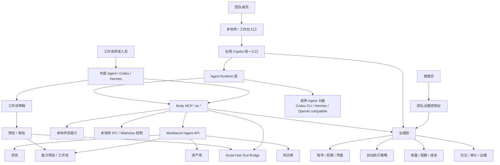

# Copilot 商业化产品架构

**版本**：v0.1  
**日期**：2026-07-22  
**状态**：产品与架构对齐稿  
**目标读者**：CEO / 产品 / 架构 / Agent 工程 / 工作流研发 / 管理员  
**功能偏好 companion**：[`docs/Copilot功能偏好与长期工作形态.md`](./Copilot功能偏好与长期工作形态.md)

## 0. 一句话

> **Copilot 是团队进入工作台的统一 Agent 入口，不是另一个网页聊天机器人。**

它要把成熟 Agent 能力、工作台资产/项目/能力、团队权限和用量治理接到一起，让团队成员从一个入口完成真实生产任务。

更产品化地说：

> **用户说目标，Copilot 调度 Agent 和工作台，把产物落回项目；管理员能管住权限、成本和审计。**

---

## 1. LoopEngine 写法约定

公开资料里没有找到一个足够明确、可引用为标准的“LoopEngine 文档格式”。本文采用更接近 LoopEngine 的表达方式：不按“页面和功能”堆清单，而按**闭环**写系统。

每个闭环固定回答七件事：

| 项 | 含义 |
| --- | --- |
| Trigger | 什么触发这个循环 |
| Context | 进入循环时需要知道什么 |
| Plan | 谁负责拆解和选择路径 |
| Act | 真正调用哪个受控能力 |
| Observe | 如何拿到结果、进度、错误和证据 |
| Govern | 权限、成本、审计、确认怎么管 |
| Exit | 什么叫完成，什么叫失败，如何恢复 |

本文不追求把所有技术细节一次写死，而是先冻结商业化产品的“主循环”和边界。

外部参考采用三条共识：

- Anthropic 的 agentic system 建议：先用简单、可测的 workflow，把计划和工具接口打磨好，再增加自主性。
- OpenAI Agents 相关编排思路：先单 Agent 做强，多 Agent 后置；专家更适合先作为 tools，而不是一开始 handoff 抢主会话。
- Google ADK / 多 Agent 模式：顺序链、协调、循环、人审节点要显式建模。

---

## 2. 北极星

### 2.1 成熟产品最终长什么样

团队成员打开本地壳或工作台，不需要知道 Codex、MCP、Hermes、Token、Gateway 这些工程名词。

他看到的是：

1. 当前团队账号已就绪。
2. 当前项目和资产上下文已识别。
3. Copilot 知道可用能力。
4. 可以一句话发起任务。
5. 任务执行中有进度、确认和可取消。
6. 产物进入工作台项目和资产库。
7. 失败时给出可点击恢复动作。

管理员看到的是：

1. 谁在用 Copilot。
2. 调了哪些能力。
3. 花了多少成本。
4. 哪些动作自动执行，哪些需要确认。
5. 哪些工作流已发布给团队。
6. 哪些失败、阻塞和风险需要处理。

工作流研发人员看到的是：

1. 可以用外部 Agent 研发流程。
2. 流程先进入草稿。
3. 预检通过后再发布为工作台预设或 Script Hub 工具。
4. 发布、回滚、权限和审计都有证据。

### 2.2 不做什么

| 不做 | 原因 |
| --- | --- |
| 不做另一个网页聊天机器人 | 聊天不是壁垒，生产环境连接和治理才是壁垒 |
| 不重新发明比 Codex 更强的大脑 | 第一阶段复用成熟 Agent，产品重点是接入、治理、产物闭环 |
| 不让 Copilot / 大脑绕过 `ac.*`（及工作台受控 API）直接改业务数据 | 否则权限、审计、版本和恢复都会失控；MCP 只是对外插头，不是唯一合法路径 |
| 不把普通用户暴露在 MCP / Token / Gateway 配置里 | 配置属于管理员和工程态，成员只需要任务入口；操作工作台不必强制经 MCP |
| 不一开始做 Agent 市场和复杂多 Agent 编排 | 先证明团队能稳定完成工作，再做生态 |

---

## 3. 总体架构



### 3.1 六层分工

| 层 | 职责 | 现有/规划锚点 |
| --- | --- | --- |
| 入口层 | 本地壳、工作台、右侧 Copilot、后续一方网页统一登录态 | `persist:assetcutter-team`、Workbench WebView、Script Hub WebView |
| Copilot 交互层 | 任务入口、上下文摘要、状态、确认、失败恢复、结果呈现 | `companion-desktop/shell/copilot-panel.js` |
| Agent Runtime 层 | 接 Codex / Hermes / 外部 Agent，执行 turn、工具调用、取消和恢复 | `AgentSessionService`、Brain Adapter |
| Body 控制层（`ac.*`）+ MCP 插头 | 执行真源是 BodyHost/`ac.*`；MCP 把同一工具表暴露给外部大脑 | `agent-body-host.cjs`、`agent-body-mcp.cjs` |
| 工作台业务层 | 项目、资产、能力、知识库、工作流、产物版本 | Workbench Agent API、能力预设、资产库 |
| 治理层 | 团队账号、权限、凭据、策略、用量、配额、审计、证据 | `agent-store`、usage audit、policy、server-status blockers |

### 3.2 依赖方向

依赖必须单向：

```text
Copilot UI
  -> Agent Runtime
  -> ac.*（BodyHost，可直连）
  -> （可选）Body MCP 对外插头
  -> Workbench / Script Hub / Companion APIs
  -> 业务资产和产物
```

禁止：

- Copilot UI 直接写工作台业务数据。
- 大脑绕过 `ac.*` 直接调用内部私有接口。
- 以 DOM / 点选工作台 UI 当主控制路径。
- 工作台业务逻辑依赖某个具体大脑。
- 普通用户入口暴露底层 MCP 配置。
- 把「全权」设为默认权限模式。

---

## 4. 五个核心闭环

### 4.1 任务执行闭环

```text
用户目标
  -> Copilot 识别团队/项目/资产上下文
  -> Agent Runtime 规划
  -> ac.* 调工作台能力
  -> 工作台生成产物
  -> Copilot 展示结果和下一步
  -> 审计与用量落账
```

| 环节 | 要求 |
| --- | --- |
| Trigger | 成员在右侧 Copilot 输入目标，或点击快捷任务 |
| Context | 团队账号、当前项目、选中资产、可用能力、权限、余额/配额 |
| Plan | 第一阶段由 Codex / 规则化任务链完成，不追求全自主 |
| Act | 只通过 `ac.workbench.*`、`ac.script_hub.*`、`ac.companion.*` 等工具执行 |
| Observe | 任务状态、工具调用、产物 id、失败码、恢复动作 |
| Govern | 高风险动作确认；成本动作显示范围和预算；所有工具调用写审计摘要 |
| Exit | 产物入库、用户可打开；失败时给登录/授权/重试/降级动作 |

第一条商业化验收链：

```text
准备工作台
  -> 创建或打开项目
  -> 运行一个能力
  -> 列出资产
  -> 读取产物
  -> Copilot 返回可打开结果
```

### 4.2 登录与身份闭环

目标不是“本地壳有一个登录页”，而是：

> **壳内一方网页登录一次，工作台、Script Hub、Copilot/MCP 都复用同一团队会话。**

| 身份 | 关注点 |
| --- | --- |
| 成员 | 不重复登录；失败时知道去哪登录 |
| 管理员 | 能看到谁在用、是否授权、是否过期 |
| Agent | 能拿到机器可读的登录阻塞原因和恢复动作 |
| 工程 | Cookie/token 不进日志，不离开本地壳安全边界 |

当前架构锚点：

- 统一一方网页 session partition：`persist:assetcutter-team`
- Workbench/Script Hub 复用同一 partition
- MCP `server-status` 和 Copilot 入口展示 `workbench_login_required`
- blocker action 提供登录和 E2E 恢复命令/按钮

未完成闭环：

- 登录后真实跑通 Workbench E2E acceptance。
- 团队用量上传和 quota policy 需要真实登录态验收。

### 4.3 治理闭环

商业化 Copilot 的关键不是“更聪明”，而是“可控”。

```text
工具调用
  -> 风险分级
  -> 策略判断
  -> 必要时确认
  -> 执行
  -> 审计摘要
  -> 用量/成本归集
  -> 管理员可查
```

| 治理对象 | 第一阶段做法 | 后续商业化形态 |
| --- | --- | --- |
| 权限 | safe / confirm / forbidden；Ask/Sandbox/Auto 为显式模式 | 团队角色模板、项目级权限；全权非默认 |
| 凭据 | 本地壳持有，不进日志 | 团队凭据分发和轮换 |
| 用量 | 本地 usage audit + dry-run upload | 云端 quota policy 强制执行 |
| 审计 | tool execution 摘要 | 可搜索、可导出、可回放证据链 |
| 成本 | token/事件统计 | 套餐、预算、超额策略 |

必须保留的原则：

- Cookie、Token、Prompt 原文不进入审计明文。
- confirm-risk 工具必须能证明谁批准、从哪个 UI 批准。
- dry-run 诊断不能被误认为真实治理完成。

### 4.4 工作流发布闭环

工作流研发人员可以在外部 Agent 里研发流程，但不能直接把草稿变成团队可用能力。

```text
外部 Agent 研发
  -> ac.skills.save 保存草稿
  -> 预检 Workbench preset / Script Hub tool 形态
  -> 管理员确认
  -> 发布为团队能力
  -> 使用数据和失败反馈回流
  -> 可回滚或下线
```

当前已经有的骨架：

- `assetcutter://mcp/workflow-publication`
- `ac.skills.save/get/revisions/delete`
- `ac.workflow.promote_workbench_preset`
- `ac.workflow.promote_script_hub_tool`
- preflight evidence、passed/missing gates、admin confirmation gate

下一步要补的商业化闭环：

- 真正的发布写入路径。
- 发布后版本和回滚。
- 团队成员侧的能力发现和使用。
- 使用数据反哺工作流质量。

### 4.5 价值度量闭环

商业化不能只证明“能跑”，要证明“值得付费”。

```text
任务执行
  -> 产物入库
  -> 记录成本与耗时
  -> 标记成功/失败/恢复
  -> 聚合到团队/项目/能力
  -> 管理员看到 ROI
```

建议第一批指标：

| 指标 | 用途 |
| --- | --- |
| workbench_task_success_rate | Copilot 是否真的能完成工作台任务 |
| time_to_first_result | 用户从输入到看到产物的速度 |
| recovery_success_rate | 失败恢复动作是否有效 |
| assets_created_by_copilot | Copilot 贡献了多少生产资产 |
| reusable_workflows_created | 团队沉淀了多少可复用流程 |
| tokens_per_successful_task | 成本是否可控 |
| confirmations_per_task | 是否过度打扰用户 |

---

## 5. 角色视角审视

### 5.1 CEO

要补：

- 价值指标：省时、成功率、复用资产、成本。
- 收费边界：团队席位、用量、能力发布、治理后台。
- 留存理由：团队流程和资产沉淀，不只是一次性聊天。

要砍：

- 过早的 Agent 市场。
- 复杂多模型管理。
- “更强网页 Agent”叙事。

### 5.2 普通团队成员

要补：

- 当前上下文：我在哪个项目、选了什么资产、能做什么。
- 快捷任务：创建项目、运行能力、查看产物、继续优化。
- 失败恢复：登录、授权、重试、降级、打开结果。

要砍：

- MCP Token、JSON 配置、工具 schema、Gateway、Hermes 细节。
- 默认铺开的调试日志。

### 5.3 管理员

要补：

- 权限模板：只读、可执行、管理员。
- 用量和预算策略。
- 审计搜索和导出。
- 凭据分发和轮换。
- 高风险动作审批。

要砍：

- 初期不要做过细 RBAC。
- 不要把每个工具都做成独立配置页。

### 5.4 工作流研发人员

要补：

- 草稿、预检、测试样例、发布、回滚。
- 工具白名单和风险说明。
- 发布后使用数据反馈。

要砍：

- 初期不做复杂可视化工作流编辑器。
- 不允许绕过 `ac.*` 上传任意脚本直接执行。

### 5.5 架构负责人

要补：

- 边界冻结：Copilot、Project Agent、Body MCP、Workbench API、治理层分别管什么。
- 状态机和错误码。
- 端到端验收命令和证据。

要砍：

- UI 层直接拼业务 API。
- 为 Copilot 另起一套平行资产系统。

### 5.6 安全 / 合规

要补：

- 凭据不出壳。
- Prompt / Token / Cookie 不进明文审计。
- 高风险动作确认证据。
- 本机执行权限策略。
- 审计事件标准化。

要砍：

- 过早承诺复杂合规认证。
- 默认自动执行本机 shell / 文件覆盖 / 发布动作。

---

## 6. 与 Project Agent 的边界

现在有两个容易混淆的 Agent：

| 名称 | 位置 | 作用域 | 主职责 |
| --- | --- | --- | --- |
| 桌面壳 Copilot | 本地壳右侧 | 团队入口 + 本机能力 + 工作台控制 | 统一 Agent 入口、Codex 接入、MCP、治理、跨工具控制 |
| Project Agent | 工作台项目内右侧 | 单个项目 | 项目上下文、画布/资产/工作流编排、专家和记忆 |

边界：

- Copilot 是团队进入工作台的总入口。
- Project Agent 是工作台项目里的生产助手。
- 两者可以共享账号、权限、资产引用和审计，但不应混用会话。
- Project Agent 不替代 Copilot 的本机执行和外部 Agent 接入。
- Copilot 不替代 Project Agent 的项目内资产体验。

后续桥接方式：

```text
Copilot
  -> 打开/创建工作台项目
  -> 把任务交给 Project Agent 或 Workbench API
  -> 读取项目产物和状态
  -> 在壳侧展示摘要和治理证据
```

---

## 7. 商业化路线图

### Phase 1：能用的统一入口

目标：成员能从 Copilot 发起任务，真实调用工作台并拿到产物。

验收：

- 登录态闭环通过。
- Codex 可用。
- `准备工作台 -> 创建/打开项目 -> 运行能力 -> 列资产 -> 读取产物` 跑通。
- 失败时有可点击恢复动作。

### Phase 2：好用的任务入口

目标：Copilot 不像调试面板，而像工作入口。

验收：

- 顶部就绪态。
- 当前项目/资产上下文摘要。
- 空状态快捷任务。
- 结果卡片和下一步动作。
- 工程配置默认折叠。

### Phase 3：团队治理

目标：个人 Agent 能力变成团队可控能力。

验收：

- 权限模板。
- confirm-risk 审批证据。
- 用量云端上传。
- quota policy 生效。
- 审计可查。

### Phase 4：工作流发布

目标：外部 Agent 研发的流程能受控发布给团队。

验收：

- 草稿 registry。
- Workbench preset / Script Hub tool 预检。
- 管理员审批。
- 发布、版本、回滚。
- 团队成员可直接使用。

### Phase 5：商业化后台

目标：可售卖、可运营、可扩展。

验收：

- 团队套餐和席位。
- 用量成本看板。
- 能力使用排行。
- 风险和失败报表。
- 能力市场或团队能力库。

---

## 8. 当前代码映射

| 架构对象 | 当前锚点 |
| --- | --- |
| Copilot UI | `companion-desktop/shell/copilot-panel.js` |
| Shell 设置 / 诊断 | `companion-desktop/shell/index.html` |
| Agent Session | `companion-desktop/agent-session/` |
| Body Host | `companion-desktop/agent-body-host.cjs` |
| Body MCP | `companion-desktop/agent-body-mcp.cjs` |
| 工具 schema | `companion-desktop/agent-tool-schemas.cjs` |
| 阻塞恢复动作 | `companion-desktop/agent-blocker-actions.cjs` |
| Workbench client | `companion-desktop/agent-workbench-client.cjs` |
| Script Hub client | `companion-desktop/agent-script-hub-client.cjs` |
| 用量草稿 | `companion-desktop/agent-usage-cloud-draft.cjs` |
| 主站 Agent API | `server/agent-workbench-api.js`、`server/auth-api.js` |
| Project Agent | `services/projectAgent/**`、`components/project-agent/**` |
| 收口清单 | `docs/架构未收口清单.md` |

---

## 9. 下一步建议

不要继续优先扩设置页。设置页是后台，商业化体感在右侧 Copilot 主入口。

建议下一轮只做一个产品闭环：

### Copilot 工作台任务入口 MVP

范围：

1. Copilot 顶部显示团队入口状态：账号、工作台、Agent、治理。
2. 空状态显示 4 个可执行任务：打开/创建项目、运行预设、查看最近资产、验收链路。
3. 输入一句话能跑通最小工作台链路。
4. 成功返回结果卡片。
5. 失败返回恢复动作。
6. 所有动作落到现有 `ac.*`、blocker actions 和 audit 证据。

验收句：

> 成员不打开设置、不看终端，只在右侧 Copilot 里就能知道能不能干活、能做什么、任务做到哪、产物在哪里、失败怎么修。

---

## 10. 参考资料

- Anthropic：Building effective agents  
  https://www.anthropic.com/engineering/building-effective-agents
- Anthropic：Writing effective tools for agents  
  https://www.anthropic.com/engineering/writing-tools-for-agents
- OpenAI：Agents / orchestration / handoffs  
  https://developers.openai.com/
- Google ADK：Multi-agent patterns / workflow patterns  
  https://adk.dev/
