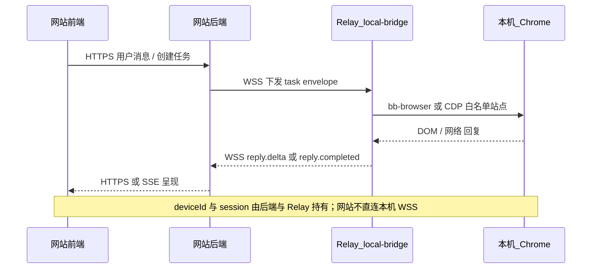

# 本地伴侣 · 站点中转插件（多站点版）

> **定位**  
> 本文档描述 **本地伴侣（Companion）主程序** 内 **「站点中转」插件（Relay）** 的行为与协议。  
> **总架构、插件模型、存储与计算** 以 [`本地伴侣-存储与计算规范.md`](./本地伴侣-存储与计算规范.md) 为准；本文不单独定义「本地中转应用」产品——**中转能力已并入伴侣，仅为插件之一**，后续还可增加更多插件（同步、CLI、其他自动化等）。  
本仓库内 **带界面的本地宿主壳**（插件 / 仓库 两模块管理页）见 [`本地伴侣-本地程序开发.md`](./本地伴侣-本地程序开发.md)（`local-companion/`）。

---

## 1. 背景与目标（Relay 插件范围内）

在 **Companion 宿主** 已安装并运行的前提下，Relay 插件负责：

- **上行**：接收经你们 **后端** 路由的任务（WSS 与设备会话绑定）
- **执行**：驱动用户本机浏览器（如 **bb-browser / CDP**）访问**白名单**目标站点（如 Gemini Web），完成发送与监听
- **下行**：将目标站点响应 **流式或整段** 回传至后端，再至网站前端展示与归档

**核心原则**（插件级）：

- 通用 **Relay 核心**（队列、重连、与宿主 telemetry 对接）稳定；**站点连接器**可插拔、快更
- 优先复用社区适配器（`bb-sites`），保留私有 `overrides`
- 安全：白名单域名、用户授权、最小权限；遵守目标站点 ToS

---

## 2. 范围与非范围

### 2.1 范围（本插件交付）

- 作为 Companion **`plugins/relay`**（或等价路径）实现，由 **pluginhost** 注册与声明 `capabilities.relay`
- 与网站后端 **认证后的设备长连接（WSS）**
- 统一任务 envelope（发送、流式回传、状态、错误）
- **站点连接器**机制（`SiteConnector` / connector 包）
- 接入 `bb-sites` 为默认连接器来源；`connectors/community`、`connectors/overrides`、`manifest.json`
- 健康检查、版本回滚、与宿主统一的日志与错误码

### 2.2 非范围

- 不替代目标站点官方 API
- 不保证所有站点永久免维护
- 不提供绕过平台风控 / 条款的能力

---

## 3. 总体架构（在 Companion 之内）

```text
你的网站前端
   │ HTTPS/WSS
你的网站后端（会话、鉴权、任务路由、设备绑定）
   │ WSS（连接到「该用户设备」上的本地伴侣）
本地伴侣 Companion（主程序）
   │ 插件：Relay（站点中转）
   │   └── 本机调用
bb-browser / CDP
   │
用户本机 Chrome 目标站点标签页
```

**数据路径**：

1. 用户在网站发送消息  
2. 后端将任务经 WSS 下发到 **已配对的 Companion 设备**  
3. **Relay 插件** 接收任务，调用对应 **站点连接器** 执行发送  
4. 监听回复并流式/整段回传  
5. 网站前端渲染与落库（逻辑仍在你们后端与前端）

### 3.1 序列图（已决 · 与伴侣本机 HTTP 分工）

以下强调 **WSS 中继（Relay）** 与 **`127.0.0.1` HTTP（capabilities / 存储 / 计算）** 并行、职责分离；宿主形态（Electron 托盘 + 子进程拉起 `local-bridge`）见 [`本地伴侣-待决策清单与建议.md`](./本地伴侣-待决策清单与建议.md)。



---

## 4. 模块设计（Relay 插件内部）

### 4.1 插件核心（低频变更，建议仍放在 `plugins/relay/` 下）

- `transport`：与云端 WSS、重连、心跳、ACK（若宿主统一云连接，可改为注入接口）
- `orchestrator`：本插件任务队列、超时、重试、并发
- `session`：设备身份与后端会话对齐（可与宿主 `auth` 协同）
- `security`：域名白名单、连接器权限边界
- `telemetry`：对接宿主日志与错误码
- `plugin-runtime`（连接器侧）：加载与管理 **站点连接器**（非宿主级「大插件」，而是 Relay 子插件）

### 4.2 站点连接器（高频变更）

每个目标站点一个连接器：

- 页面识别与初始化  
- 消息输入与发送  
- 回复抓取（DOM / network / eval）  
- 完成态 / 失败态判定  

建议接口（语言中立；实现可为 TS/Go 等）：

```ts
export interface SiteConnector {
  id: string;
  version: string;
  match(ctx: { url?: string; domain?: string }): boolean;
  init(ctx: ConnectorContext): Promise<void>;
  sendMessage(input: SendInput): Promise<{ requestId: string }>;
  subscribeReplies(cb: (event: ReplyEvent) => void): () => void;
  healthCheck(): Promise<HealthResult>;
  teardown(): Promise<void>;
}
```

**推荐目录**（位于 Relay 插件内，见总规范 `plugins/relay/connectors/`）：

```text
plugins/relay/connectors/
  community/       # bb-sites 同步内容
  overrides/       # 私有修补
  manifest.json
```

---

## 5. `bb-sites` 接入策略

- 默认从 `bb-sites` 拉取连接器；**Companion / Relay 启动时**做兼容性检查
- 更新灰度、失败回滚、关键站点 **overrides** 兜底

---

## 6. 协议设计（后端 ↔ 设备上的 Relay 插件）

与具体站点解耦的 envelope 示例：

```json
{
  "protocolVersion": 1,
  "type": "task.send_message",
  "taskId": "uuid",
  "connectorId": "gemini-web",
  "threadId": "optional",
  "payload": {
    "text": "用户输入内容"
  }
}
```

回传事件建议：

- `task.accepted`
- `reply.delta`
- `reply.completed`
- `task.failed`
- `task.timeout`
- `connector.unhealthy`

---

## 7. 安全与合规要求

- 与宿主一致：本机对外服务以 **`127.0.0.1`** 为主（WSS 出站至你们后端为 TLS）
- 设备配对：**一次性授权**（由宿主或 Relay 与宿主协同实现，以总规范为准）
- 仅允许 **白名单站点** 被自动化；审计日志脱敏
- 明示用户遵守目标站点 ToS

---

## 8. MVP 里程碑（本插件）

| 阶段 | 目标 |
|------|------|
| **M1** | 单站点（如 Gemini）端到端：网站发消息 → 站点回复 → 回传展示；支持整段回传 |
| **M2** | `reply.delta` 流式；重连、超时、重试与错误码；基础监控与日志 |
| **M3** | 多个 `connectorId`；`bb-sites` 自动同步；灰度发布与自动回滚 |

### 8.1 最终产品闭环（新增）

为避免只完成「能力点」而缺少用户完整体验，后续开发统一按以下闭环推进：

1. **投递闭环**：网站下发任务后，用户立刻看到 `task.accepted`（同一 `taskId`）。  
2. **执行闭环**：Relay 调用站点连接器并持续回传 `reply.delta`，最终 `reply.completed` 收尾。  
3. **恢复闭环**：Relay 断线重连后按 `taskId + seq` 续传，后端与前端幂等去重。  
4. **可见闭环**：`relay offline` / `auth expired` / `connector unhealthy` 在网站设置与托盘至少一处明确提示，并给出可执行动作。  

> M2 验收前，以上四项均需可演示。

---

## 9. 验收标准（Done Definition）

- **M1 完成**：至少 **1** 个白名单站点稳定收发（与 §8 M1 一致）  
- **M3 完成**：可在网站上稳定收发 **至少 2 个** 不同站点连接器  
- 单次任务失败可定位（错误码 + 日志链路）  
- 连接器更新失败可回滚，不拖死宿主与其他插件  
- **Relay 离线**、站点未登录、连接器失效三类场景有清晰提示（网站 + 可选宿主托盘）  
- 关键路径有自动化测试（协议 envelope、队列、回滚）

---

## 10. 风险清单

- 站点改版导致连接器失效（高概率）  
- 平台条款与风控  
- 用户环境差异（浏览器版本、权限）

**应对**：宿主慢更、**连接器快更**；社区主源 + 私有 overrides；健康检查与回滚优先于「永不失效」。
