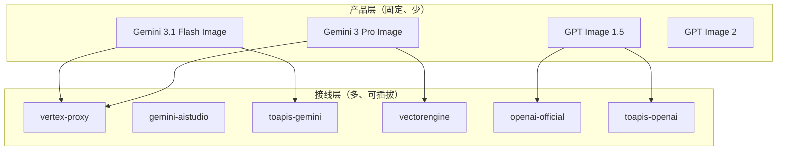
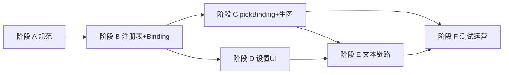

# 模型中心与供应商绑定 — 改造清单

**状态**：MVP 已落地（2026-05-27，`f8383f1`）；阶段 E 文本链路已接 binding；§9 产品项仍待拍板  
**目标读者**：产品、研发、运营  
**关联文档**：

- `docs/adr/模型中心与供应商绑定.md` — ADR 与 ChannelId ↔ AiProvider 映射表
- `docs/架构宪章-店仓菜单.md` — 供货商 / 仓库 / 菜单分层原则
- `docs/多模型可运营改造计划.md` — 阶段 1～3 已落地
- `docs/枢纽节点式模型接线改造清单.md` — 阶段 G～K：节点式供应商/枢纽接线（后续）
- `services/modelRegistry/README.md` — 注册表模块说明

---

## 1. 执行摘要（1 分钟）

1. **用户只认「网站上的模型」**（`registryId`：如 Gemini 3 Pro Image、GPT Image 1.5），不在产品 UI 里选「第几家中转」。
2. **供应商是可插拔接线（Binding）**：十家中转都卖同一模型，也只对应**一个**产品入口；运行时按优先级选第一条可用接线。
3. **模型可先上架、Binding 后补**：注册表定 SKU，凭证与 channel 独立配置。
4. **生图与文本均已接 binding**（`getClientForTask` / `pickBinding`）；legacy `getAiProvider()` 仅试用与云同步兼容。

---

## 2. 目标架构

### 2.1 四层结构

| 层 | 职责 | 用户是否感知 |
|----|------|--------------|
| **模型（SKU）** | `registryId`、展示名、能力（生图/文本、参考图上限、`family`） | ✅ 快捷条、设置、工作流 |
| **能力族** | `gemini-family` \| `openai-family`（对应现有 `providerRoute` + 未来文本槽） | ❌ 工程内部 |
| **供应商绑定（Binding）** | 某 channel 如何接这条模型：`priority`、`enabled`、可选 `upstreamOverride` | ❌ 高级设置 / 自动 failover |
| **凭证** | Key、Base URL、站点代理 env | 设置里填写 |

### 2.2 运行时原则

```text
用户选 registryId
  → pickBinding(registryId, role)     // role: text | image
  → resolveUpstream(id, binding)
  → createClient(binding.channel)
```

**不再**：`用户选全局供应商` → `getAI()` 互斥分支。

### 2.3 数据流（Mermaid）



### 2.4 与「店仓菜单」宪章的对应

| 宪章概念 | 本文对应 |
|----------|----------|
| 菜单 / 货架 | `registryId` 列表（`imageModels.ts`、`textModels.ts`） |
| 货物 | 具体模型 SKU |
| 供货商 | Channel 实现（Vertex 代理、ToAPIs、OpenAI 官方…） |
| 拣货 | `pickBinding` + `resolve` |
| 仓库 | 凭证存储（`settingsStore`）、运营 allowlist（`merge.ts`） |

---

## 3. 现状 vs 目标

| 项 | 现状（2026-05-27） | 目标 |
|----|-------------------|------|
| 生图模型列表 | ✅ `imageModels.ts` + family | 保持，扩展元数据 |
| 生图调用 | ✅ `getAIForImageModel` → `pickBinding` + channel client | 按 **binding 优先级** 选 channel |
| 文本/理解 | ✅ `getAI()` → `getClientForTask(DEFAULT_MODEL_TEXT, "text")` | 文本走 `registryId` + binding |
| 设置 UI | ✅ `AiProviderCredentialsPanel` 按 family / channel | 按 **模型族 / channel 接线** 管理 |
| 上游 id | ✅ `resolve.ts` 按 binding.channel | 按 **binding.channel** 映射 |
| 中转站 | ✅ ToAPIs 双路径、VectorEngine 与 Vertex 分 channel | 声明 `supportedFamilies`，binding 挂接 |
| 云同步 | ✅ `enabledChannels` + legacy `enabledAiProviders` 双向同步 | channel 为主 |

### 3.1 业务背景（2026-05 共识）

| 类型 | 说明 | 产品策略 |
|------|------|----------|
| **Vertex** | Google Cloud Gemini，经站点代理，稳定 | **Gemini 系默认推荐** |
| **Gemini（AI Studio）** | 官方 Key 直连 | 当前不可用 → 灰显 / deprecated |
| **ToAPIs / VectorEngine** | API 中转，可能只接了 Gemini 或 OpenAI 路径 | UI 标注「中转 · 已接路径」 |
| **OpenAI 官方** | 刚接入 Chat + Images | OpenAI 系默认 |

---

## 4. 核心类型（已落地）

实现见 `services/modelRegistry/types.ts`（以下为摘要）：

```ts
/** 模型能力族：决定用哪套适配器 */
export type ModelFamily = "gemini" | "openai";

/** 接线 channel（实现层，不是产品菜单） */
export type ChannelId =
  | "vertex-proxy"
  | "gemini-aistudio"
  | "toapis-gemini"
  | "toapis-openai"
  | "vectorengine"
  | "openai-official";

export type ProviderBinding = {
  bindingId: string;
  registryId: string;
  channel: ChannelId;
  /** 越小越优先 */
  priority: number;
  /** 用户未显式配置时的默认是否启用 */
  defaultEnabled?: boolean;
  /** 该 channel 上的上游 model id 覆盖（可选） */
  upstreamOverride?: string;
};

export type ModelResolveRole = "text" | "image";
```

### 4.1 Binding 示例

```ts
// 同一 registryId，多条 binding（十家中转 = 十条 binding，不是一个新模型）
{
  bindingId: "vertex→gemini-3-pro-image",
  registryId: "gemini-3-pro-image-preview",
  channel: "vertex-proxy",
  priority: 10,
  defaultEnabled: true,
},
{
  bindingId: "toapis→gemini-3-pro-image",
  registryId: "gemini-3-pro-image-preview",
  channel: "toapis-gemini",
  priority: 20,
  defaultEnabled: false,
}
```

### 4.2 默认优先级链（family 级）

```text
gemini-family:  vertex-proxy > toapis-gemini > vectorengine > gemini-aistudio
openai-family:  openai-official > toapis-openai
```

---

## 5. 分阶段改造

### 阶段 A — 规范与类型（1～2 天）

**目的**：名词统一，避免再扩「第 N 个平级供应商」。

| # | 任务 | 产出 | 状态 |
|---|------|------|------|
| A.1 | ADR：模型 SKU vs 供应商 Binding | `docs/adr/模型中心与供应商绑定.md` | ✅ |
| A.2 | 定义 `ModelFamily` / `ChannelId` / `ProviderBinding` | `services/modelRegistry/types.ts` | ✅ |
| A.3 | 冻结首期 `ChannelId` 枚举 | 见 §4、`channelCatalog.ts` | ✅ |
| A.4 | 更新能力矩阵：场景用 `registryId` 槽位 | `docs/spec/model-capability-matrix.md` | ✅ |
| A.5 | 更新拣货路径索引注释 | `services/workflowAiPickIndex.ts` | ✅ |

**验收（#accept-phase-binding-a）**：

- [x] 新同学 30 分钟内能回答：「加一家新中转 = 加 binding，不是加菜单模型」（见 ADR）
- [x] `ChannelId` 与现有 `AiProvider` 映射关系有表格说明（见 ADR §映射表）

---

### 阶段 B — 注册表 + Binding 数据（2～4 天）

**目的**：模型可先上架，binding 后补。

| # | 任务 | 产出 | 文件 | 状态 |
|---|------|------|------|------|
| B.1 | 生图注册表补 `family`（或统一 `providerRoute` 语义） | 每条模型有 family | `imageModels.ts` | ✅ |
| B.2 | 默认 binding 静态表 | `providerBindings.ts` | **新建** | ✅ |
| B.3 | 文本模型注册表（最小集） | `textModels.ts` | **新建** | ✅ |
| B.4 | `merge.ts`：有效模型 = 注册表 ∩ **至少一条 ready binding** ∩ 运营 allowlist | 无 binding 显示禁用+原因 | `merge.ts` | ✅ |
| B.5 | `imageModelProvider.ts`：就绪检查改为 channel 级 | `isChannelReady` | `imageModelProvider.ts` | ✅ |
| B.6 | AI Studio channel 默认 `defaultEnabled: false` | 数据 | `providerBindings.ts` | ✅ |

**验收（#accept-phase-binding-b）**：

- [x] 只改 `providerBindings.ts` + `imageModels.ts` 即可在 merge 层看到新模型行
- [x] `npm run typecheck` 通过（提交前已验证 binding 单测）
- [x] 单测：`tests/providerBindings.test.ts`（binding 覆盖所有 `registryId`）

---

### 阶段 C — 解析与选型（3～5 天，核心）

**目的**：「按模型进、按 binding 出」。

| # | 任务 | 产出 | 文件 | 状态 |
|---|------|------|------|------|
| C.1 | `pickBinding(registryId, role)` | 按 priority 取第一个 ready binding | `pickBinding.ts` **新建** | ✅ |
| C.2 | `isChannelReady(channel)` | 凭证 + env 检查 | `channelCredentials.ts` | ✅ |
| C.3 | `resolveUpstreamModelId(binding, role)` | 从 provider 分支迁到 channel 分支 | `resolve.ts` | ✅ |
| C.4 | 生图：`getAIForImageModel` → `getClientForTask` | 内部 pickBinding + adapter | `geminiService.ts` | ✅ |
| C.5 | 保留 `resolveUpstreamImageModelIdForRegistry` 薄封装 | 兼容旧调用 | `resolve.ts` | ✅ |
| C.6 | 日志：`[model-registry] picked binding=… channel=…` | 可观测 | `pickBinding.ts` / `log.ts` | ✅ |

**验收（#accept-phase-binding-c）**：

- [x] `tests/pickBinding.test.ts`：仅 Vertex ready → 选 vertex；Vertex 不可用 → fallback ToAPIs
- [ ] 手测：关 AI Studio、开 Vertex，同一「Gemini 3 Pro Image」仍能生图（待 QA 勾选）
- [x] 无「先 resolve 再 adapter 又改一次」的双重映射（review `resolve` vs adapter）

---

### 阶段 D — 设置 UI 与云同步（2～3 天）

**目的**：UI 表达「接线」，不是「五选一供应商品牌」。

| # | 任务 | 产出 | 文件 | 状态 |
|---|------|------|------|------|
| D.1 | 凭证面板按 **family 分组** + 每 channel 一行 | 勾选 / Key / 状态 | `AiProviderCredentialsPanel.tsx` | ✅ |
| D.2 | ToAPIs **一行**，子勾选「Gemini 路径 / OpenAI 路径」 | 两条 binding 共用 Key | 同上 | ✅ |
| D.3 | Vertex 无 Key 行；AI Studio 灰显 +「建议用 Vertex」 | 文案 | 同上 | ✅ |
| D.4 | 持久化 `ac_enabled_channels` | `settingsStore.ts` | | ✅ |
| D.5 | 云配置 `enabledChannels` | `workspaceUserCloudConfig.ts`、`App.tsx` | | ✅ |
| D.6 | 工作流密钥弹窗与设置页共用 panel | 已部分完成 | `WorkflowApiKeyModal.tsx` | ✅ |

**验收（#accept-phase-binding-d）**：

- [x] 用户看不到「试用 / Antigravity」（设置 panel 已移除）
- [x] 可同时启用 Vertex + ToAPIs，状态分别显示
- [x] 换设备后 channel 启用状态一致（云同步 `enabledChannels`）
- [x] 无新增原生 `<select>`

---

### 阶段 E — 文本 / 理解全链路（4～6 天）

**目的**：对话、理解、贴图、擂台与「生图」同一套模型入口。

| # | 任务 | 产出 | 文件 | 状态 |
|---|------|------|------|------|
| E.1 | 默认文本模型进 `textModels.ts` | 与 `constants.ts` 对齐 | `textModels.ts`、`constants.ts` | ✅ |
| E.2 | `getAI()` → `getClientForTask({ registryId?, role })` | 默认文本 registryId | `geminiService.ts` | ✅ |
| E.3 | 全站 `resolveUpstreamTextModelId` 带 binding | `capabilityExecutor.resolveTextModelIdFromContext` + 单测 | `capabilityExecutor` 等 | ✅ |
| E.4 | `getAiProvider()` 标记 `@deprecated` | 顶栏显示 channel 摘要 | `settingsStore.ts` | ✅ |
| E.5 | 更新多模型计划 §8 backlog | 文档 | `docs/多模型可运营改造计划.md` | ✅ |

**验收（#accept-phase-binding-e）**：

- [ ] 理解 + 生图可配置不同 channel — **已允许**（见 ADR §产品策略）
- [ ] 回归：文本 + 生图各至少一条主路径烟测（待 QA 勾选）

---

### 阶段 F — 测试、门禁、运营（持续）

| # | 任务 | 产出 | 状态 |
|---|------|------|------|
| F.1 | `tests/pickBinding.test.ts`、`tests/capabilityExecutorResolve.test.ts` | 单测 | ✅ |
| F.2 | 扩展 `tests/modelRegistryResolve.test.ts`（按 channel） | 解析 | ✅ |
| F.3 | 涉及 workflow 时间线时跑 `npm run test:workflow-rings` | 回归 | — 未因本次改动触发 |
| F.4 | `public/model-ops.example.json` 增加 `bindingOverrides` | 运营 | ✅ |
| F.5 | PR 门禁：新模型不得硬编码在 `App.tsx`；必须 registry + binding | Review | 文档化（ADR + 本清单） |

---

## 6. 实施顺序与 MVP



| 里程碑 | 范围 | 状态 |
|--------|------|------|
| **MVP** | A + B + C（生图）+ D（UI 分组） | ✅ 已合并 `f8383f1` |
| **完整** | + E（文本/理解）+ F | E/F 主体完成；§9 拍板与 QA 烟测待办 |

**MVP 用户可感知结果**：用户始终选「Gemini 3 Pro Image」，后台 Vertex / ToAPIs 自动选线，AI Studio 不再作为平级选项。

---

## 7. 文件 touch 一览

| 优先级 | 新建 | 修改 |
|--------|------|------|
| **P0** | `modelRegistry/types.ts`、`providerBindings.ts`、`pickBinding.ts` | `imageModels.ts`、`merge.ts`、`imageModelProvider.ts` |
| **P0** | — | `geminiService.ts`（生图）、`resolve.ts` |
| **P1** | `textModels.ts` | `settingsStore.ts`、`AiProviderCredentialsPanel.tsx` |
| **P1** | — | `workspaceUserCloudConfig.ts`、`App.tsx` |
| **P2** | `docs/adr/模型中心与供应商绑定.md` | ✅ | `docs/多模型可运营改造计划.md`、`workflowAiPickIndex.ts` | ✅ |
| **P2** | `tests/pickBinding.test.ts` 等 | ✅ | `tests/modelRegistryResolve.test.ts` | ✅ |

---

## 8. 明确不做 / 延后

| 项 | 原因 |
|----|------|
| 为每家中转单独加 `registryId` | 违背「一个模型一个入口」 |
| 继续扩 `AiProvider` 联合类型 | 应收敛到 `ChannelId` |
| 第一阶段接满 N 家中转 | 先 binding 机制 + 2～3 channel，其余只加数据 |
| 动态发现中转站模型列表 | 二期；首期静态 binding + 运营 JSON |

---

## 9. 产品决策（已定）

1. **同一模型多条 binding**：**固定 priority failover**（`providerBindings` + 运营 `bindingOverrides`）；不在 UI 提供用户自定义优先级。
2. **文本与生图 channel**：**允许不同**；`pickBinding(..., role)` 独立选型。

---

## 10. 与现有代码的对照

| 已有 | 改造后角色 |
|------|------------|
| `imageModels.ts` / `DIALOG_IMAGE_REGISTRY` | 模型 SKU 真相源（扩展 family） |
| `providerRoute: gemini \| openai` | 可演进为 `family` 或保留作 family 别名 |
| `resolve.ts` | 按 binding.channel 解析 upstream |
| `merge.ts` + `opsConfig.ts` | 注册表 ∩ binding ready ∩ 运营 allowlist |
| `getAIForImageModel(registryId)` | 模板：`getClientForRegistry` |
| `getAI()` / `getAiProvider()` | 逐步 deprecated → `getClientForTask` |
| `services/aiProviderCatalog.ts` | 过渡；最终由 `providerBindings` + channel 凭证 UI 替代 |
| `unifiedAiGateway.ts` | 对外入口不变；内部委托改为 binding 解析 |

---

## 11. 修订记录

| 日期 | 说明 |
|------|------|
| 2026-05-27 | 初版：模型中心 + 供应商 binding 分阶段改造清单（规划态） |
| 2026-05-27 | MVP 落地：`f8383f1`；勾选阶段 A～F；补 ADR、能力矩阵、拣货索引；§9 仍开放 |
