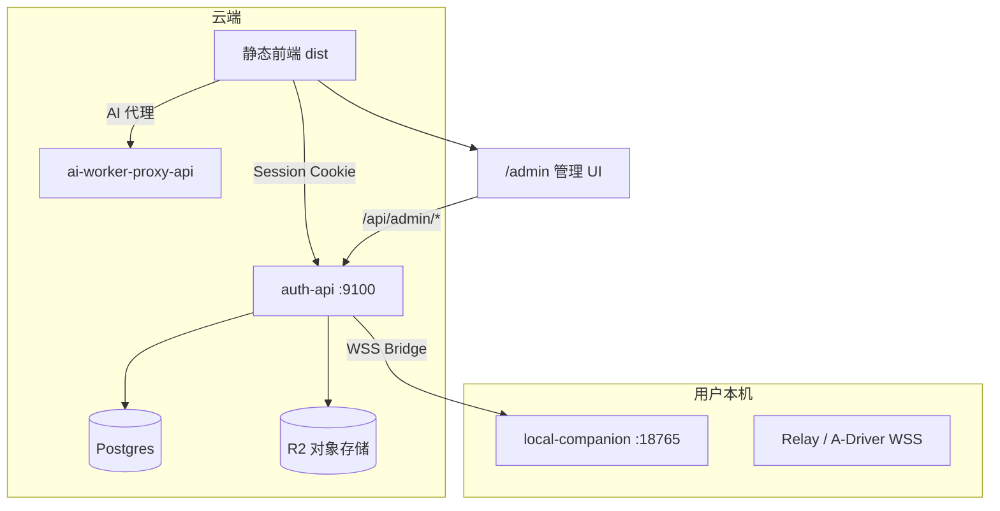

# 管理后台优化规划

**定位**：整合管理后台现状梳理、成熟产品对照、权限模型与界面改造路线。供产品评审与后续分阶段实现；**本文不含实现代码**。

**关联文档**：

- `docs/Gemini代理-公平排队与每用户限流.md` §10.1（运维数值 vs Secret 分层）
- `docs/架构宪章-店仓菜单.md`（业务侧分层，与管理后台互补）
- `docs/交接文档.md` §2 `server/`、`components/admin/`

**文档版本**：v0.2（2026-06-05）

---

## 1. 背景与目标

### 1.1 为什么要做

当前管理后台具备用户、审计、伴侣发行、Gemini 限流等基础能力，但：

- 权限只有 `user` / `admin` 两档，**任一 admin 权限相同**；
- 前端 `RequireRole role="admin"` 与后端 `requireAdmin()` 只做粗粒度校验；
- 首页为占位；审计、用户列表等缺少成熟控制台常见的筛选、分页、详情与 Dashboard；
- `AdminPasswordGate`（前端 env 密码门）存在但**未接入** `App.tsx`，不适合作为生产安全手段。

**目标**：参考 Stripe / Cloudflare / Vercel / Supabase 一类控制台，在保持现有 dark UI 风格前提下，建立 **RBAC + 角色×权限矩阵 UI**，默认 **`super` + `admin`** 两档，并支持在界面中**新增自定义角色、调整权限**。

### 1.2 非目标（避免过度设计）

- 不要求管理后台承载全部业务逻辑（工作流、对话等仍在主站）。
- 不要求 Secret（API Key、R2 Secret、GCP JSON）可在 UI 内编辑；仅展示**是否已配置**等只读摘要。
- MVP 不要求一人多角色（先 **单用户单角色**）；不要求独立子域名（可选演进）。

---

## 2. 术语（避免实现时混淆）

| 术语 | 含义 | 现状 / 目标 |
|---|---|---|
| **普通用户** | 只能使用主站，不能进 `/admin` | `users.role = 'user'`（迁移后仍保留） |
| **后台账号** | 可进 `/admin` 的站点账号 | 现状：`users.role = 'admin'`；目标：`users.staff_role_id` 非空（见 §7.3） |
| **`admin_roles.slug`** | 权限模板：`super`、`admin`、`support`… | **新增**；与「后台账号」不是同一概念 |
| **`permissions[]`** | 细粒度 API 权限 key | 由 `staff_role_id` 关联的角色计算得出 |

**命名注意**：权限模板 slug **`admin`** 表示「日常运营角色」，不要与历史上 `users.role === 'admin'` 混为一谈；迁移完成后，后台账号统一用 **`staff_role_id`** 表达「是哪种运营角色」。

---

## 3. 后端在整体架构中的位置（简图）

管理后台是 **auth-api 上 `/api/admin/*` + 主 SPA `/admin/*`**，不是独立 monolith。



| 块 | 职责 | 本仓库入口 |
|---|---|---|
| **鉴权与会话** | 登录、Cookie、后台入口判定 | `server/auth-api.js`、`server/auth-store.js` |
| **对象存储** | 工作区云同步、能力预设发布 | `server/r2-storage-handlers.js` |
| **Bridge** | 网站 ↔ 本地伴侣任务 | `server/bridge-relay.js` |
| **AI 代理** | Gemini/Vertex，公平排队 | `server/ai-worker-proxy-api.js` |
| **管理 API** | 用户、审计、发行、限流配置 | `server/auth-api.js` `/api/admin/*` |
| **本地伴侣** | 本机存储与计算 | `local-companion/` |

**原则**：密钥与环境变量在部署层；管理 UI 只管**可调数值、用户与发布物、可查日志**。

---

## 4. 现状快照（优化起点）

### 4.1 已有管理页面

路径：`/admin/*`，布局 `components/admin/AdminLayout.tsx`。

| 菜单 | 组件 | 后端 API | 主要能力 |
|---|---|---|---|
| 首页 | `AdminPlaceholder` | — | 占位说明 |
| 用户管理 | `AdminUsersPanel` | `GET/PATCH /api/admin/users`、reconcile | 列表、搜索、改 role/status、配额 MB、R2 用量同步 |
| 审计日志 | `AdminAuditLogsPanel` | `GET /api/admin/audit-logs` | 最近 300 条平铺 |
| 本地伴侣发行 | `AdminCompanionArtifactsPanel` | `/api/admin/companion-artifacts` | 上传登记 desktop_shell / host_plugin_bundle |
| Gemini 公平限流 | `AdminGeminiFairnessPanel` | `/api/admin/gemini-fairness-config` | 磁盘 JSON 数值旋钮（见 §13.1） |

### 4.2 鉴权现状

| 层级 | 实现 | 问题 |
|---|---|---|
| 前端 | `RequireRole role="admin"`（`App.tsx`） | 无菜单级、无操作级区分 |
| 后端 | `requireAdmin()` | 所有 admin API 同等开放 |
| 数据 | `users.role`：`user` \| `admin` | 无 super、无自定义角色模板 |
| 二次门控 | `AdminPasswordGate` + `VITE_ADMIN_PASSWORD` | **未接入**；生产不应依赖 |

### 4.3 已有审计动作（后端）

包括但不限于：`auth.*`、`admin.user_update`、`admin.workspace_usage_reconcile`、`admin.companion_artifact_*`、`admin.gemini_fairness_config_*`、`admin.capability_preset_publish` 等。UI 尚未展示 `meta`、筛选与分页。

### 4.4 与成熟产品的差距摘要

| 维度 | 成熟控制台常见能力 | 当前 |
|---|---|---|
| 角色 | super + 岗位角色 + 自定义 | 仅 admin |
| 权限 UI | 角色×模块矩阵、成员管理 | 无 |
| Dashboard | 指标卡片、健康状态 | 占位 |
| 用户 | 详情页、分页、批量、导出 | 全量表格 |
| 审计 | 筛选、meta、导出 | 固定 300 条 |
| 高危操作 | 二次确认、diff、仅 super | 部分有 confirm，无角色限制 |
| 可观测 | 队列/429/health 聚合 | 无 |

---

## 5. 权限模型（已定方向）

### 5.1 默认两角色 + 可扩展

| 角色 slug | 定位 | 系统属性 |
|---|---|---|
| **super** | 创始人 / 技术负责人 | **内置、不可删**；默认**全部权限** |
| **admin** | 日常运营 / 客服 / 发布 | **内置、不可删**；默认「够用但不危险」；**仅 super 可改其矩阵行** |
| **（自定义）** | 如 support、release | 矩阵 **+ 新增**；无绑定用户时可删 |

**普通注册用户** `users.role = 'user'` 且 **`staff_role_id` 为空**，不出现在权限矩阵。

**谁能改矩阵**：仅 **`roles.write`**；且该权限 **不可通过矩阵授予非 super 角色**（系统硬编码，见 §5.2.2）。

**谁能改用户后台角色**：仅 **`users.role.write`**；且 **`users.role.write` 与 `roles.write` 同样不可授予非 super**（防止运营自助提权）。

### 5.2 权限粒度设计

采用 **RBAC**：角色模板 → 权限集合；后台账号 → 单个 `staff_role_id`（MVP 单角色）。

1. **模块（菜单）**：侧栏可见、可进页面。
2. **动作（API）**：读 / 写 / 危险操作。

#### 5.2.1 权限 key 与默认矩阵

| 权限 key | 说明 | super 默认 | admin 默认 |
|---|---|:---:|:---:|
| `dashboard.read` | 管理首页 | ✓ | ✓ |
| `users.read` | 用户列表与详情 | ✓ | ✓ |
| `users.write` | 改 status、workspace 配额 | ✓ | ✓ |
| `users.role.write` | 指定用户 `staff_role_id`（含升 super） | ✓ | **—** |
| `users.reconcile` | R2 用量同步（含强制，UI 二次确认） | ✓ | ✓ |
| `audit.read` | 审计日志 | ✓ | ✓ |
| `companion.read` | 伴侣发行列表 | ✓ | ✓ |
| `companion.write` | 登记 / 上传 | ✓ | ✓ |
| `companion.delete` | 删除发行记录 | ✓ | ✓ |
| `gemini_fairness.read` | 读限流配置 | ✓ | ✓ |
| `gemini_fairness.write` | 改限流数值（PUT/DELETE 磁盘覆盖） | ✓ | ✓ |
| `gemini_fairness.strict` | HMAC、STRICT 等高危字段 | ✓ | **—** |
| `presets.publish` | `POST /api/r2/capability-store/publish` | ✓ | **—** |
| `roles.read` | 查看角色矩阵（只读） | ✓ | **—** |
| `roles.write` | 新增角色、改矩阵 | ✓ | **—** |

#### 5.2.2 系统硬编码规则（不可被矩阵绕过）

| 规则 | 说明 |
|---|---|
| 最后一个 super | 不可降级、不可禁用 |
| super 角色行 | 非 super 不可编辑 |
| super 自身 | 不可去掉 `roles.write` |
| **`roles.write`** | **仅 super 角色可持有**；自定义角色矩阵里该列恒为「—」 |
| **`users.role.write`** | **仅 super 可持有**；含「指定他人为 super」 |
| 升为 super | 须 super 执行 + UI 二次确认 + audit diff |
| 矩阵变更 | 须 `roles.write` + audit `admin.role_permissions_update` |

#### 5.2.3 权限依赖（保存矩阵时自动校验）

| 若勾选 | 则必须同时有 |
|---|---|
| `users.write` / `users.role.write` / `users.reconcile` | `users.read` |
| `companion.write` / `companion.delete` | `companion.read` |
| `gemini_fairness.write` / `gemini_fairness.strict` | `gemini_fairness.read` |
| `gemini_fairness.strict` | `gemini_fairness.write` |
| `roles.write` | `roles.read` |
| 侧栏某模块「读写」 | 对应 `*.read`；写操作另需 `*.write` |

### 5.3 用户与角色关系（MVP）

- 字段：**`users.staff_role_id`** → `admin_roles.id`；`NULL` 表示非后台账号。
- **`GET /api/admin/me`**（**已存在**，需扩展）：返回 `{ user, staffRole, permissions: string[] }`。
- 后端 `/api/admin/*` 使用 `requirePermission(...)`，**不依赖**前端隐藏。
- 进入 `/admin`：由 **`permissions.length > 0`**（或 `staff_role_id != null`）判定，**逐步替代** `RequireRole role="admin"` 对 `users.role` 的检查。

### 5.4 菜单与 API 一致性

- 前端菜单按 `permissions` 过滤；直链无权页显示「无权限」。
- 按钮级：例如用户表「改角色」下拉仅在有 `users.role.write` 时渲染。

---

## 6. 角色 × 权限矩阵 UI（核心交互）

### 6.1 页面位置

侧栏：**角色与权限**（需 `roles.read`；编辑需 `roles.write`，实际仅 super）。

### 6.2 主表（矩阵）

**行** = 角色模板；**列** = 功能模块 + 关键动作（MVP **一张表**）。

| UI 列 | 映射权限 |
|---|---|
| Dashboard | `dashboard.read` |
| 用户管理 | `users.read` + `users.write`（无 / 只读 / 读写） |
| 改用户角色 | `users.role.write`（无 / 有；**super 行固定有，其他行系统禁止勾选**） |
| 用量同步 | `users.reconcile` |
| 审计 | `audit.read` |
| 伴侣发行 | `companion.read` + `companion.write` |
| 伴侣删除 | `companion.delete` |
| Gemini 限流 | `gemini_fairness.read` + `gemini_fairness.write` |
| 限流高危 | `gemini_fairness.strict` |
| 能力预设发布 | `presets.publish` |
| 角色与权限 | `roles.read` + `roles.write`（**非 super 行「写」列禁用**） |

**单元格**：**无 / 只读 / 读写** 三态；系统角色标注 🔒。

**示例**（`support` 为 super **手动改矩阵**后的示意，非「从 admin 复制」的默认结果）：

```
┌─ 角色与权限 ─────────────────────────────────────────────┐
│ [+ 新增角色]                              当前：super     │
├──────────────────────────────────────────────────────────┤
│ 角色      │ 用户 │ 改角色 │ 审计 │ 伴侣 │ 限流 │ 权限管理 │
│───────────┼──────┼────────┼──────┼──────┼──────┼──────────│
│ super 🔒  │ R/W  │   ✓    │  R   │ R/W  │ R/W  │  R/W     │
│ admin 🔒  │ R/W  │   —    │  R   │ R/W  │ R/W  │   —      │
│ support   │ R/W  │   —    │  R   │  —   │  —   │   —      │
└──────────────────────────────────────────────────────────┘
```

### 6.3 新增角色

- 弹窗：slug、显示名、描述；**「从 admin 复制权限」**（复制后仍可手动删减）。
- slug 保留字：`super`、`admin`、`user` 不可用于自定义。
- 保存 → audit `admin.role_permissions_update`。

### 6.4 编辑与删除

- **super / admin**：不可删除；**admin 行仅 super 可改**。
- **自定义角色**：无绑定用户时可删；slug/显示名/描述可改（slug 创建后是否可改：建议 **不可改**，仅 displayName）。
- 保存矩阵 → 二次确认 → 展示 diff → audit。

### 6.5 出厂菜单速查（默认两角色）

| 菜单/能力 | super | admin |
|---|:---:|:---:|
| Dashboard | ✓ | ✓ |
| 用户（读） | ✓ | ✓ |
| 用户（写配额/禁用） | ✓ | ✓ |
| 改用户后台角色 / 升 super | ✓ | — |
| 用量同步（含强制） | ✓ | ✓ |
| 审计 | ✓ | ✓ |
| 伴侣发行 + 删除 | ✓ | ✓ |
| Gemini 限流（无高危） | ✓ | ✓ |
| 能力预设发布 | ✓ | — |
| 角色与权限 | ✓ | — |

---

## 7. 各模块 UI/UX 优化清单

### 7.1 Dashboard（替换 `/admin` 占位）

- [ ] 今日/近 7 日：新注册、登录失败（audit 聚合）
- [ ] 存储：R2 工作区用量 Top、接近配额用户
- [ ] 发行：最新伴侣 stable 版本与 channel
- [ ] 系统：**经 auth-api 聚合** auth + ai-worker-proxy health（避免浏览器跨域直打 proxy，见 §13.2）
- [ ] 快捷入口：按 `permissions` 显示
- [ ] （P2）Gemini 队列拒绝/429（proxy metrics 或 admin 聚合）

### 7.2 用户管理

- [ ] 分页 + 排序；筛选 status、**staff 角色**、配额使用率
- [ ] 用户详情页：配额进度条、最近登录、audit 摘要
- [ ] 「后台角色」下拉绑定 `staff_role_id`（非旧 `users.role` 二选一）
- [ ] 改 `staff_role_id` / 升 super：仅 `users.role.write`
- [ ] 禁用/配额：`users.write`；批量操作需确认
- [ ] 导出 CSV；（P2）auditor 模板角色 + 脱敏导出
- [ ] （可选）试用 Gemini 额度：`trial-gemini-quota`

### 7.3 审计日志

- [ ] 筛选 action、操作者、时间、targetUserId
- [ ] 分页；**meta** JSON 折叠；动作字典
- [ ] 矩阵/限流变更含 diff
- [ ] 导出

### 7.4 本地伴侣发行

- [ ] 流水线 UI：上传 → 登记 → updater YAML
- [ ] stable / beta Tab
- [ ] 删除：`companion.delete` + 二次确认
- [ ] （可选）update pipeline smoke 摘要

### 7.5 Gemini 公平限流

- [ ] 预设档位：保守 / 标准 / 高峰
- [ ] 展示优先级：env 总闸 > env clamp > 持久化 > 默认（见 Gemini 文档 §10.2）
- [ ] 高危字段单独区块：`gemini_fairness.strict`
- [ ] 保存 diff；回滚上一版/默认
- [ ] UI 提示：**生产多实例时**须共享配置源（§13.1）
- [ ] （P2）队列深度、拒绝次数

### 7.6 导航与全局体验

- [ ] 侧栏按 `permissions` 渲染
- [ ] 顶栏：用户、**staff 角色** badge、**真实 `logoutSession`**
- [ ] 统一 loading/empty/error、Toast
- [ ] 移动端表格 → 卡片
- [ ] **删除或仅 dev 启用** `AdminPasswordGate`（勿进生产构建）
- [ ] （可选）`admin.` 子域名

---

## 8. 后端 API 与权限映射

### 8.1 现有路由 → 目标权限

| 路由 | 方法 | 目标权限 | 备注 |
|---|---|---|---|
| `/api/admin/me` | GET | 任意后台角色 | **已存在**；扩展返回 `staffRole` + `permissions` |
| `/api/admin/users` | GET | `users.read` | |
| `/api/admin/users/:id` | PATCH | 字段级 | `status`/配额 → `users.write`；`staff_role_id` → `users.role.write` |
| `/api/admin/users/:id/workspace-usage/reconcile` | POST | `users.reconcile` | `force` 仍属此项，UI 二次确认 |
| `/api/admin/audit-logs` | GET | `audit.read` | 扩展 query，见 §8.2 |
| `/api/admin/companion-artifacts` | GET | `companion.read` | |
| `/api/admin/companion-artifacts/upload-url` | POST | `companion.write` | |
| `/api/admin/companion-artifacts` | POST | `companion.write` | |
| `/api/admin/companion-artifacts/:id` | DELETE | `companion.delete` | |
| `/api/admin/gemini-fairness-config` | GET | `gemini_fairness.read` | |
| `/api/admin/gemini-fairness-config` | PUT | `gemini_fairness.write` | body 含 strict 字段时需 `gemini_fairness.strict` |
| `/api/admin/gemini-fairness-config` | DELETE | `gemini_fairness.write` | |
| `/api/r2/capability-store/publish` | POST | `presets.publish` | 非 `/api/admin` 前缀，但走 `requireAdmin`  today |

### 8.2 建议新增 API

| 路由 | 说明 |
|---|---|
| `GET /api/admin/dashboard` | Dashboard 聚合（含代理 health 转发） |
| `GET /api/admin/roles` | 角色列表 + 权限矩阵 |
| `PUT /api/admin/roles/:id/permissions` | 更新矩阵（`roles.write`） |
| `POST /api/admin/roles` | 新增自定义角色 |
| `DELETE /api/admin/roles/:id` | 删除自定义角色 |
| `GET /api/admin/permissions` | 权限字典（列头、依赖规则） |
| `GET /api/admin/audit-logs` | `?action=&cursor=&from=&to=&limit=` |

### 8.3 数据模型与迁移

**新表**

- `admin_roles`：`id`, `slug`, `display_name`, `is_system`, `description`, `created_at`, `updated_at`
- `role_permissions`：`role_id`, `permission_key`（联合主键）

**用户表**

- 新增 **`users.staff_role_id`**（nullable FK → `admin_roles`）
- 保留 **`users.role`**：`user` | `admin` 仅作**迁移期兼容**；目标语义：
  - 普通用户：`role=user`，`staff_role_id=NULL`
  - 后台账号：`role=admin`（或未来改为 `staff`），`staff_role_id` 指向模板

**Migration**：`server/migrations/006_admin_rbac.sql`（序号接现有 005）

**种子与迁移步骤**（P0 必做，避免上线锁死）

1. 插入系统角色 `super`、`admin` 及默认 `role_permissions`。
2. **`npm run seed:admin` 对应账号** → `staff_role_id = super`（`upsertAdminUser` 升级）。
3. 其余 **`users.role = 'admin'`** → 默认 **`staff_role_id = admin`**（可人工改 super）。
4. 前端/API 过渡期同时认 `users.role === 'admin'` 与 `staff_role_id`，**P1 结束仅认后者**。

**代码位置**：`server/admin-permissions.js` + `services/adminPermissions.ts`

---

## 9. 安全与运维原则

| 类别 | 管理 UI | 环境变量 / Secret |
|---|---|---|
| 限流数值、配额 MB | ✓ | env **clamp** 上下界 |
| 用户 status、staff 角色 | ✓（分权） | — |
| 伴侣版本 | ✓ | — |
| API Key / R2 / GCP | ❌ | Secret / Dashboard |
| `GEMINI_FAIRNESS_STRICT`、HMAC | 仅 super + audit | env 可覆盖 |
| `DATABASE_URL` | ❌ | env |

- [ ] 管理 API 独立 rate limit
- [ ] 可选：管理后台 IP allowlist
- [ ] CSRF：延续 `assertWriteOrigin` + 会话（admin 与 R2 同策略）

---

## 10. 建议新增模块（P2 及以后）

| 模块 | 权限 |
|---|---|
| 成员邀请 | `roles.write` |
| 运营配置 / model-ops | 自定义 ops 角色 |
| 系统配置只读 | super / ops |
| 强制下线 session | super |
| Script Hub 管理 | `script_hub.*` |
| 告警 webhook | ops 类角色 |
| auditor 模板 | 仅 `audit.read` + `users.read` 等只读组合 |

---

## 11. 分阶段实施路线图

### P0 — 权限底座（无矩阵 UI 也可验收）

1. permission 枚举 + 默认矩阵种子
2. 表 + **`staff_role_id`** + 迁移步骤（§8.3）
3. `requirePermission()` 替换 `requireAdmin()`（含 `/api/r2/capability-store/publish`）
4. 扩展 **`GET /api/admin/me`**；前端菜单按 permissions 过滤
5. 系统硬编码规则（§5.2.2）
6. 废弃生产 **`AdminPasswordGate` / `VITE_ADMIN_PASSWORD`**
7. PATCH 用户 / 高危 API 的 audit **meta diff**（矩阵 API 在 P1 再补 audit）

**验收**

- admin 模板账号：**PATCH 他人 `staff_role_id` → 403**
- super：**可改 admin 模板权限**（调用 `PUT .../permissions` API，尚无 UI 亦可）
- 普通 user：**`/api/admin/me` → 401/403**

### P1 — 角色矩阵 UI + 控制台体验

1. **角色与权限**页（§6）
2. Dashboard（含 §13.2 健康聚合）
3. 用户分页、详情、`staff_role_id` 下拉
4. 审计筛选 + meta + 分页
5. Gemini 限流预设 + diff；**多实例配置方案**（§13.1 至少文档+选型）
6. 顶栏 logout + 角色 badge

**验收**：super 在 UI 新增 `support` 并赋权；support 登录只见授权菜单。

### P2 — 运营与可观测

1. Dashboard 接 proxy 队列指标
2. 运营 JSON / 预设管理页
3. auditor 模板、审计导出
4. 告警 webhook
5. Script Hub 管理域

---

## 12. 已拍板项（原待确认，v0.2 固化）

| # | 决策 |
|---|---|
| 1 | 仅 **super** 可新增自定义角色、改矩阵 |
| 2 | **admin** 不能编辑 **admin** 行；仅 super 可改 |
| 3 | 普通 **`user`** 不出现在矩阵 |
| 4 | MVP **一张矩阵表**（§6.2 列定义） |
| 5 | **admin** 默认含 **`companion.delete`**（二次确认） |
| 6 | **admin** 默认含 **强制 reconcile**（二次确认） |
| 7 | **`presets.publish`** admin 默认 **无** |
| 8 | 权限变更 audit：**`admin.role_permissions_update`**，合进审计页 |
| 9 | **`roles.write` / `users.role.write` 不可授予非 super**（系统硬编码） |

---

## 13. 已知风险与对策（实现前必读）

### 13.1 Gemini 限流配置：auth-api 与 ai-worker-proxy 分机部署

**现状**：管理 UI 经 **auth-api** 读写 `server/data/gemini-fairness-config.json`；**ai-worker-proxy** 在**本机进程**读同名路径并约 3s 重读。

| 环境 | 行为 | 风险 |
|---|---|---|
| 本地 `dev:auth-backend` + `dev:ai-worker-proxy` 同仓库 | 共享 `server/data/`，**生效** | 低 |
| Render **auth-api** 与 **ai-worker-proxy** 分机 | 各写各的 ephemeral 磁盘 | **管理页改限流对 proxy 不生效** |

**对策**（P1 前须选型其一）：

1. **Postgres 配置表** + proxy 轮询（与 Gemini 文档 `GEMINI_FAIRNESS_CONFIG_SOURCE=db` 对齐）— **推荐生产**
2. 配置 JSON 存 **R2**，两服务读同一 object
3. 短期：管理 UI 显式标注「仅同机部署生效」；生产仍改 env / 手动同步

### 13.2 Dashboard 健康检查勿浏览器直打 proxy

静态 admin 页跨域请求 **ai-worker-proxy `/healthz`** 可能遇 CORS。应 **`GET /api/admin/dashboard`** 由 auth-api **服务端 fetch** proxy health 再返回。

### 13.3 `users.role` 与 `staff_role_id` 双轨过渡期

迁移窗口内须定义优先级：**以 `staff_role_id` 为准**；`users.role === 'admin'` 且 `staff_role_id` 空时 fallback 为 `admin` 模板并打日志告警，避免 silent 提权/降权。

### 13.4 矩阵 UI 与 API 权限漂移

实现单元测试：**每个 UI 列** ↔ **permission key** ↔ **API 路由** 三方对照表（可放在 `tests/adminPermissions.test.ts`）。

---

## 14. 实现时注意（仓库约定）

- 下拉用 `CustomDropdown`（`.cursor/rules/dropdown-ui-style.mdc`）
- 改 auth-api 后重启（`.cursor/rules/auto-restart-services.mdc`）
- 变更同步 **`docs/交接文档.md`** 与本文件版本号
- Secret 不得进 audit meta 或前端构建变量

---

## 修订记录

| 日期 | 版本 | 说明 |
|---|---|---|
| 2026-06-05 | v0.1 | 初稿 |
| 2026-06-05 | v0.2 | 术语与 `staff_role_id` 迁移；消除 super/roles 矛盾；API 与路由对齐；§13 生产风险；P0/P1 验收修正；已拍板项固化；矩阵列↔权限映射 |
