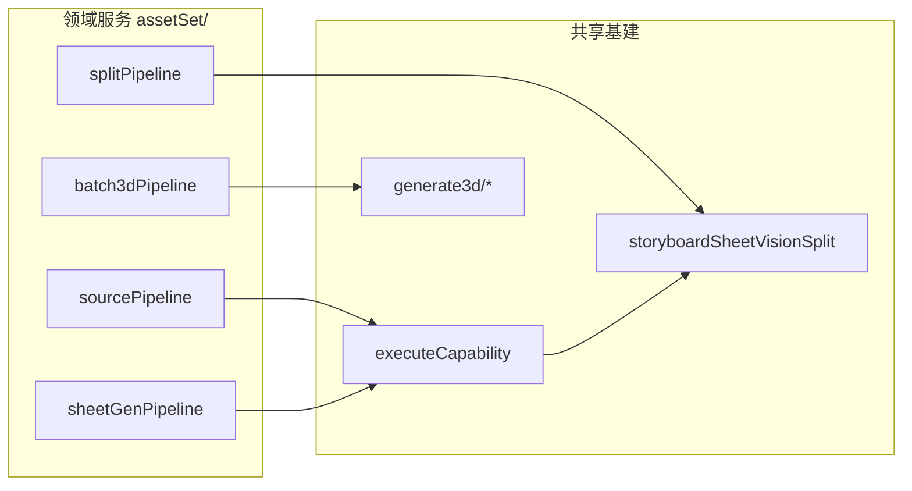

# 资产集 · 开发规格

**版本**：v0.2（架构修订，2026-07-01）  
**状态**：规划 / 待实现  
**定位**：工作区容器资产 `asset_set` — 从原画到组件 3D 的拆解流水线；**交互与分镜表同族，领域与数据模型独立**。

**关联文档**

| 文档 / 模块 | 关系 |
|-------------|------|
| [`docs/分镜表-P0.md`](./分镜表-P0.md) | 容器资产、全屏面板、画板多选交互范式 |
| [`docs/分镜表-结构化解析.md`](./分镜表-结构化解析.md) | ADR / 真源·派生 / 阶段边界写法参考 |
| `services/storyboardTableAsset.ts` | 容器 normalize / 工厂模式参考 |
| `services/storyboardSheetVisionSplit.ts` | 拼图识别与按框切图（**依赖，不 fork**） |
| `services/generate3d/tripoWorkflow.ts` | 3D 预设 → Tripo 入参 |

---

## 〇、架构摘要（30 秒）

```
WorkflowAsset (assetKind: asset_set)
  └── assetSet: AssetSetDoc
        ├── sourceAssets[]     L0 参考图条（真源：图 + 槽语义）
        ├── components[]       L1–L3 组件格（真源：bbox；派生：裁切 / 视角 / 模型）
        └── panelPrefs         表级预设 id、上次选择（云同步真源）
```

**流水线**：L0 准备 → L1 风格图框选 → L2 组件 multiview 出图 → L3 批量 3D。  
**首版刻意收窄**：L1 仅 `styled` 画布；L2 不喂资产级风格图；3D 不 spawn 独立工作区资产。

---

## 一、架构决策（ADR）

| # | 决策 | 理由 | 代价 / 后续 |
|---|------|------|-------------|
| **A1** | 新容器 `assetKind: 'asset_set'`，组件内嵌于 `assetSet.components[]` | 与分镜表、组卡、文字卡正交；避免「一行一子资产」爆炸 | 需在 bundle sanitize / hydrate / 网格渲染各加一分支 |
| **A2** | **一张卡 = 一次资产拆解**（场景/角色/道具） | 封面、统计、权限边界清晰 | 多资产批处理靠多张卡，不做表内多根 |
| **A3** | L0 `sourceAssets[]` 类比分镜 `roleAssets`：**名称 + 图**，默认三槽可增删 | 用户熟悉；不强制线性流水线 | 槽位靠 `slotKind` 解析，不靠显示名 |
| **A4** | L1 拆分画布**仅** `slotKind: 'styled'` | 首版降复杂度；框与出图风格一致 | 方案 C（multiview 视角上拆）延后 |
| **A5** | `cropRegion` 为组件空间真源；`cropPreview` 可自风格图 + bbox **再生成** | 风格图替换时可重算裁切，不必双写逻辑 | 风格图变更需定义是否提示「重算裁切」 |
| **A6** | L2 输入**仅** `cropPreview` + 能力预设 instruction；**不**拼接资产级风格图 | 提示词即契约；减少多图参考链路过长 | 质量调优靠换预设，不靠面板硬编码 prompt |
| **A7** | 组件 multiview：**一张拼图 → 切分 → `views[]`**；透视为其中一格 | 与分镜 sheet 链路一致，复用切分基建 | 依赖视觉切分准确度 |
| **A8** | 3D：`views.length === 1` → 单图预设；`>= 2` → 多视角预设 | 与 Tripo / 腾讯现有入参模型对齐 | 2 视角时多视角质量可能弱于 4 视角，由预设约束 |
| **A9** | 3D 结果**内嵌** `component.model3d` | 拆解上下文不丢；表卡即完整交付物 | GLB 体积计入 bundle / 伴侣存储策略需遵守现有分层 |
| **A10** | 组件**平铺**，无父子树 | 画板 / 批量 / 索引简单 | 复杂装备要拆成多张资产集卡 |
| **A11** | 异步任务状态：**表级 session + 组件格 patch 回填**（类比分镜 `storyboardSheetGenSession`） | 关面板再开可恢复 busy；避免 UI 单点持有任务 | 需定义 session 与持久化状态的边界 |
| **A12** | UI **编排**在 `AssetSetPanel`；**领域逻辑**在 `services/assetSet/*` | 防止 `WorkflowSection` 继续膨胀 | 画板 / 切分 modal 通过薄适配层复用分镜组件 |

---

## 二、边界（本阶段不做）

| 类别 | 不做 |
|------|------|
| 拆分 | 资产级 multiview 某一视角上框选（方案 C） |
| 结构 | 组件组 / 子组件；组资产 + 子图卡 |
| 出图 | L2 参考资产级 `styled` / `multiview` 作 img2img 附加输入 |
| 出模 | 3D 完成后 spawn 为独立 `WorkflowAsset` |
| 自动化 | 侧栏一键跑通 L0→L3；无「资产集流程」全自动 |
| 数据 | 跨项目组件模板库；组件版本历史（可 P2+） |

---

## 三、核心概念与真源

### 3.1 概念关系

```
sourceAssets（L0 参考图条）
    │
    ├─ slotKind: original  ──► 转风格能力 ──► styled
    ├─ slotKind: styled    ──► L1 框选真源画布
    └─ slotKind: multiview ──► 资产级 turnaround（不参与 L2）

components[]（平铺组件格）
    │
    ├─ cropRegion (真源) ──► deriveCropPreview(styled, region)
    ├─ multiviewSheet    ──► visionSplit ──► views[] (真源：切分结果)
    └─ views[]           ──► route3dPreset ──► model3d (产出物)
```

### 3.2 真源 / 派生 / 产出物

| 字段 | 性质 | 说明 |
|------|------|------|
| `sourceAssets[].image*` | 真源 | L0 配图 |
| `components[].cropRegion` | 真源 | L1 框选；坐标系 0–1000，与 `BoundingBox` 同型 |
| `components[].cropPreview*` | 派生 | 可由 `styled` + `cropRegion` 重算；持久化仅为 hydrate 性能 |
| `components[].multiviewSheet*` | 中间产物 | L2 生图结果；可保留供重切分 |
| `components[].views[]` | 真源（切分后） | L3 路由依据；`role` 映射 multiview 槽位 |
| `components[].model3d` | 产出物 | 异步任务回填；失败可重试 |
| `panelPrefs.*PresetId` | 表级真源 | 云同步；`localStorage` 仅新建默认值 |

### 3.3 不变量（实现必须遵守）

1. **补丁入口单一**：所有写 `components[]` / `sourceAssets[]` 经 `patchAssetSetDoc`（或同级 `applyAssetSetPatch`），禁止 UI 直接 mutate 嵌套对象。
2. **槽位解析**：读写 `styled` / `original` / `multiview` 只认 `slotKind`，不认 `name`。
3. **锁定跳过**：`locked === true` 的组件不参与 L2 / L3 批量；L1 可配置是否允许改 bbox（首版：锁定后不可批量出图，可改名的中栏编辑）。
4. **无风格图不拆分**：`resolveStyledSourceAsset()` 无图时，L1 入口 disabled + 明确文案。
5. **跨设备 URL**：持久化仅存相对路径 / `*ObjectKey` / `*CompanionKey`；渲染时 resolve，遵守 `cross-device-availability` 规则。
6. **3D 路由纯函数**：`pickAssetSet3dPreset(views, singlePreset, multiPreset)` 可单测，禁止散落在 UI。

---

## 四、领域模型

### 4.1 类型（`types.ts`）

```ts
export type AssetSetCategory = 'scene' | 'character' | 'prop';

export type AssetSetSourceSlotKind =
  | 'original'
  | 'styled'
  | 'multiview'
  | 'custom';

export type AssetSetSourceAsset = {
  id: string;
  name: string;
  slotKind?: AssetSetSourceSlotKind;
  image?: string;
  imageCompanionKey?: string;
  imageObjectKey?: string;
};

export type AssetSetComponentViewRole =
  | 'perspective'
  | 'front'
  | 'back'
  | 'left'
  | 'right'
  | string; // 扩展视角时兼容，映射层处理未知 role

export type AssetSetComponentView = {
  id: string;
  role: AssetSetComponentViewRole;
  image?: string;
  imageCompanionKey?: string;
  imageObjectKey?: string;
};

export type AssetSetComponentModel3d = {
  status: 'idle' | 'queued' | 'running' | 'done' | 'failed';
  jobId?: string;
  provider?: 'tripo' | 'tencent' | string;
  error?: string;
  files?: string[];
  fileCompanionKeys?: string[];
  previewUrl?: string;
  updatedAt?: number;
};

export type AssetSetComponent = {
  id: string;
  index: number;
  name?: string;

  cropSource: 'styled'; // 首版字面量；扩展 C 方案时改为 union
  cropRegion: BoundingBox;

  cropPreview?: string;
  cropPreviewCompanionKey?: string;
  cropPreviewObjectKey?: string;

  multiviewSheet?: string;
  multiviewSheetCompanionKey?: string;
  multiviewSheetObjectKey?: string;

  views: AssetSetComponentView[];
  model3d?: AssetSetComponentModel3d;
  locked?: boolean;
};

/** 表级 UI / 能力偏好（云同步真源） */
export type AssetSetPanelPrefs = {
  stylePresetId?: string;
  assetMultiviewPresetId?: string;
  componentSheetPresetId?: string;
  single3dPresetId?: string;
  multi3dPresetId?: string;
};

export type AssetSetDoc = {
  title?: string;
  category: AssetSetCategory;
  sourceAssets: AssetSetSourceAsset[];
  components: AssetSetComponent[];
  panelPrefs?: AssetSetPanelPrefs;
};
```

`WorkflowAsset` 扩展：

```ts
assetKind?: 'image' | 'text' | 'storyboard_table' | 'asset_set';
assetSet?: AssetSetDoc;
```

### 4.2 默认创建载荷

新建资产集时 `createAssetSetAsset(input)` 注入：

| 字段 | 默认值 |
|------|--------|
| `category` | 用户选择或 `character` |
| `sourceAssets` | `[original←上传图, styled空, multiview空]` |
| `components` | `[]` |
| `panelPrefs` | 空；新建时从 scoped local 默认填入各 presetId |

### 4.3 组件出图契约（预设 instruction，非代码硬编码）

产品语义（写入默认 `componentSheetPreset` 的 instruction，用户可在能力商店覆盖）：

> 提取图片中框选的元素，保持结构不变，重新按网格排列，灰色背景。只保留框选的元素。

执行路径：`executeCapability(componentSheetPreset, cropPreview)` → `multiviewSheet` → `splitStoryboardSheetByVision`（或等价包装）→ `views[]`。

---

## 五、流水线（阶段职责）



| 阶段 | 服务入口（规划） | 输入 | 输出 | 失败策略 |
|------|------------------|------|------|----------|
| **L0** | `runAssetSetStyleTransfer` / `runAssetSetAssetMultiview` | `sourceAssets` 中指定槽 | 写回 `styled` / `multiview` | toast；槽位 busy 态 |
| **L1** | `confirmAssetSetSplit(boxes)` | `styled` 图 + bbox[] | `components[]` 全量或增量 | 无框确认 disabled |
| **L2** | `runAssetSetComponentSheetBatch(componentIds)` | 各格 `cropPreview` | `multiviewSheet` + `views[]` | 单格失败不阻塞其余；汇总报告 |
| **L3** | `runAssetSetBatch3d(componentIds)` | 各格 `views[]` | `model3d` | 按格重试；锁定跳过 |

**L0 自由度**：步骤顺序任意；**L1 硬依赖** `styled` 有图。资产级 `multiview` 首版仅为参考图条展示与后续 C 方案预留，**不进入 L2 参考链**。

---

## 六、UI 架构

### 6.1 分层

```
WorkflowSection          入口：新建 / 网格卡 / openPanel(assetId)
    └── AssetSetPanel    状态编排、session 订阅、patch 回调
            ├── AssetSetSourceStrip      L0（可抽 shared/NamedImageStrip）
            ├── AssetSetCanvasGrid       L1–L3 多选（适配 StoryboardEditCanvasGrid）
            ├── AssetSetComponentEditor  中栏单格详情
            └── AssetSetPreviewRail      右栏：风格图 / sheet / 3D
```

**原则**：Panel 不直接调用 Gemini / Tripo；只调 `services/assetSet/*`。

### 6.2 工作区表卡 `AssetSetGridCard`

| 元素 | 规则 |
|------|------|
| 角标 | 资产集 + `category` 中文 |
| 封面 | 优先 `components[].cropPreview` 前 4 张；不足用 `styled` / `original` |
| 摘要 | `computeAssetSetStats(doc)` → `N 组件 · M 已出图 · K 已出模` |

### 6.3 全屏面板布局

与分镜表同族三栏 + 顶栏参考图条：

| 区域 | 职责 |
|------|------|
| 顶栏 | 标题、类型、统计、预设下拉、关闭 |
| 左 | 大纲 + 画板网格 + 多选批量条 |
| 中 | 当前组件：名、crop、views、model3d |
| 右 | 风格图（进 L1 modal）、组件 sheet、3D 预览 |

画板交互：**单击激活、框选多选、Shift/Ctrl 增减** — 与分镜一致，降低学习成本。

### 6.4 分镜复用策略（避免耦合腐烂）

| 分镜模块 | 资产集用法 | 推荐 |
|----------|------------|------|
| `StoryboardSheetSplitAdjustModal` | L1 / L2 切分 | **直接复用**；入参 `expectedLabels` 改为组件序号 |
| `useStoryboardCanvasMarqueeSelect` | 画板多选 | P0 可复用 hook；数据适配层 `AssetSetCanvasGrid` |
| `StoryboardEditCanvasGrid` | 格子渲染 | P0 后评估抽 `shared/CanvasTileGrid` |
| `StoryboardRoleAssetStrip` | 参考图条 | 抽 `shared/NamedImageAssetStrip`（分镜 / 资产集共用） |
| `storyboardSheetVisionSplit` | 切分 | **服务层复用**，资产集不 copy |

**禁止**：在 `storyboard/*` 内 import `asset-set/*`（依赖单向：资产集 → 分镜/共享）。

---

## 七、异步任务与 Session

类比分镜 `storyboardSheetGenSession`：

```ts
// services/assetSet/assetSetTaskSession.ts（规划）
type AssetSetTaskSession = {
  kind: 'component_sheet' | 'batch_3d';
  busy: boolean;
  progress?: { done: number; total: number };
  busyComponentIds: Set<string>;
  controller?: AbortController;
};
```

| 规则 | 说明 |
|------|------|
| Session 键 | `assetId` |
| 持久化 | **仅**结果写回 `AssetSetDoc`；session 本身内存 |
| 面板重开 | 从 doc 读 `model3d.status` + 订阅 session 恢复 busy UI |
| 取消 | L2 可 abort 未发出的批；已提交 3D 按供应商 cancel 能力处理 |

---

## 八、持久化与基建清单

实现 `asset_set` 时须同步触碰（与 `storyboard_table` 同 checklist）：

| 触点 | 动作 |
|------|------|
| `types.ts` | `AssetSetDoc` + `WorkflowAsset.assetKind` |
| `services/assetSetAsset.ts` | `create` / `normalize` / `isWorkflowAssetSetAsset` / stats |
| bundle export sanitize | 剥离行内 data URL，保留 keys |
| hydrate | companion / R2 填回显示用 URL |
| `WorkflowSection` | 新建、渲染分支、`openAssetSetPanel` |
| 归档 / 仓库 | 整卡跟随现有 `archived` / `inRepository` |
| 用量审计 | L2 / L3 写 `assetId` + `componentId` 到 usage / task events（对齐工作流） |

---

## 九、非功能需求

| 项 | 要求 |
|----|------|
| 性能 | 画板 50 格内虚拟滚动可选；大图压缩后入 doc（类比分镜 `storyboardFrameImage`） |
| 存储 | 单组件 multiview + 3D 遵守伴侣 / R2 分层；避免巨型 data URL 常驻 JSON |
| 可观测 | 任务日志带 `assetSetId` / `componentId`；失败 message 可展示在格内 |
| 只读 | `readOnly` 面板禁用 L1–L3 写操作（与分镜对齐） |
| 测试 | 纯函数：`normalize`、`pick3dPreset`、`deriveCropPreview`、`computeStats`；pipeline 用 mock capability |

---

## 十、风险与缓解

| 风险 | 影响 | 缓解 |
|------|------|------|
| 风格图更新后 bbox 错位 | 裁切与视觉不符 | A5：支持「重算裁切」；大幅换图时提示确认 |
| 分镜 UI 强耦合 | 资产集改动牵动分镜回归 | A12 + §6.4 单向依赖；共享组件抽到 `components/shared/` |
| 切分框爆炸 / 漏切 | L2 views 不完整 | 复用分镜错题本策略：layoutGrid 顺序回填、手调 modal |
| 3D 内嵌撑大 bundle | 同步慢 | 模型走 companion key；doc 只存键与 URL |
| 批量 3D 计费 | 用户误触 | 批量前确认 N 格；锁定与 eligibility 计数展示 |
| `views.role` 与 Tripo 槽位不一致 | 提交失败 | 集中 `mapViewsToTripoMultiview(views)` 单测 |

---

## 十一、分阶段交付

依赖关系：**P0 → P1 → P2 → P3**（P1 与 P0 参考图条可部分并行，但 L1 不依赖 P1 能力）。

### P0 — 容器与 L1 骨架

- [ ] 类型 + `assetSetAsset.ts`（create / normalize / stats / slot 解析）
- [ ] `AssetSetGridCard` + `WorkflowSection` 入口
- [ ] `AssetSetPanel` 三栏骨架 + 参考图条三默认槽
- [ ] L1：`StoryboardSheetSplitAdjustModal` 适配 → `components[]` + `deriveCropPreview`
- [ ] 画板展示 + 单选（多选可 P2 前只做单选）
- [ ] bundle sanitize / hydrate + `tests/assetSetAsset.test.ts`

**P0 验收**：能建卡、上传原画到 `original`、有 `styled` 时可框选并生成平铺格。

### P1 — L0 能力

- [ ] `panelPrefs.stylePresetId` + 转风格写回 `styled`
- [ ] 资产级 multiview 预设 + 写回 `multiview` 槽
- [ ] 参考图条增删改名

### P2 — L2 组件出图

- [ ] 画板多选 + `assetSetTaskSession`（sheet 批）
- [ ] `runAssetSetComponentSheetBatch` + 切分 → `views[]`
- [ ] 默认 instruction 种子预设（`asset_set_component_sheet_*`）
- [ ] 格内 busy / 进度 / 完成度

### P3 — L3 批量 3D

- [ ] `pickAssetSet3dPreset` + 双预设下拉
- [ ] `runAssetSetBatch3d` → 内嵌 `model3d`
- [ ] 格内预览 / 失败重试 / 锁定跳过

### 后续

- L1 方案 C（multiview 视角画布）
- `category` → 默认布局与预设包
- `components[].history` 版本栈
- 抽 shared 画板 / 参考图条组件

---

## 十二、模块目录（目标态）

```
services/assetSet/
  assetSetAsset.ts           # create, normalize, patch, stats, slot resolvers
  assetSetCrop.ts            # deriveCropPreview, applySplitBoxes
  assetSetSourcePipeline.ts  # L0 style / asset multiview
  assetSetSheetPipeline.ts   # L2 batch sheet + split wrap
  assetSetBatch3d.ts         # L3 route + submit + poll回填
  assetSetTaskSession.ts     # in-flight UI session
  assetSetImage.ts           # compress / persist helpers

components/asset-set/
  AssetSetPanel.tsx
  AssetSetGridCard.tsx
  AssetSetCanvasGrid.tsx
  AssetSetSourceStrip.tsx
  AssetSetComponentEditor.tsx
  AssetSetPreviewRail.tsx
  assetSetPanelUi.ts         # 样式常量，对齐 storyboardTableUi

tests/
  assetSetAsset.test.ts
  assetSetBatch3d.test.ts
  assetSetCrop.test.ts
```

---

## 十三、验收标准（发布门禁）

1. 工作区单卡容器；打开全屏面板；Esc 关闭。
2. `sourceAssets` 含默认三槽；可增删自定义项；槽位按 `slotKind` 读写。
3. 仅 `styled` 有图时可拆分；确认后 `components.length === boxes.length`。
4. L2 多选生成 multiview 并切出 `views`（含 `perspective` 或等价 role）。
5. L3 按 `views.length` 路由 3D；结果仅存在于 `component.model3d`。
6. 刷新 / 换设备后结构仍在；无写死 localhost。
7. 分镜相关测试无回归；新增 assetSet 单测通过。

---

## 十四、决策日志

| 日期 | 条目 |
|------|------|
| 2026-07-01 | v0.1 产品共识：平铺组件、风格图拆分、L0 自由顺序、3D 内嵌 |
| 2026-07-01 | v0.2 架构修订：ADR、真源/派生、服务分层、session、风险、模块目录 |
