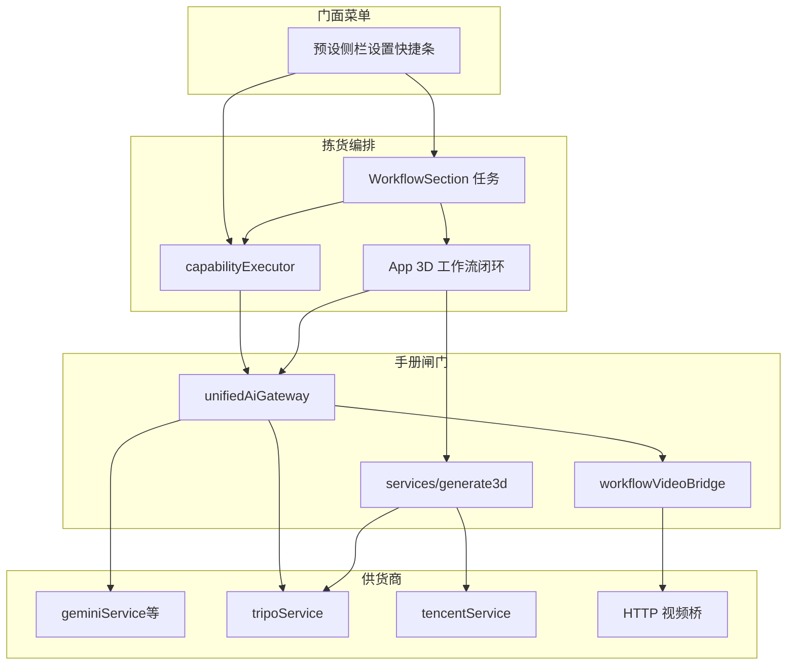
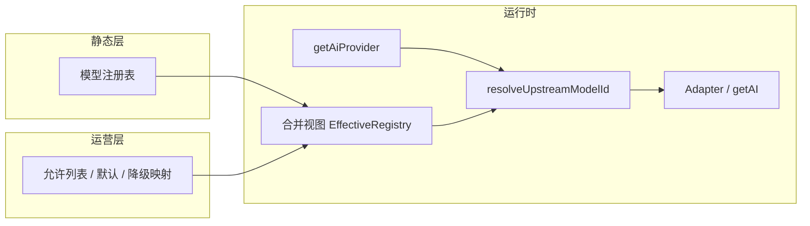

# 多模型 · 可运营改造计划

**目标读者**：后续开发、产品、运营、后端。  
**状态**：**阶段 1～3 已落地**（注册表、解析、UI 合并运营策略、可选远端 `VITE_MODEL_OPS_CONFIG_URL`、`**[model-registry]`** 日志）。**阶段 4** 已部分落地（如 OpenAI 官方适配）。**站点统一大模型网关**（`services/unifiedAiGateway.ts`，§3.6）已落地：全站业务经此 import；**生视频**在网关中经 `workflowGenerateVideo` 统一出口，当前默认走 **HTTP 桥**（`VITE_WORKFLOW_VIDEO_API_URL`），且已接入工作流 `**generate_video`** 能力与结果落盘（见 §3.6 表后「工作流侧」）。

---

## 执行摘要（1 分钟版）

1. **先把「模型是谁、在各渠道叫什么」收敛到注册表 + 单一解析函数**，消除 `types.ts` / `App.tsx` / `geminiService` / `toapisAdapter` 多处字符串与重复映射。
2. **再用「能力标签 + 运营允许列表」驱动 UI 与默认项**，实现上下架、分档、降级尽量不发版。
3. **适配器分层最后做**：在 Gemini 兼容路径仍占主导时，优先 id 与元数据统一；非 Gemini 协议再引入窄接口，避免过早抽象。
4. **全站**：五种活儿（聊天、生图、带图改图、生 3D、生视频）及贴图/擂台/站点助手等 **一律经 `unifiedAiGateway` import**，再委托 `geminiService` / Tripo；新供应商优先扩网关而非散点改 UI。
5. **分层原则**（本节 **§1.4**）：「供货商 → 供应商工作手册 → 菜单 / 拣货」。旧独立宪章 `架构宪章-店仓菜单.md` 已归档，原则以下文为准。「仓库」只指大楼货仓（见 `docs/架构宪章-本地壳大楼租户.md`），不指本层。

---

## 验收标准

本节为**验收的权威汇总**；§4 各阶段文末仅作交叉引用。评审 PR、阶段结项或对外演示时，以本节为准。

### 项目级验收（多模型 + 可运营整体达成）

全部计划阶段（含贵司决定实施的阶段 3～4）完成后，应同时满足：


| 维度              | 验收表述（大白话）                                                             | 可验证证据                                                                    |
| --------------- | --------------------------------------------------------------------- | ------------------------------------------------------------------------ |
| **多模型**         | 新增/调整一个已接入渠道的模型，主要改**注册表（及该渠道绑定）**，不在业务组件里复制一串上游 model id             | Code review：新模型未在 `App.tsx`/各 Section 硬编码上游 id；注册表有完整 `providerBindings` |
| **单一解析**        | 同一 `registryId` + 渠道 → **唯一**上游 id；不存在「先 resolve 再 adapter 又改一次」的双重映射 | 单测或静态审查：`resolve` 与 `toapisAdapter` 等职责边界文档化且无重复改写                       |
| **可运营**（阶段 3 起） | 不下发新前端包（或仅后端/配置变更）即可：**下架**某模型、**改默认**、**启用降级**                       | 运维/产品在预发改配置后复测；日志可见 `[model-registry]` 命中降级或禁用原因                         |
| **兼容与恢复**       | 老用户本地/云端里存的旧 model 字符串仍能**自动迁移或安全回退**，不白屏、不静默用错模型                     | 用旧 `localStorage` 快照或备份配置启动；期望有迁移或 fallback + 日志                         |
| **体验**          | 用户可见的模型列表与当前**渠道 + 运营策略**一致；不可用项有原因（隐藏或禁用提示）                          | 切换 `AiProvider` 手测；边界：某渠道无绑定的 `registryId` 不得出现在可选列表                     |
| **工程纪律**        | `npm run typecheck` 通过；模型相关下拉**不使用原生 `<select>`**                     | CI 与 UI 规范 checklist                                                     |


以下「分阶段验收」未达标前，不强行宣称「项目级验收」已全部满足（例如仅做完阶段 1～2 时，「可运营」整行可标为 **不适用 / 待阶段 3**）。

### 分阶段验收清单


#### 阶段 0：规范与清单

**填表模版**（可直接复制到 PR / issue）：`[docs/archived/phase0-model-inventory-template.md](archived/phase0-model-inventory-template.md)`。


| #   | 验收项                                                                                                  | 怎么验                                                      |
| --- | ---------------------------------------------------------------------------------------------------- | -------------------------------------------------------- |
| 0.1 | 已冻结 `registryId` 策略（§3.2 A 或 B）并有书面记录（本文修订记录或 ADR）                                                   | 文档可读                                                     |
| 0.2 | 全站 model 引用盘点完成，**无 obvious 漏项**（重点：`geminiService`、`capabilityExecutor`、hooks、`types.ts`、`App.tsx`） | 盘点列表存档（可附 PR / issue）；可用模版 §0.2                          |
| 0.3 | §3.3 能力矩阵表已填全，且与产品确认「每个场景用哪个槽位」                                                                      | 表内无空白行或已标注「不适用」；见 `docs/archived/model-capability-matrix.md` |
| 0.4 | 各 `AiProvider` 与注册表差异有说明（哪些 registryId 在某渠道为 `null`）                                                 | 文档或注册表注释                                                 |


**通过门槛**：新同学仅看盘点与矩阵，能在 **30 分钟内**说清「加一个 Gemini 生图模型要动哪里、不该动哪里」。


#### 阶段 1：注册表与解析集中化


| #   | 验收项                                                          | 怎么验                   |
| --- | ------------------------------------------------------------ | --------------------- |
| 1.1 | `npm run typecheck` 通过                                       | CI 或本地命令输出            |
| 1.2 | 注册表为模型元数据**唯一来源**；`DIALOG_IMAGE_`* 等与注册表**一致**（推导或单测锁定）      | 单测或脚本断言               |
| 1.3 | **仅**改注册表 + provider 绑定（+ 阶段 3 前的「全量允许」若有）即可让新模型进入**类型合法**集合 | 桌面演练：加一条假模型走完整类型与解析   |
| 1.4 | 至少一条 **纯文本**、一条 **生图** 主路径烟测通过（如设置/工作区快捷生图/纹理任选）             | 手测记录或 E2E             |
| 1.5 | 旧配置 migrate / fallback 行为明确且无静默失败                            | 旧字符串回归用例或手测           |
| 1.6 | 双重映射风险已排除或有测试覆盖                                              | Code review + §5 单元测试 |


**通过门槛**：阶段 1 合并后，团队共识为「以后改上游 id 只认解析模块」。


#### 阶段 2：UI 与持久化


| #   | 验收项                                                          | 怎么验                |
| --- | ------------------------------------------------------------ | ------------------ |
| 2.1 | 所有模型相关下拉选项来自**合并后的数据源**（注册表 ∩ 渠道绑定 ∩ 运营允许；阶段 3 前允许允许列表 = 全量） | Code review        |
| 2.2 | 切换 `getAiProvider()` 后，选项与默认值**合法**（不出现当前渠道无绑定的模型）           | 手测各 provider       |
| 2.3 | 持久化与云同步存 `**registryId`**（或与策略 A 一致的稳定字段），跨设备与刷新后仍一致         | 两台设备或清缓存场景         |
| 2.4 | **无**新增原生 `<select>` 用于模型选择                                  | `rg "<select"` 或审查 |


**通过门槛**：产品与研发共同签字「设置 + 主生图入口」行为符合预期。


#### 阶段 3：运营配置


| #   | 验收项                                                       | 怎么验                     |
| --- | --------------------------------------------------------- | ----------------------- |
| 3.1 | **不发布新前端**（或约定范围内不动前端包）即可：隐藏/下架某 `registryId`、改默认模型、启用降级链 | 预发改配置 → 客户端拉取后复测        |
| 3.2 | 配置非法时有 **fallback**（不全站不可用），且打 `[model-registry]` 可检索日志   | 故意下发空 allowlist / 错误版本号 |
| 3.3 | 配置带 **version / etag**（或等价机制），客户端缓存行为可说明                  | 文档 1 页 + 一次抓包或日志        |


**通过门槛**：运营能在 Runbook 上按步骤完成一次「紧急下架模型」，无需前端同学发版。


#### 阶段 4（可选）：非 Gemini 适配器


| #   | 验收项                              | 怎么验    |
| --- | -------------------------------- | ------ |
| 4.1 | 至少一个**最小功能**走新适配器端到端             | 指定功能烟测 |
| 4.2 | Gemini 主路径**回归**通过（文本 + 生图各至少一条） | 回归列表打勾 |


### PR / 阶段合并门禁（建议强制执行）

- `npm run typecheck` 通过（若仓库已有 `npm test` / lint，与阶段 1+ 一并纳入 CI）。
- 涉及 `resolve` 逻辑的改动：**新增或更新**单测快照（各 provider × 典型 `registryId`）。
- UI：模型选择不得使用原生 `<select>`（`.cursor/rules/dropdown-ui-style.mdc`）。
- 若当阶段宣称「可运营」：必须附带**配置变更 Runbook** 片段（改哪份 JSON/接口、如何回滚）。

---

## 1. 背景与目标

### 1.1 业务目标

- **多模型**：对话理解、生图、纹理、工作流能力执行、擂台等场景可切换不同厂商/规格，新增模型主要改配置与注册项，而非全站搜字符串。
- **可运营**：上下架、套餐可见性、默认模型、灰度、紧急降级由配置或后台驱动；关键操作可审计；用量与计费与现有策略对齐（注册表可提供 `billingSku` 等外挂字段，见 §6）。

### 1.2 技术目标


| 原则    | 含义                                                    |
| ----- | ----------------------------------------------------- |
| 单一真相源 | 模型元数据只在一处定义；持久化用稳定 `registryId`。                      |
| 解析单路径 | 上游 id 只经由统一解析入口，避免 `resolveUpstream`* 与网关适配器**双重改写**。 |
| 适配器隔离 | 协议差异不进业务组件；业务依赖「能力 + registryId」，不依赖厂商 URL 形状。        |
| 渐进迁移  | 分阶段合并，每阶段可回滚；旧 `localStorage` 配置兼容迁移。                 |


### 1.3 非目标（可明确延后）

- 自研统一推理网关（除非基础设施已就绪）。
- 全站统一「流式 + 工具调用 + 多步 Agent」抽象（待主路径稳定后再评估）。
- 强行把腾讯混元 3D 等管线改成与 Gemini 相同请求形状；**优先**在注册表或运营层做「可见性/默认能力」挂接，协议仍走独立 `service`。

### 1.4 供应商工作手册：原则、货架地图与待办

本节是全站 AI 分层的评审真源（旧 `docs/架构宪章-店仓菜单.md` 已归档）。与 §8 backlog 互补：本节偏**边界与完整性**，§8 偏执行优先级。壳里谁开门见 `docs/架构宪章-本地壳大楼租户.md`。「仓库」只指大楼货仓。

#### 1.4.0 比喻、原则与非目标

| 比喻 | 含义 |
| --- | --- |
| **供货商** | 外部能力来源（如 Gemini/OpenAI、Tripo、腾讯混元、生视频 HTTP 桥等）。只认**合同**（鉴权、请求/响应、错误、计费/配额），不认本站 UI。在大楼里对应作坊办公室工位背后的总部。 |
| **供应商工作手册** | 站内**适配与契约**：把「顾客点的抽象能力」翻译成「某供货商听得懂的调用」。按**货物大类**分区（文、图、视频、3D…），**不按公司名**当唯一分区维度。旧称本层为「仓库」。 |
| **门面 / 菜单** | 用户可见的**能力与参数**（预设、侧栏、设置、快捷条等），以及**运营上下架**（可见性、默认项）。 |
| **点单 / 拣货** | 从「用户动作」到「按工作手册某区办事」的**编排**：读单、选区、调适配、把结果写入大楼**仓库**或交回界面。 |

必须遵守：

1. **依赖方向（单向）**  
   **菜单 / 页面 → 编排（拣货）→ 工作手册分区 → 供货商**。禁止业务 UI、随意 `hook` **直连**厂商客户端或写死可换供应商的 URL（站内同源 API、静态资源等按既有规范除外）。
2. **新货物大类 = 新手册分区契约 + 菜单扩展**  
   新增一类产出（如新模态）时：先定**输入/输出与同步模型**（一次返回 / 轮询 / 回调），再扩展**类型与 UI**；**不**把异构契约硬塞进已有分区的可选字段里凑合。
3. **编排与适配分离**  
   「客户点了什么」应落成稳定的**任务/意图**；**按哪本手册分区、选哪家供货商**由编排或注册的分发逻辑决定，避免在多个按钮里复制 `if (A厂) else (B厂)`。
4. **可运营**  
   「今天卖什么、默认卖什么」宜尽量走**配置或运营下发**；契约与默认值宜有**单点维护**，避免同一政策散落在多处字符串。
5. **允许多道闸门，禁止无纪律绕路**  
   可以存在多个**明确的**统一出口（例如大模型网关、3D 任务适配目录、视频桥），等价于工作手册里多个**受控工位入口**；**禁止**为图省事新增「消防梯」式直连实现层（与 ESLint / 团队约定对齐）。

刻意不作为目标：

- **不要求**整个站只有一个物理文件或一个「上帝类」承担所有供货商。
- **不要求**文、图、视频、3D **共用同一张**模型注册表或同一套字段；可**分表/分注册** + 统一「编排入口」即可。
- **不要求**字面意义上「只有一个拣货员类」；要求的是**调用链清晰、边界稳定**。

与当前代码的粗略映射（演进中，非权威）：

| 层次 | 现状参考（会随重构变化） |
| --- | --- |
| 供货商侧 | `geminiService`、`tripoService`、`tencentService`、`workflowVideoBridge` 等 |
| 手册闸门 | `services/unifiedAiGateway.ts`、`services/generate3d/`、视频桥接配置等 |
| 菜单 | 能力预设、工作流侧栏、`SystemConfig` / 运营 JSON、各 `AppMode` 区块 |
| 拣货编排 | `capabilityExecutor`、`WorkflowSection` 任务执行、`App` 中与强状态绑定的闭环等 |

新增或调整能力时：**先对照本节原则**，再改具体路径；若原则与实现冲突，**优先更新实现或显式记录例外**。

#### 1.4.1 原则 × 现状 × 待办（优先级）


| 原则要点                   | 现状（简述）                                                        | 待办                                                                      | 优先级 |
| ---------------------- | ------------------------------------------------------------- | ----------------------------------------------------------------------- | --- |
| **依赖单向**（菜单→拣货→闸门→供货商） | ESLint + `unifiedAiGateway` 已约束文/图侧；3D 有 `generate3d/` 例外目录   | 新增路径时同步更新 `**services/workflowAiPickIndex.ts`**；禁止在无例外目录直连实现层           | P0  |
| **新模态=新货架契约+菜单**       | `generate_video` / `generate_3d` 已有独立契约与 UI                   | 新模态 PR 必须带：类型字段 + 预设/侧栏 + 矩阵表一行（`docs/archived/model-capability-matrix.md`） | P0  |
| **编排与适配分离**            | `capabilityExecutor` + `WorkflowSection` + `App`（3D 伴侣闭环）多段串联 | **短期**：依赖图与本节路径索引；**中期**：收敛「工作流执行任务」单入口或抽薄编排层（见 §8）                     | P1  |
| **可运营**                | 文/图/档位：`VITE_MODEL_OPS_CONFIG_URL`；视频：环境变量桥；3D：代码 registry    | 视频/3D 是否接**轻量运营 JSON** 或与文图**同权威源**：产品拍板后补 Runbook 与合并逻辑                | P1  |
| **多闸门、禁绕路**            | 网关 + `generate3d/` + 视频桥                                      | PR 评审对照 §1.4.0；例外须在 PR 描述写明                                               | P0  |


#### 1.4.2 货物大类 → 手册闸门 → 运营/配置手段


| 货物大类             | 主要手册闸门（代码）                                                                                                 | 运营/配置手段（当前）                                                              | 备注                                   |
| ---------------- | ---------------------------------------------------------------------------------------------------------- | ------------------------------------------------------------------------ | ------------------------------------ |
| **文**（对话/理解/标签等） | `unifiedAiGateway` → `geminiService` 等                                                                     | `SystemConfig.modelText` + 注册表解析；可选运营 JSON 影响**生图档位**联动                  | 文本模型 id 与 `modelRegistry` 对齐         |
| **图**（生图/改图/多参考） | 同上                                                                                                         | 同上 + `merge.ts` 合并运营允许列表                                                 | 挡位与 `maxReferenceImagesForImageGear` |
| **视频**           | `unifiedAiGateway.workflowGenerateVideo` → `workflowVideoBridge`                                           | 构建变量 `**VITE_WORKFLOW_VIDEO_API_URL`**（尚无与 `model-ops` 同源 JSON）          | 多供应商、异步形态见 §8                        |
| **3D**           | `unifiedAiGateway` re-export；执行编排 `**services/generate3d/`**；Tripo 直连 `tripoService` 仅允许在网关与 `generate3d/` | 腾讯凭据 env/页面；**无**与文图同一套 ops JSON；`**GENERATE3D_PROVIDER_REGISTRY`** 代码登记 | 运营开关策略见 §1.4.1                       |
| **贴图/擂台/站点助手等**  | 经 `unifiedAiGateway`                                                                                       | 随文/图默认与渠道                                                                | 见 §3.6                               |


#### 1.4.3 工作流拣货路径（依赖方向）

下列为**推荐数据流**（非运行时强制）。详细键值见 `**services/workflowAiPickIndex.ts`**（含 `**WORKFLOW_SECTION_RUN_TASK_BRANCHES**` 与 `WorkflowSection.runTask` 判定顺序；便于检索与 Code Review）。




#### 1.4.4 PR 自检清单（涉及新供货商 / 新模态 / 新闸门时）

- 已读本文 **§1.4.0** 五条原则。
- 已更新 `**services/workflowAiPickIndex.ts**`（若新增或变更用户可达的调用链；`**WorkflowSection.runTask**` 分支/顺序变化时须同步 `**WORKFLOW_SECTION_RUN_TASK_BRANCHES**`）。
- 已更新 `**docs/archived/model-capability-matrix.md**`（若涉及新场景或新槽位）。
- 未在无 `eslint` 豁免路径下新增 `geminiService` / `tripoService` / `tencentService` 直连 import。
- 若动运营行为：已对照 `**docs/model-ops-runbook.md**` 或注明「仅 env / 仅代码」例外。

---

## 2. 现状基线（与代码的耦合点）

实施前应用 `git`/搜索再核对一次；下表为规划时的典型入口。


| 区域     | 路径                                 | 现状                                                                                   | 扩展时的典型痛点                   |
| ------ | ---------------------------------- | ------------------------------------------------------------------------------------ | -------------------------- |
| 对话生图常量 | `types.ts`                         | `DIALOG_IMAGE_MODELS`、`DIALOG_IMAGE_GEARS`、`DIALOG_IMAGE_MODEL_MAX_REFERENCE_IMAGES` | 与解析逻辑、设置默认值易不同步            |
| 默认配置   | `App.tsx`                          | `SystemConfig` 默认 `modelText` / `modelImage` / `modelPro`                            | 与「可选列表」无类型关联               |
| 调用与映射  | `services/geminiService.ts`        | `getAI()`、`resolveUpstreamTextModelId`、`resolveUpstreamImageModelId`                 | 映射随网关增多而膨胀                 |
| 渠道与密钥  | `services/settingsStore.ts`        | `AiProvider`                                                                         | 「渠道」与「该渠道可用模型集」未绑定         |
| 网关适配   | `services/toapisAdapter.ts` 等      | 模型 id 特化                                                                             | 易与 `resolveUpstream`* 重复映射 |
| 能力执行   | `services/capabilityExecutor.ts` 等 | 直接或间接使用 `resolveUpstreamImageModelId`                                                | 散落调用点                      |
| 其它栈    | `services/tencentService.ts` 等     | 独立 API                                                                               | 运营「开关」需统一策略入口（§3.4）        |


---

## 3. 目标架构

### 3.1 分层与数据流




- **注册表**：「理论上能提供什么」。
- **运营配置**：「当前环境允许用户用什么、默认是谁、异常时替换成谁」。
- **合并视图**：UI 与解析只读合并结果，避免组件直接 if-else 运营规则。

### 3.2 模型注册表（Model Registry）

**职责**：描述站内模型条目；**不**发起网络请求。

建议字段（可按首版裁剪）：


| 字段                            | 说明                                                          |
| ----------------------------- | ----------------------------------------------------------- |
| `registryId`                  | 站内稳定 id：持久化、埋点、运营 JSON、用户配置均引用它                             |
| `displayName` / `description` | 展示与工具提示                                                     |
| `kind`                        | `text`                                                      |
| `capabilities`                | 能力标签集合，见 §3.3                                               |
| `limits`                      | 如 `maxReferenceImages`（替代散落的 `Partial<Record<modelId, n>>`） |
| `providerBindings`            | `Record<AiProvider, upstreamModelId                         |
| `tier` / `tags`               | 套餐、内测、区域（与运营侧过滤组合使用）                                        |
| `billingSku`                  | 可选，供计费系统外挂关联                                                |


`**registryId` 命名策略（建议二选一，团队冻结后不变）**：


| 策略                                                    | 优点                                | 缺点                 |
| ----------------------------------------------------- | --------------------------------- | ------------------ |
| **A. 过渡期沿用上游 id**（如 `gemini-3.1-flash-image-preview`） | 迁移成本最低，旧配置几乎可直接当 registryId       | 上游改名时站内 id 被迫跟或做迁移 |
| **B. 稳定内部 id**（如 `ac.image.standard`）                 | 运营与埋点稳定，上游变更只改 `providerBindings` | 需一次性迁移用户本地与云端配置    |


首版可采 **A**，在 §4 阶段 1 内预留 **B** 的别名或迁移表。

**硬约束**：业务模块禁止写死「上游厂商 model 字符串」；只持 `registryId`，由 `resolveUpstreamModelId(registryId, role, provider)` 解析（`role`: `text` | `image` 等，便于同一实体多角色若未来需要）。

### 3.3 能力矩阵（Capability → Requirements）

**职责**：功能点声明「需要的标签」，从合并后的注册表过滤出可选模型。

建议标签（可扩展，首版保持精简）：


| 标签          | 含义                                 |
| ----------- | ---------------------------------- |
| `text`      | 纯文本补全/理解                           |
| `vision`    | 多模态输入（图+文）                         |
| `image_out` | 图像输出                               |
| `json_mode` | 结构化 JSON 输出可靠                      |
| `max_refs`  | 与 `limits.maxReferenceImages` 联动校验 |


**功能 × 槽位（能力矩阵草稿表 — 阶段 0 填全）**：


| 功能 / 场景      | 配置槽位（示例）            | 建议必填能力                          |
| ------------ | ------------------- | ------------------------------- |
| 对话理解 / 标题    | `modelText`         | `text`，若带图则 +`vision`           |
| 对话生图 / 工作流生图 | `modelImage` / 挡位   | `image_out`，多参考图时校验 `max_refs`  |
| 高质量生图        | `modelPro`          | `image_out` + 运营定义的「pro」tag     |
| 纹理 / PBR     | `config.modelImage` | `image_out` + `vision`（依实现）     |
| 擂台提示词        | `modelText`         | `text` + `json_mode`（若强依赖 JSON） |


新增功能时：**只增加一行矩阵声明**，不复制模型下拉构建逻辑。

### 3.4 Provider 与适配器

- **阶段 A（与阶段 1～2 对齐）**：保留 `GeminiClientLike` + `getAI()`；注册表负责 **id 与 limits**；`resolveUpstream`* 合并为 **单一模块导出**，`toapisAdapter` 内映射只处理 ToAPIs 独有规则，且与统一解析的优先级写清（避免二次替换）。
- **阶段 B（阶段 4）**：引入 `TextAdapter` / `ImageAdapter`（或按请求类型划分）；`getAI()` 或后继入口根据 `registryId` 解析出 **adapter 类型 + 上游 id**。

### 3.5 运营与配置层（Ops Config）


| 能力  | 说明                                   |
| --- | ------------------------------------ |
| 可见性 | 按租户/套餐/用户分组的 `registryId` 允许集合       |
| 默认项 | 各场景默认 `registryId`；可支持 A/B（需实验 id）   |
| 降级  | `registryId` → 备用 `registryId` 或「关闭」 |
| 版本  | 配置 `version` + `etag`；客户端缓存失效规则      |


**权威源选项（与 §6 对齐后敲定）**：

1. **服务端下发**：`auth-api` 或 BFF 返回「允许列表 + 默认」—— 适合付费与防篡改。
2. **R2/静态 JSON + 签名或版本号**：适合轻量运营；前端合并。
3. **发版内置**：仅默认与紧急开关；上下架仍依赖发版。

**客户端展示原则**：下拉数据 = `注册表 ∩ 允许列表 ∩ 当前 provider 在 providerBindings 有非 null`。  
**UI 规范**：禁止使用原生 `<select>`，使用 `components/ui/CustomDropdown.tsx`（见 `.cursor/rules/dropdown-ui-style.mdc`）。

### 3.6 工作流统一 AI 网关（产品：「配电箱」）

**大白话**：网站里凡是「要叫大模型」的（对话、工作流、擂台、贴图、站点助手…），**先接到同一个总闸**（`unifiedAiGateway`），再由总闸去叫后面的电厂（Gemini/OpenAI/ToAPIs… 或 Tripo）。以后加新电厂，主要改总闸背后的接线，而不是每个页面各拉一根线。

**当前约定的五种活儿**（与工作流能力分类对齐；后续可增删改，但入口仍走网关）：


| 用户说法    | 网关中的职责（函数 / 委托）                                                                                                                   | 当前实现要点                                                                                                                                                                                                                          |
| ------- | --------------------------------------------------------------------------------------------------------------------------------- | ------------------------------------------------------------------------------------------------------------------------------------------------------------------------------------------------------------------------------- |
| 聊天      | `workflowChat` → `getDialogTextResponse`                                                                                          | 文生文、图生文等多模态出文字                                                                                                                                                                                                                  |
| 生图（纯字）  | `workflowGenerateImage(null, …)`                                                                                                  | 文生图                                                                                                                                                                                                                             |
| 带图改图    | `workflowGenerateImage` / `workflowGenerateImageMultiRefs`                                                                        | 单图或多参考图                                                                                                                                                                                                                         |
| 生 3D 模型 | Tripo：`createTripoTask` / `waitTripoTaskDone` / `getTripoTask`；腾讯混元：`startTencent3DProJob` 等（`**export \* from tencentService`**） | **一律**从 `**unifiedAiGateway`** import；**禁止**业务/hooks/components 直连 `**tripoService`** / `**tencentService`**（ESLint 与 Tripo 同门禁）                                                                                                |
| 生视频     | `workflowGenerateVideo`                                                                                                           | **HTTP 桥**：`**VITE_WORKFLOW_VIDEO_API_URL`** 非空时 POST `{ prompt, referenceImages? }`，解析 `videoUrl` / `url` / `videoDataUrl` / `videoBase64`；未配置则抛 `**WorkflowVideoNotAvailableError`**；实现 `**services/workflowVideoBridge.ts`** |


**工程路径**：`services/unifiedAiGateway.ts`。首版为**再导出 + 薄委托**；`App`、`WorkflowSection`、`useDialogGeneration`、擂台、贴图、`capabilityExecutor` 等均已改为经本文件导入，**禁止**在 `components` / `hooks` / 业务 `services` 中直接 `import geminiService`（实现与 `getAI` 仍留在 `geminiService`）。**生 3D（腾讯）与 Tripo 相同：`import tencentService` 仅允许在 `unifiedAiGateway.ts` / `tencentService.ts` 实现层及 `tests/tencentService.test.ts`。工作流能力执行的理解 / gen_text / 视觉检测**等与设置页 `**modelText`** 对齐：经 `**CapabilityExecuteContext.textModelRegistryId`**（由 `App` 注入 `config.modelText`）。可选排障：构建变量 `**VITE_DEBUG_UNIFIED_AI=1`** 时输出 `**[unified-ai]`** 耗时日志。

**工作流侧（`generate_video` 能力分类）**（与上表「生视频」同一后端出口，产品上单卡执行）：

- **类型与预设**：`types.ts` 中 `CAPABILITY_CATEGORIES` 含 `generate_video`；`WorkflowAsset.resultMeta[displayKey].mediaKind` 可为 `**'video'`**，供网格判断用 `**<video>`** 预览（`services/workflowImageDisplay.ts` 的 `workflowResultUsesVideoPreview`）。
- **执行**：`services/capabilityExecutor.ts` 对 `generate_video` 走内置路径，内部调用 `workflowGenerateVideo`；**能力集合**（`executeCapabilitySet`）内若某步产出视频会**显式失败**（需在单卡主区执行生视频）。
- **UI**：`WorkflowSection` 结果写入 `results` 时带 `mediaKind: 'video'`；`ProgressivePreviewImage` / `WorkflowGridImage` 的 `mediaVariant="video"`；底部 **快捷创作条** 与补全列表**排除** `generate_video`（与 `generate_3d` 一致）。能力预设编辑见 `CapabilityPresetSection.tsx`（理解开关、无宿主包/无 engine 等与生 3D 类似约定）。
- **拖放**：`services/workflowTextAsset.ts` — 根资产拖入 `generate_video` 需 **有图或有文**（`workflowAssetAllowedForCapabilityDrop`）；单测见 `tests/workflowTextAsset.test.ts`。
- **交接增量**：`docs/交接文档.md` 中有与本能力相关的一行摘要，可与本文对照。

**3D 任务适配（`services/generate3d/`）**：在 **Tripo / 腾讯** 之上增加窄封装（预设规范化、工作流 Tripo 提交与轮询、腾讯队列 `runTencentGenerate3dQueueItem`、`**GENERATE3D_PROVIDER_REGISTRY`** 登记表）。后续新增 3D 供应商：扩展 `**Generate3dProviderId`** 与 registry，新增适配文件并在队列/工作流处分发；**不必**并入生图 `registryId` 矩阵。

**演进**：在网关上增加日志标签（`WorkflowAiJobKind`）、限流、熔断或「同一活儿多供应商 fallback」时，业务侧接口名尽量保持稳定。

---

## 4. 分阶段实施计划

### 依赖关系

```text
阶段 0（清单） → 阶段 1（注册表+解析） → 阶段 2（UI/持久化）
                                      ↘ 阶段 3（运营配置） → 阶段 4（适配器扩展）
                                      ↘ 站点 AI 网关（unifiedAiGateway，与上列并行演进）
```

阶段 2 可与阶段 3 **部分并行**（先硬编码允许列表 = 全量，再接远端）。

### 阶段 0：规范与清单

**工期参考**：0.5～1.5 天（视代码体量）。


| 任务                             | 产出                                                                |
| ------------------------------ | ----------------------------------------------------------------- |
| 冻结 `registryId` 策略（§3.2 A 或 B） | 团队共识记录在本文或 ADR                                                    |
| 全站引用盘点                         | `model` / `modelId` / `resolveUpstream` 调用列表；建议命令：`rg "model(Text |
| 填全 §3.3 能力矩阵表                  | Markdown 表或 `docs/archived/model-capability-matrix.md`                |
| 列出各 `AiProvider` 与注册表差异        | 文档化「某渠道不支持的 registryId」                                           |


**验收**：见 **[验收标准 — 阶段 0](#accept-phase-0)**。

### 阶段 1：注册表与解析集中化（优先）

**建议目录**：`services/modelRegistry/`（与现有 `services/`* 一致，便于 `geminiService` 引用）。


| 文件（建议）              | 职责                                                      |
| ------------------- | ------------------------------------------------------- |
| `registry.ts`       | 静态 `MODEL_ENTRIES`、类型、`getModelEntry(registryId)`       |
| `resolve.ts`        | `resolveUpstreamModelId`、`listModelsForProviderAndRole` |
| `merge.ts`（阶段 3 启用） | 注册表 + 运营配置 → `EffectiveModelView`                       |


**任务**：

- 将 `resolveUpstreamTextModelId` / `resolveUpstreamImageModelId` 迁入 `resolve.ts`，对外保持兼容导出或薄包装在 `geminiService.ts`，减少一次性 diff。
- ToAPIs 等：**文档化调用顺序**（先统一解析 or 适配器内补映射），保证同一 `registryId` 只有一种最终上游 id。
- `types.ts`：`DIALOG_IMAGE_`* 由注册表推导或单测锁定与注册表一致。
- `SystemConfig`：字段语义改为存 `registryId`；读旧配置时 **migrate**（字符串匹配注册表或 fallback 到默认项）。

**验收**：见 **[验收标准 — 阶段 1](#accept-phase-1)**。

**回滚**：保留旧解析函数分支开关一周（`USE_MODEL_REGISTRY` 环境变量或常量），便于对比。

### 阶段 2：UI 与持久化统一数据源


| 任务                                             | 说明                                                             |
| ---------------------------------------------- | -------------------------------------------------------------- |
| 设置页 / `WorkspaceQuickComposeBar` 生成设置 / 其它模型下拉 | 选项来自合并逻辑；禁用项展示原因（渠道不支持 vs 运营关闭）                                |
| 持久化                                            | 写回 `registryId`；云同步字段与 `clientPersist` 约定一致                    |
| 跨设备                                            | 持久化仍勿写死 `localhost`；站内 API 见 `cross-device-availability` skill |


**验收**：见 **[验收标准 — 阶段 2](#accept-phase-2)**。

### 阶段 3：运营配置接入


| 任务                  | 说明                                             |
| ------------------- | ---------------------------------------------- |
| JSON Schema 或 TS 类型 | `allowlist`、`defaults`、`fallbacks`、`version`   |
| 加载与缓存               | TTL、手动刷新入口（可选）、与登录态关系                          |
| 观测                  | 统一日志前缀，如 `[model-registry]`：解析失败、无绑定、运营禁用、降级命中 |


**验收**：见 **[验收标准 — 阶段 3](#accept-phase-3)**。

### 阶段 4（可选）：非 Gemini 适配器

- 定义窄接口；新厂商独立文件实现。
- 评估复用 OpenAI 兼容客户端或 Vercel AI SDK（以团队栈为准）。

**验收**：见 **[验收标准 — 阶段 4](#accept-phase-4)**。

---

## 5. 测试与质量


| 类型   | 内容                                                                     |
| ---- | ---------------------------------------------------------------------- |
| 单元测试 | `resolveUpstreamModelId`：各 `AiProvider` × 典型 `registryId` 快照；禁止双重映射的用例 |
| 契约   | 注册表中每条 `image_out` 必有 `limits.maxReferenceImages` 或显式继承默认              |
| 回归   | 切换渠道手测 + 关键路径自动化（若有）                                                   |


---

## 6. 风险、缓解与开放问题

### 6.1 风险矩阵


| 风险             | 缓解                                                                                |
| -------------- | --------------------------------------------------------------------------------- |
| 上游 id 变更导致 404 | `providerBindings` 按渠道拆分；监控 4xx 率并按 registry 聚合                                   |
| 运营配置为空或全拒      | 合并时 **fallback** 到注册表安全默认；服务端校验「至少 N 个 text/image」                                |
| 本地配置迁移失败       | 双写期 + 解析失败时回退默认并打 `[model-registry]` 日志                                           |
| 范围蔓延           | 3D（Tripo/腾讯）协议与注册表仍可独立演进，但 **import 已收口 `unifiedAiGateway`**；运营开关不强行统一上游协议；阶段门控评审 |


### 6.2 开放问题（实施前对齐）

1. 运营配置 **权威源** 与 **刷新周期**（§3.5）。
2. 套餐维度：账号 / 工作区 / 组织。
3. 计费：`billingSku` 是否进入注册表，或独立映射表。
4. 是否需要 **主备 failover**（阶段 3 增加策略字段）。
5. **审计**：谁改配置、是否需二次确认（生产环境）。

---

## 7. 文档与工程纪律

- 每阶段合并后：`docs/交接文档.md` 追加一条；**更新 `DOCS.md` §「更换或增加模型」** 指向 `services/modelRegistry/` 与本文。
- 可选：新增 `.cursor/rules` 短规则 — 「新增可用户选模型必须登记注册表并通过统一解析」。
- **分层原则与 PR**：涉及**新供货商、新产出模态、新手册闸门或新用户可达调用链**的 PR，须对照本文 **§1.4.0** 与 **§1.4.4** 自检清单；并视情况更新 `**services/workflowAiPickIndex.ts`**。
- **Import 门禁**：`eslint.config.js` 对 `App.tsx`、`components/`、`hooks/`、`services/`（除 `unifiedAiGateway.ts`、`geminiService.ts`、`tencentService.ts`、`services/generate3d/**/*.ts`）、`tests/`（除 `tencentService.test.ts`）禁止 import 路径以 `**geminiService`** / `**tripoService`** / `**tencentService`** 结尾，防止绕过 `unifiedAiGateway`。
- **运营配置 Runbook**：`docs/model-ops-runbook.md`（`VITE_MODEL_OPS_CONFIG_URL`、字段语义、回滚与 `[model-registry]` 排障）。
- 本文档版本号：文末维护 **修订记录**。

---

## 8. 下一步建议（滚动维护）

按优先级可并行，实施时以本节为 backlog 备忘，细节以 PR 为准。


| 优先级 | 方向                 | 说明                                                                                                                                                                                                                                                            |
| --- | ------------------ | ------------------------------------------------------------------------------------------------------------------------------------------------------------------------------------------------------------------------------------------------------------- |
| P0  | **模型 Binding MVP** | **已落地（2026-05-27）**：`pickBinding` + `providerBindings` + channel 设置 UI + 云同步 `enabledChannels`；ADR **`docs/adr/模型中心与供应商绑定.md`**；清单勾选见 **`docs/模型中心与供应商绑定改造清单.md`**。遗留：`getAiProvider()` 试用兼容、§9 产品拍板、QA 烟测。 |
| P0  | **原则对照 + 阶段 0 收口** | 落实 **§1.4** 评审口径；路径索引 `**workflowAiPickIndex.ts`** 与 PR 自检。阶段 0：矩阵/盘点/策略书面收口（见 [验收标准 — 阶段 0](#accept-phase-0)）；Runbook 见 `**docs/model-ops-runbook.md**`。                                                                                                     |
| P1  | **拣货编排收敛**         | **短期**：以 §1.4.3 为准，禁止新增「菜单→供货商」跳层；**中期**：将 `WorkflowSection.runTask` / `App` 3D 回填等收敛为薄编排入口或文档化「唯一允许」分支表。                                                                                                                                                     |
| P1  | **视频 / 3D 可运营策略**  | 与 §1.4.2 对齐：视频桥、3D 模块是否纳入**同源运营配置**或维持 env/代码开关；结论写入 Runbook 或 ADR。                                                                                                                                                                                           |
| P1  | **阶段 4 纵深**        | 在 `**unifiedAiGateway`** 保持对外 API 稳定的前提下，将更多场景从「仅 Gemini 协议」迁到 `**openaiAdapter`** 或未来 `**TextAdapter`/`ImageAdapter`**；`**capabilityExecutor`** 默认文本/生图 registryId 已统一引用 `**modelRegistry/constants**`（改默认只动一处）；每增一渠道理顺 `resolve` 与适配器边界并补单测。                |
| P1  | **生视频（后续）**        | **已接**：HTTP 桥 + 工作流 `**generate_video`**（§3.6）。**后续**：多供应商路由、异步任务与统一错误模型、能力集合是否允许视频节点等需产品拍板（与 §1.4.1 可运营行联动）。                                                                                                                                                 |
| P2  | **§6.2 开放问题**      | 运营权威源、套餐维度、计费/`billingSku`、主备 failover、审计 — 逐项关闭或降级为「明确不做」。                                                                                                                                                                                                   |
| P2  | **观测与限流**          | **调试日志**：`**VITE_DEBUG_UNIFIED_AI=1`** 时 `**[unified-ai]`** 输出耗时 + `**channels**`（`getEnabledChannels()`）+ `**registryId**`（传入 model）+ 失败时 `**errorHint**`（`rate_limit` / `upstream_busy` / `auth_config` / `other` 启发式）；生图多参考带 `**refImageCount**`。后续可接远端打点 / 限流。 |
| P2  | **删除兼容层**          | `**services/workflowAiGateway.ts`** 已删除（仓库内无 import）；外部 fork 若仍引用请改 `**unifiedAiGateway`**。                                                                                                                                                                   |


---

## 修订记录


| 日期         | 修订                                                                                                                                                                                                                                                               |
| ---------- | ---------------------------------------------------------------------------------------------------------------------------------------------------------------------------------------------------------------------------------------------------------------- |
| 2026-05-06 | 初稿                                                                                                                                                                                                                                                               |
| 2026-05-06 | 优化：执行摘要、Mermaid 数据流、`registryId` 策略对比、能力矩阵模板、目录与文件建议、分阶段依赖/回滚、测试与观测、风险与开放问题结构化                                                                                                                                                                                   |
| 2026-05-06 | 新增 **§验收标准**：项目级表、阶段 0～4 清单与验证方式、PR 门禁；§4 各阶段验收改为引用本节                                                                                                                                                                                                            |
| 2026-05-06 | **阶段 2～3 落地**：`merge.ts` / `opsConfig.ts` / `log.ts`；`useEffectiveImageGearRows`；`CustomDropdown` 支持 `disabled`；工作区底部条、能力预设、侧栏、擂台、App 对话挡位统一有效档位；设置页「重新拉取」运营 JSON；示例 `public/model-ops.example.json`                                                             |
| 2026-05-06 | 新增 **§8 下一步建议**；§7 补充 **ESLint** 对 `geminiService`/`tripoService` 直连 import 的门禁说明（与 `eslint.config.js` 一致）                                                                                                                                                       |
| 2026-05-06 | 新增 `**docs/model-ops-runbook.md`**；扩充 `**docs/archived/model-capability-matrix.md`**；§8 P0 行改为指向上述文档                                                                                                                                                                 |
| 2026-05-06 | 生视频预留：`**WorkflowVideoNotAvailableError**`、`**isWorkflowVideoAvailable()**`（`unifiedAiGateway`）；§3.6 表更新                                                                                                                                                         |
| 2026-05-06 | 删除 `**workflowAiGateway.ts**`；`**unifiedAiGateway`** 增加 `**VITE_DEBUG_UNIFIED_AI`** 与 `**[unified-ai]`** 耗时日志；§3.6 / §8 P2 更新                                                                                                                                    |
| 2026-05-06 | `**[unified-ai]`** 调试日志扩展：`**provider`**、`**registryId**`、`**errorHint**`、`**refImageCount**` / `**promptLen**`                                                                                                                                                  |
| 2026-05-06 | 阶段 4 小步：`**capabilityExecutor**` 默认文本/生图 **registryId** 改用 `**modelRegistry/constants`**（`DEFAULT_MODEL_TEXT` / `DEFAULT_MODEL_IMAGE`）；单测锁定 **OpenAI** 下默认解析                                                                                                     |
| 2026-05-06 | `**CapabilityExecuteContext.textModelRegistryId`** 与 `**SystemConfig.modelText`** 对齐：`**WorkflowSection**`、`**CapabilitySetCanvas**`、`**runCapabilityTest**`、`**workflowImageTags**`；拆分组件 `**detectObjectsInImage**` 显式传提示词与文本模型                                 |
| 2026-05-06 | `**geminiService**` 文本类 API 默认 `**model**` 统一引用 `**DEFAULT_MODEL_TEXT**`（`modelRegistry/constants`），与全站默认 **registryId** 单一来源一致                                                                                                                                  |
| 2026-05-06 | 运营 JSON 拉取：`**opsConfig.refreshModelOpsConfig`** 支持 `**If-None-Match` / `If-Modified-Since`** 与 **304**（浏览器仅**同源** URL 附加条件头）；`**docs/model-ops-runbook.md`**、`**tests/modelRegistryOpsConfig.test.ts`**                                                         |
| 2026-05-06 | 生视频：`**VITE_WORKFLOW_VIDEO_API_URL**` + `**services/workflowVideoBridge.ts**`；`**workflowGenerateVideo**` 返回 `**WorkflowVideoJobResult**`；`**isWorkflowVideoAvailable()**` 随 URL 配置；`**tests/workflowVideoBridge.test.ts**`                                      |
| 2026-05-06 | 工作流 `**generate_video**` 产品接入：`**capabilityExecutor**` / 预设与侧栏；结果 `**resultMeta.mediaKind: 'video'**` 与网格 `**<video>**`；快捷条排除该类；§3.6 增补「工作流侧」、§8 P1「生视频」行更新；开发与 `**DOCS.md` §11.2.1** 同步                                                                         |
| 2026-05-06 | **生 3D 入口统一**：`**unifiedAiGateway`** 增加 `**export * from tencentService**`；`**App**` / `**useGenerate3DManager**` / `**MultiViewUpload**` 改从网关引用；ESLint 禁止直连 `**tencentService**`；§3.6 表「生 3D」行与 §7 门禁同步                                                         |
| 2026-05-06 | `**services/generate3d/**` 3D 任务适配层：腾讯队列 runner、Tripo 工作流封装、`**GENERATE3D_PROVIDER_REGISTRY**`；`**App**` / `**useGenerate3DManager**` 接入；ESLint 放行该目录直连 tripo/tencent 实现；§3.6 增补「3D 任务适配」段；`**DOCS.md` §11.4** 同步                                                |
| 2026-05-06 | 新增 `**docs/架构宪章-店仓菜单.md`**（店—仓—菜单比喻、原则、非目标、与代码粗略映射）；`**DOCS.md`** 项目概述链入；执行摘要 § 增补与宪章的互补说明                                                                                                                                                                       |
| 2026-05-06 | **§1.4** 与宪章对照表、货架地图、Mermaid 拣货路径、PR 自检；§7 增补宪章 PR 与 `**generate3d`** ESLint 例外说明；§8 按宪章重排 backlog；`**services/workflowAiPickIndex.ts**` + `**tests/workflowAiPickIndex.test.ts**`；风险表 `unifiedAiGateway` 引号笔误修复                                                 |
| 2026-05-06 | **DOCS.md**（§一架构原则、§11.2）链入 §1.4 与 `**workflowAiPickIndex.ts`**；`**docs/交接文档.md**` 关键目录增拣货索引行，「大模型 import」补 `**tencentService**` / `**generate3d**` 例外；修订记录上行补全反引号                                                                                               |
| 2026-05-06 | `**workflowAiPickIndex**` 增加 `**WORKFLOW_SECTION_RUN_TASK_BRANCHES**`；`**modelRegistry/README.md**` 链入；`**.cursor/rules/workflow-ai-pick-index.mdc**` + `**index.mdc**`；单测扩展；§1.4.4 自检补 `**runTask**` 同步要求                                                       |
| 2026-05-06 | `**services/workflowSetActionPrefix.ts**`（`set:` 单源）；`**workflowRunTaskBranch.ts**`（`**classifyWorkflowRunTaskBranch**` + 分支表）；`**WorkflowSection.runTask**` 改为 `**switch**`；`**workflowAiPickIndex**` 改为 re-export 分支；`**tests/workflowRunTaskBranch.test.ts**` |
| 2026-05-06 | 阶段 0 模版 `**docs/archived/phase0-model-inventory-template.md**`；验收阶段 0 链入；`**model-capability-matrix.md**`、`**DOCS.md` §11.2** 引用                                                                                                                                     |
| 2026-05-27 | **模型 Binding MVP**：`**pickBinding**` / `**providerBindings**` / channel 凭证 UI；`**getClientForTask**`；ADR `**docs/adr/模型中心与供应商绑定.md**`；能力矩阵与 `**workflowAiPickIndex**` 增 `**model_registry_pick**` 节点；清单 `**docs/模型中心与供应商绑定改造清单.md**` 勾选 A～F |
| 2026-08-25 | 原 `docs/架构宪章-店仓菜单.md` 的原则、非目标与粗略映射并入 **§1.4.0**；该文件归档。分层评审以本节为准 |


