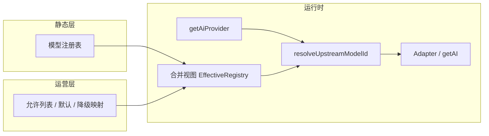

# 多模型 · 可运营改造计划

**目标读者**：后续开发、产品、运营、后端。  
**状态**：规划文档（未实施）。落地时以仓库最新代码与 `docs/交接文档.md` 增量为准。

---

## 执行摘要（1 分钟版）

1. **先把「模型是谁、在各渠道叫什么」收敛到注册表 + 单一解析函数**，消除 `types.ts` / `App.tsx` / `geminiService` / `toapisAdapter` 多处字符串与重复映射。
2. **再用「能力标签 + 运营允许列表」驱动 UI 与默认项**，实现上下架、分档、降级尽量不发版。
3. **适配器分层最后做**：在 Gemini 兼容路径仍占主导时，优先 id 与元数据统一；非 Gemini 协议再引入窄接口，避免过早抽象。

---

## 验收标准

本节为**验收的权威汇总**；§4 各阶段文末仅作交叉引用。评审 PR、阶段结项或对外演示时，以本节为准。

### 项目级验收（多模型 + 可运营整体达成）

全部计划阶段（含贵司决定实施的阶段 3～4）完成后，应同时满足：

| 维度 | 验收表述（大白话） | 可验证证据 |
|------|-------------------|------------|
| **多模型** | 新增/调整一个已接入渠道的模型，主要改**注册表（及该渠道绑定）**，不在业务组件里复制一串上游 model id | Code review：新模型未在 `App.tsx`/各 Section 硬编码上游 id；注册表有完整 `providerBindings` |
| **单一解析** | 同一 `registryId` + 渠道 → **唯一**上游 id；不存在「先 resolve 再 adapter 又改一次」的双重映射 | 单测或静态审查：`resolve` 与 `toapisAdapter` 等职责边界文档化且无重复改写 |
| **可运营**（阶段 3 起） | 不下发新前端包（或仅后端/配置变更）即可：**下架**某模型、**改默认**、**启用降级** | 运维/产品在预发改配置后复测；日志可见 `[model-registry]` 命中降级或禁用原因 |
| **兼容与恢复** | 老用户本地/云端里存的旧 model 字符串仍能**自动迁移或安全回退**，不白屏、不静默用错模型 | 用旧 `localStorage` 快照或备份配置启动；期望有迁移或 fallback + 日志 |
| **体验** | 用户可见的模型列表与当前**渠道 + 运营策略**一致；不可用项有原因（隐藏或禁用提示） | 切换 `AiProvider` 手测；边界：某渠道无绑定的 `registryId` 不得出现在可选列表 |
| **工程纪律** | `npm run typecheck` 通过；模型相关下拉**不使用原生 `<select>`** | CI 与 UI 规范 checklist |

以下「分阶段验收」未达标前，不强行宣称「项目级验收」已全部满足（例如仅做完阶段 1～2 时，「可运营」整行可标为 **不适用 / 待阶段 3**）。

### 分阶段验收清单

<a id="accept-phase-0"></a>

#### 阶段 0：规范与清单

| # | 验收项 | 怎么验 |
|---|--------|--------|
| 0.1 | 已冻结 `registryId` 策略（§3.2 A 或 B）并有书面记录（本文修订记录或 ADR） | 文档可读 |
| 0.2 | 全站 model 引用盘点完成，**无 obvious 漏项**（重点：`geminiService`、`capabilityExecutor`、hooks、`types.ts`、`App.tsx`） | 盘点列表存档（可附 PR / issue） |
| 0.3 | §3.3 能力矩阵表已填全，且与产品确认「每个场景用哪个槽位」 | 表内无空白行或已标注「不适用」 |
| 0.4 | 各 `AiProvider` 与注册表差异有说明（哪些 registryId 在某渠道为 `null`） | 文档或注册表注释 |

**通过门槛**：新同学仅看盘点与矩阵，能在 **30 分钟内**说清「加一个 Gemini 生图模型要动哪里、不该动哪里」。

<a id="accept-phase-1"></a>

#### 阶段 1：注册表与解析集中化

| # | 验收项 | 怎么验 |
|---|--------|--------|
| 1.1 | `npm run typecheck` 通过 | CI 或本地命令输出 |
| 1.2 | 注册表为模型元数据**唯一来源**；`DIALOG_IMAGE_*` 等与注册表**一致**（推导或单测锁定） | 单测或脚本断言 |
| 1.3 | **仅**改注册表 + provider 绑定（+ 阶段 3 前的「全量允许」若有）即可让新模型进入**类型合法**集合 | 桌面演练：加一条假模型走完整类型与解析 |
| 1.4 | 至少一条 **纯文本**、一条 **生图** 主路径烟测通过（如设置/工作区快捷生图/纹理任选） | 手测记录或 E2E |
| 1.5 | 旧配置 migrate / fallback 行为明确且无静默失败 | 旧字符串回归用例或手测 |
| 1.6 | 双重映射风险已排除或有测试覆盖 | Code review + §5 单元测试 |

**通过门槛**：阶段 1 合并后，团队共识为「以后改上游 id 只认解析模块」。

<a id="accept-phase-2"></a>

#### 阶段 2：UI 与持久化

| # | 验收项 | 怎么验 |
|---|--------|--------|
| 2.1 | 所有模型相关下拉选项来自**合并后的数据源**（注册表 ∩ 渠道绑定 ∩ 运营允许；阶段 3 前允许允许列表 = 全量） | Code review |
| 2.2 | 切换 `getAiProvider()` 后，选项与默认值**合法**（不出现当前渠道无绑定的模型） | 手测各 provider |
| 2.3 | 持久化与云同步存 **`registryId`**（或与策略 A 一致的稳定字段），跨设备与刷新后仍一致 | 两台设备或清缓存场景 |
| 2.4 | **无**新增原生 `<select>` 用于模型选择 | `rg "<select"` 或审查 |

**通过门槛**：产品与研发共同签字「设置 + 主生图入口」行为符合预期。

<a id="accept-phase-3"></a>

#### 阶段 3：运营配置

| # | 验收项 | 怎么验 |
|---|--------|--------|
| 3.1 | **不发布新前端**（或约定范围内不动前端包）即可：隐藏/下架某 `registryId`、改默认模型、启用降级链 | 预发改配置 → 客户端拉取后复测 |
| 3.2 | 配置非法时有 **fallback**（不全站不可用），且打 `[model-registry]` 可检索日志 | 故意下发空 allowlist / 错误版本号 |
| 3.3 | 配置带 **version / etag**（或等价机制），客户端缓存行为可说明 | 文档 1 页 + 一次抓包或日志 |

**通过门槛**：运营能在 Runbook 上按步骤完成一次「紧急下架模型」，无需前端同学发版。

<a id="accept-phase-4"></a>

#### 阶段 4（可选）：非 Gemini 适配器

| # | 验收项 | 怎么验 |
|---|--------|--------|
| 4.1 | 至少一个**最小功能**走新适配器端到端 | 指定功能烟测 |
| 4.2 | Gemini 主路径**回归**通过（文本 + 生图各至少一条） | 回归列表打勾 |

### PR / 阶段合并门禁（建议强制执行）

- `npm run typecheck` 通过（若仓库已有 `npm test` / lint，与阶段 1+ 一并纳入 CI）。
- 涉及 `resolve` 逻辑的改动：**新增或更新**单测快照（各 provider × 典型 `registryId`）。
- UI：模型选择不得使用原生 `<select>`（`.cursor/rules/dropdown-ui-style.mdc`）。
- 若当阶段宣称「可运营」：必须附带**配置变更 Runbook** 片段（改哪份 JSON/接口、如何回滚）。

---

## 1. 背景与目标

### 1.1 业务目标

- **多模型**：对话理解、生图、纹理、工作流能力执行、擂台等场景可切换不同厂商/规格，新增模型主要改配置与注册项，而非全站搜字符串。
- **可运营**：上下架、套餐可见性、默认模型、灰度、紧急降级由配置或后台驱动；关键操作可审计；用量与计费与现有策略对齐（注册表可提供 `billingSku` 等外挂字段，见 §6）。

### 1.2 技术目标

| 原则 | 含义 |
|------|------|
| 单一真相源 | 模型元数据只在一处定义；持久化用稳定 `registryId`。 |
| 解析单路径 | 上游 id 只经由统一解析入口，避免 `resolveUpstream*` 与网关适配器**双重改写**。 |
| 适配器隔离 | 协议差异不进业务组件；业务依赖「能力 + registryId」，不依赖厂商 URL 形状。 |
| 渐进迁移 | 分阶段合并，每阶段可回滚；旧 `localStorage` 配置兼容迁移。 |

### 1.3 非目标（可明确延后）

- 自研统一推理网关（除非基础设施已就绪）。
- 全站统一「流式 + 工具调用 + 多步 Agent」抽象（待主路径稳定后再评估）。
- 强行把腾讯混元 3D 等管线改成与 Gemini 相同请求形状；**优先**在注册表或运营层做「可见性/默认能力」挂接，协议仍走独立 `service`。

---

## 2. 现状基线（与代码的耦合点）

实施前应用 `git`/搜索再核对一次；下表为规划时的典型入口。

| 区域 | 路径 | 现状 | 扩展时的典型痛点 |
|------|------|------|------------------|
| 对话生图常量 | `types.ts` | `DIALOG_IMAGE_MODELS`、`DIALOG_IMAGE_GEARS`、`DIALOG_IMAGE_MODEL_MAX_REFERENCE_IMAGES` | 与解析逻辑、设置默认值易不同步 |
| 默认配置 | `App.tsx` | `SystemConfig` 默认 `modelText` / `modelImage` / `modelPro` | 与「可选列表」无类型关联 |
| 调用与映射 | `services/geminiService.ts` | `getAI()`、`resolveUpstreamTextModelId`、`resolveUpstreamImageModelId` | 映射随网关增多而膨胀 |
| 渠道与密钥 | `services/settingsStore.ts` | `AiProvider` | 「渠道」与「该渠道可用模型集」未绑定 |
| 网关适配 | `services/toapisAdapter.ts` 等 | 模型 id 特化 | 易与 `resolveUpstream*` 重复映射 |
| 能力执行 | `services/capabilityExecutor.ts` 等 | 直接或间接使用 `resolveUpstreamImageModelId` | 散落调用点 |
| 其它栈 | `services/tencentService.ts` 等 | 独立 API | 运营「开关」需统一策略入口（§3.4） |

---

## 3. 目标架构

### 3.1 分层与数据流



- **注册表**：「理论上能提供什么」。
- **运营配置**：「当前环境允许用户用什么、默认是谁、异常时替换成谁」。
- **合并视图**：UI 与解析只读合并结果，避免组件直接 if-else 运营规则。

### 3.2 模型注册表（Model Registry）

**职责**：描述站内模型条目；**不**发起网络请求。

建议字段（可按首版裁剪）：

| 字段 | 说明 |
|------|------|
| `registryId` | 站内稳定 id：持久化、埋点、运营 JSON、用户配置均引用它 |
| `displayName` / `description` | 展示与工具提示 |
| `kind` | `text` \| `image` \| `multimodal` 等 |
| `capabilities` | 能力标签集合，见 §3.3 |
| `limits` | 如 `maxReferenceImages`（替代散落的 `Partial<Record<modelId, n>>`） |
| `providerBindings` | `Record<AiProvider, upstreamModelId | null>`；`null` 表示该渠道不支持 |
| `tier` / `tags` | 套餐、内测、区域（与运营侧过滤组合使用） |
| `billingSku` | 可选，供计费系统外挂关联 |

**`registryId` 命名策略（建议二选一，团队冻结后不变）**：

| 策略 | 优点 | 缺点 |
|------|------|------|
| **A. 过渡期沿用上游 id**（如 `gemini-3.1-flash-image-preview`） | 迁移成本最低，旧配置几乎可直接当 registryId | 上游改名时站内 id 被迫跟或做迁移 |
| **B. 稳定内部 id**（如 `ac.image.standard`） | 运营与埋点稳定，上游变更只改 `providerBindings` | 需一次性迁移用户本地与云端配置 |

首版可采 **A**，在 §4 阶段 1 内预留 **B** 的别名或迁移表。

**硬约束**：业务模块禁止写死「上游厂商 model 字符串」；只持 `registryId`，由 `resolveUpstreamModelId(registryId, role, provider)` 解析（`role`: `text` | `image` 等，便于同一实体多角色若未来需要）。

### 3.3 能力矩阵（Capability → Requirements）

**职责**：功能点声明「需要的标签」，从合并后的注册表过滤出可选模型。

建议标签（可扩展，首版保持精简）：

| 标签 | 含义 |
|------|------|
| `text` | 纯文本补全/理解 |
| `vision` | 多模态输入（图+文） |
| `image_out` | 图像输出 |
| `json_mode` | 结构化 JSON 输出可靠 |
| `max_refs` | 与 `limits.maxReferenceImages` 联动校验 |

**功能 × 槽位（能力矩阵草稿表 — 阶段 0 填全）**：

| 功能 / 场景 | 配置槽位（示例） | 建议必填能力 |
|-------------|------------------|--------------|
| 对话理解 / 标题 | `modelText` | `text`，若带图则 +`vision` |
| 对话生图 / 工作流生图 | `modelImage` / 挡位 | `image_out`，多参考图时校验 `max_refs` |
| 高质量生图 | `modelPro` | `image_out` + 运营定义的「pro」tag |
| 纹理 / PBR | `config.modelImage` | `image_out` + `vision`（依实现） |
| 擂台提示词 | `modelText` | `text` + `json_mode`（若强依赖 JSON） |

新增功能时：**只增加一行矩阵声明**，不复制模型下拉构建逻辑。

### 3.4 Provider 与适配器

- **阶段 A（与阶段 1～2 对齐）**：保留 `GeminiClientLike` + `getAI()`；注册表负责 **id 与 limits**；`resolveUpstream*` 合并为 **单一模块导出**，`toapisAdapter` 内映射只处理 ToAPIs 独有规则，且与统一解析的优先级写清（避免二次替换）。
- **阶段 B（阶段 4）**：引入 `TextAdapter` / `ImageAdapter`（或按请求类型划分）；`getAI()` 或后继入口根据 `registryId` 解析出 **adapter 类型 + 上游 id**。

### 3.5 运营与配置层（Ops Config）

| 能力 | 说明 |
|------|------|
| 可见性 | 按租户/套餐/用户分组的 `registryId` 允许集合 |
| 默认项 | 各场景默认 `registryId`；可支持 A/B（需实验 id） |
| 降级 | `registryId` → 备用 `registryId` 或「关闭」 |
| 版本 | 配置 `version` + `etag`；客户端缓存失效规则 |

**权威源选项（与 §6 对齐后敲定）**：

1. **服务端下发**：`auth-api` 或 BFF 返回「允许列表 + 默认」—— 适合付费与防篡改。
2. **R2/静态 JSON + 签名或版本号**：适合轻量运营；前端合并。
3. **发版内置**：仅默认与紧急开关；上下架仍依赖发版。

**客户端展示原则**：下拉数据 = `注册表 ∩ 允许列表 ∩ 当前 provider 在 providerBindings 有非 null`。  
**UI 规范**：禁止使用原生 `<select>`，使用 `components/ui/CustomDropdown.tsx`（见 `.cursor/rules/dropdown-ui-style.mdc`）。

---

## 4. 分阶段实施计划

### 依赖关系

```text
阶段 0（清单） → 阶段 1（注册表+解析） → 阶段 2（UI/持久化）
                                      ↘ 阶段 3（运营配置） → 阶段 4（适配器扩展）
```

阶段 2 可与阶段 3 **部分并行**（先硬编码允许列表 = 全量，再接远端）。

### 阶段 0：规范与清单

**工期参考**：0.5～1.5 天（视代码体量）。

| 任务 | 产出 |
|------|------|
| 冻结 `registryId` 策略（§3.2 A 或 B） | 团队共识记录在本文或 ADR |
| 全站引用盘点 | `model` / `modelId` / `resolveUpstream` 调用列表；建议命令：`rg "model(Text\|Image\|Pro)|resolveUpstream|DIALOG_IMAGE|modelImage|modelText" --glob "*.{ts,tsx}"` |
| 填全 §3.3 能力矩阵表 | Markdown 表或 `docs/spec/model-capability-matrix.md` |
| 列出各 `AiProvider` 与注册表差异 | 文档化「某渠道不支持的 registryId」 |

**验收**：见 **[验收标准 — 阶段 0](#accept-phase-0)**。

### 阶段 1：注册表与解析集中化（优先）

**建议目录**：`services/modelRegistry/`（与现有 `services/*` 一致，便于 `geminiService` 引用）。

| 文件（建议） | 职责 |
|--------------|------|
| `registry.ts` | 静态 `MODEL_ENTRIES`、类型、`getModelEntry(registryId)` |
| `resolve.ts` | `resolveUpstreamModelId`、`listModelsForProviderAndRole` |
| `merge.ts`（阶段 3 启用） | 注册表 + 运营配置 → `EffectiveModelView` |

**任务**：

- 将 `resolveUpstreamTextModelId` / `resolveUpstreamImageModelId` 迁入 `resolve.ts`，对外保持兼容导出或薄包装在 `geminiService.ts`，减少一次性 diff。
- ToAPIs 等：**文档化调用顺序**（先统一解析 or 适配器内补映射），保证同一 `registryId` 只有一种最终上游 id。
- `types.ts`：`DIALOG_IMAGE_*` 由注册表推导或单测锁定与注册表一致。
- `SystemConfig`：字段语义改为存 `registryId`；读旧配置时 **migrate**（字符串匹配注册表或 fallback 到默认项）。

**验收**：见 **[验收标准 — 阶段 1](#accept-phase-1)**。

**回滚**：保留旧解析函数分支开关一周（`USE_MODEL_REGISTRY` 环境变量或常量），便于对比。

### 阶段 2：UI 与持久化统一数据源

| 任务 | 说明 |
|------|------|
| 设置页 / `WorkspaceQuickComposeBar` 生成设置 / 其它模型下拉 | 选项来自合并逻辑；禁用项展示原因（渠道不支持 vs 运营关闭） |
| 持久化 | 写回 `registryId`；云同步字段与 `clientPersist` 约定一致 |
| 跨设备 | 持久化仍勿写死 `localhost`；站内 API 见 `cross-device-availability` skill |

**验收**：见 **[验收标准 — 阶段 2](#accept-phase-2)**。

### 阶段 3：运营配置接入

| 任务 | 说明 |
|------|------|
| JSON Schema 或 TS 类型 | `allowlist`、`defaults`、`fallbacks`、`version` |
| 加载与缓存 | TTL、手动刷新入口（可选）、与登录态关系 |
| 观测 | 统一日志前缀，如 `[model-registry]`：解析失败、无绑定、运营禁用、降级命中 |

**验收**：见 **[验收标准 — 阶段 3](#accept-phase-3)**。

### 阶段 4（可选）：非 Gemini 适配器

- 定义窄接口；新厂商独立文件实现。
- 评估复用 OpenAI 兼容客户端或 Vercel AI SDK（以团队栈为准）。

**验收**：见 **[验收标准 — 阶段 4](#accept-phase-4)**。

---

## 5. 测试与质量

| 类型 | 内容 |
|------|------|
| 单元测试 | `resolveUpstreamModelId`：各 `AiProvider` × 典型 `registryId` 快照；禁止双重映射的用例 |
| 契约 | 注册表中每条 `image_out` 必有 `limits.maxReferenceImages` 或显式继承默认 |
| 回归 | 切换渠道手测 + 关键路径自动化（若有） |

---

## 6. 风险、缓解与开放问题

### 6.1 风险矩阵

| 风险 | 缓解 |
|------|------|
| 上游 id 变更导致 404 | `providerBindings` 按渠道拆分；监控 4xx 率并按 registry 聚合 |
| 运营配置为空或全拒 | 合并时 **fallback** 到注册表安全默认；服务端校验「至少 N 个 text/image」 |
| 本地配置迁移失败 | 双写期 + 解析失败时回退默认并打 `[model-registry]` 日志 |
| 范围蔓延 | 3D/腾讯仅挂「运营开关」不强行统一协议；阶段门控评审 |

### 6.2 开放问题（实施前对齐）

1. 运营配置 **权威源** 与 **刷新周期**（§3.5）。
2. 套餐维度：账号 / 工作区 / 组织。
3. 计费：`billingSku` 是否进入注册表，或独立映射表。
4. 是否需要 **主备 failover**（阶段 3 增加策略字段）。
5. **审计**：谁改配置、是否需二次确认（生产环境）。

---

## 7. 文档与工程纪律

- 每阶段合并后：`docs/交接文档.md` 追加一条；**更新 `DOCS.md` §「更换或增加模型」** 指向 `services/modelRegistry/` 与本文。
- 可选：新增 `.cursor/rules` 短规则 — 「新增可用户选模型必须登记注册表并通过统一解析」。
- 本文档版本号：文末维护 **修订记录**。

---

## 修订记录

| 日期 | 修订 |
|------|------|
| 2026-05-06 | 初稿 |
| 2026-05-06 | 优化：执行摘要、Mermaid 数据流、`registryId` 策略对比、能力矩阵模板、目录与文件建议、分阶段依赖/回滚、测试与观测、风险与开放问题结构化 |
| 2026-05-06 | 新增 **§验收标准**：项目级表、阶段 0～4 清单与验证方式、PR 门禁；§4 各阶段验收改为引用本节 |
