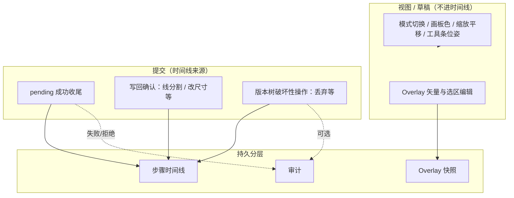

# 工作流：步骤时间线、审计与 Overlay 快照（开发说明）

**文档版本**：v0.1（2026-05-14）  
**读者**：产品（边界与分期）、前端（UI/状态收口）、后端/伴侣（审计持久化若上云）  
**摘要**：把「正式提交」**步骤时间线**、**敏感/失败** **审计**、**未提交草稿** **Overlay 快照** 分层；与现有 `WorkflowPendingTask`、`results`/`resultMeta`、`imageOverlayAnnotations*` 并存，通过 **唯一写出口** 打点，避免双记账与需求膨胀。

本文档**不替代**各模块逐字段说明；在此基础上定义 **读模型、扩展表、交互边界与验收口径**。

---

## 0. 读者导览

| 角色 | 建议阅读 |
|------|-----------|
| 产品 | §3、§9、§11、附录 A |
| 前端 | §4、§5、§6、§8、§10、`types.ts` 现有字段 |
| 数据/合规 | §5.2、§9.2、§11、附录 A |

---

## 1. 背景与问题

当前能力已具备：

- **执行链**：`pending` → `runTask` / `executeCapability` → 写入资产 `results`、`resultOrder`、`resultMeta`（及 `displayStepLabel`、`logContext` 等）。参见 `types.ts` 中 `WorkflowPendingTask`、`WorkflowAsset`。
- **标注草稿**：`WorkflowSection` 内 `lightboxOverlayByMode` 与资产上 `imageOverlayAnnotations` / `imageOverlayAnnotationsPano`（按 `displayKey`、按平面/全景分桶）。
- **日志**：大量 `onLog` 散落各处，便于开发期排查，但**非结构化**，难以作为「协作审计」或「合规导出」的一等数据源。

**痛点**：难以区分「仅预览 / 仅草稿」与「已提交、版本已变」；关大图可能丢 overlay；失败/拒绝难以按 `assetId` 检索。

---

## 2. 目标

| 目标 | 说明 |
|------|------|
| **可解释** | 一眼回答：这张图「正式发生过哪些提交？」 |
| **可恢复** | 未提交前的标注/裁切意图可按策略找回 |
| **可追责/可扩展** | 敏感、拒绝、导出等可审计；后续权限/计费可增量接 |
| **实现可控** | 步骤与视图分层；禁止「每点一下都进步骤」 |

---

## 3. 核心策略总览（A + B）

### 3.1 数据流（概念）

### 3.2 A — 步骤时间线（强约束）

**定义**：时间线的一条 = 对 **可发布资产状态** 产生 **不可逆或难反推** 后果，且他人需能复述「当时跑了什么」的操作。

**必须进入时间线（典型）**

- 队列任务 **成功落盘**：`executePending` → `processTask` → `runTask` 成功分支写入 `results` / 新 `resultKey`（含 `clientPrefetchedImageResult` / `lightboxAwaitClientResult` 等仍走同一收尾逻辑者）。
- **显式写回**：线分割变形写回、改尺寸写回等以 **确认动作** 为界（拖动过程不进）。
- **破坏性版本操作（若产品要追责）**：如丢弃当前展示版本；与 VGP 引用链冲突时的语义见 §9.3、附录 A。

**不进入时间线**

- 预览模式切换、画板色、缩放/平移、工具条位置、SAM 武装与未保存点选、纯下载、关预览等。

**去重**：同一用户意图 **只产生一条主时间线事件**；中间态进 **Overlay 快照** 或省略。

### 3.3 B — 三张表分工

| 数据 | 回答的问题 | 典型内容 |
|------|------------|----------|
| **步骤表 / 时间线** | 资产线上发生过哪些 **提交**？ | `assetId`、`ts`、`kind`、`resultKey?`、`taskId?`、`inputSourceDisplayKey?`、摘要指针（见 §5.1） |
| **审计表** | 有无 **敏感 / 失败 / 合规** 要查？ | `code`、级别、`assetId?`、`taskId?`、短消息；可引用步骤，避免重复堆全文 |
| **Overlay 快照** | **未提交前**画到哪了？ | `ImageOverlayAnnotationDoc` 的时点序列化、`bucket`（flat/pano）、可选 `baseDisplayKey`、生命周期 |

**原则**：步骤管 **提交**；审计管 **异常与敏感**；快照管 **草稿恢复**。三者不互相替代。

---

## 4. 与现有实现的关系（代码锚点）

以下便于检索「应在何处收口」，**非穷尽**：

| 主题 | 建议锚点（仓库内） |
|------|---------------------|
| 队列执行与写 `results` | `components/WorkflowSection.tsx`：`executePending`、`processTask`、`runTask` |
| 能力执行 | `services/capabilityExecutor.ts`：`executeCapability` |
| 丢弃版本 | `WorkflowSection`：`discardResult`；与 VGP 阻止逻辑对齐 |
| 大图写回 / 客户端合成 | `submitLightboxQuickCompose`、各写回 `onCommit`（如 `ImagePreviewWorkflowResizePopover` 等） |
| 任务类型定义 | `types.ts`：`WorkflowPendingTask`、`WorkflowAsset` |

**「同一事务」的可执行含义（非 DB 事务）**：

指 **同一用户可见结果的一次提交** 在代码中的 **原子边界**：例如在同一 `async` 函数内「客户端合成完成 → `resolveClient` → `runTask` 返回图 → `flushSync`/`setAssets` 写入 `results`/`resultMeta`」的连贯路径；或「用户点确认写回 → 单次 `setAssets` 批」内完成。避免在多个分散的 `useEffect` 里各写一半时间线。

---

## 5. 契约草案（实现前对齐）

以下字段为 **建议名**，落地时可并入 `types.ts` 或独立 `workflowTimeline.ts`；**禁止**在步骤/审计中存完整用户提示词原文或整图 base64（用 `resultKey`、哈希、截断）。

### 5.1 `StepTimelineEntry`（时间线）

| 字段 | 类型 | 必填 | 说明 |
|------|------|------|------|
| `id` | `string` | 是 | 稳定 id（uuid） |
| `assetId` | `string` | 是 | 工作区图片资产 |
| `ts` | `number` | 是 | `Date.now()` |
| `kind` | 枚举 | 是 | 见 §8.1 映射表 |
| `taskId` | `string?` | 否 | 与 `WorkflowPendingTask.id` 对齐（若有） |
| `resultKey` | `string?` | 否 | 写入的 `results` 键 |
| `inputSourceDisplayKey` | `string?` | 否 | 任务上的同源字段 |
| `summary` | `string?` | 否 | **短**文案或固定模板 + 截断参数，勿塞长 prompt |
| `promptFingerprint` | `string?` | 否 | 提示词 **SHA-256** 等，可选 |

### 5.2 `AuditEvent`（审计）

| 字段 | 类型 | 必填 | 说明 |
|------|------|------|------|
| `id` | `string` | 是 | uuid |
| `ts` | `number` | 是 | |
| `level` | `'info' \| 'warn' \| 'error'` | 是 | |
| `code` | `string` | 是 | 稳定机器码，如 `DISCARD_BLOCKED_VGP`、`EXPORT_IMAGE` |
| `assetId` | `string?` | 否 | |
| `taskId` | `string?` | 否 | |
| `displayKey` | `string?` | 否 | |
| `message` | `string` | 是 | 人读短句 |
| `detail` | `JSON?` | 否 | 小对象；勿存大图 |

### 5.3 `OverlaySnapshot`（快照）

| 字段 | 类型 | 必填 | 说明 |
|------|------|------|------|
| `id` | `string` | 是 | uuid |
| `assetId` | `string` | 是 | |
| `bucket` | `'flat' \| 'pano'` | 是 | 与 overlay 分桶一致 |
| `baseDisplayKey` | `string?` | 否 | 编辑时所对版本 |
| `doc` | `ImageOverlayAnnotationDoc` | 是 | JSON 序列化；注意体积 |
| `createdAt` | `number` | 是 | |
| `status` | `'active' \| 'superseded'` | 是 | 写回成功后标 `superseded` 等 |

---

## 6. 操作 → 时间线 / 审计 / 快照（映射表）

**说明**：「时间线」列指 **独立 `stepTimeline[]`** 或 **派生展示等价条目**；若采用派生，则以 `resultOrder` 为主源，本表表示 **产品语义**。

| 用户操作（产品语义） | 时间线 | 审计 | Overlay 快照 |
|---------------------|--------|------|----------------|
| 模式切换 / 画板色 / 缩放平移 / 关预览 | 否 | 否 | 否 |
| 标注、裁切选区、局部框（编辑中） | 否 | 否 | 可选 debounce |
| 显式「保存草稿」/ 关窗提示保存 | 否 | 否 | **是** |
| `pending` 成功写入新 `resultKey` | **是** | 可选 info | 成功后快照可 superseded |
| 大图快捷栏 / 卡片生图成功（同左） | **是** | 可选 | 同左 |
| rembg / SAM「应用」写回当前卡 | **是** | 可选 | 同左 |
| 线分割 / 改尺寸「确认写回」 | **是** | 可选 | 同左 |
| 丢弃版本 **成功** | **是**（若产品定义进步骤）或否 | 可选 | 否 |
| 丢弃版本 **被 VGP 拒绝** | 否 | **建议** `warn` | 否 |
| 下载当前预览图 | 否 | **按需** `EXPORT_IMAGE` | 否 |
| 队列执行 **失败**（`executeCapability` 抛错等） | 否（无新 result） | **建议** `error` + `taskId` | 否 |

**与 `logContext` / `actionType` 的关系**：时间线 **`kind` 应稳定**，可与 `actionType` 同源或再粗一层（如 `plain_i2i`、`preset:style_transfer`）；`logContext === 'quick_compose_bar_plain'` 仅影响展示前缀，**不单独作为第二条时间线类型**，避免与 `actionType` 双源。

---

## 7. 双源与资产类型边界

### 7.1 双源规则

- **若一期采用「派生时间线」**：以 **`resultOrder` + `resultMeta` +（可选）`imageTags`** 为 **唯一真源**；UI 不另写平行数组。  
- **若上「独立 `stepTimeline[]`」**：必须在 **写入 `results` 的同一提交路径** 追加条目，并约定 **派生视图 Deprecated** 或 **仅作校验**，避免两处长期不一致。  
- **禁止**：同一成功提交既写扩展时间线又在别处再记一条「伪步骤」而不链 `taskId`。

### 7.2 组资产、文字卡、3D

| 类型 | 本文档默认范围 |
|------|----------------|
| **单图工作区资产** | 全文适用 |
| **组 / 多子项** | 时间线条目需明确 `assetId` 是组还是子项；未另定前 **不套用** 大图 overlay 快照策略 |
| **文字卡** | Overlay 快照不适用；步骤仍以 `pending`/`results` 为准 |
| **仅 3D 模型预览** | 无 overlay 快照；步骤按 3D 任务管线另表（可链本文档 §8 非目标） |

### 7.3 云同步

- **步骤 / 结果**：随现有工作区 bundle / 云同步策略（与 `assets` 一致）。  
- **审计 / Overlay 快照**：若仅存 **IndexedDB / localStorage**，须在文档与设置中写明 **「仅本机、换设备不可见」**；上云则与项目权限模型一并设计。

---

## 8. 非目标（Non-goals）

1. **不替代**开发期 `onLog` 控制台排查；审计是 **补充**，不是把每条 log 落库。  
2. **不记录**每次相机 orbit、每次滑杆 tick、每次工具切换。  
3. **不把**时间线做成「全操作录屏」或法律上的不可抵赖日志（若需电子取证须另方案）。  
4. **不在本阶段**规定跨项目全局审计联邦（默认项目 Scoped）。

---

## 9. 运维、隐私与性能

### 9.1 Overlay 快照配额（建议默认值，可配置）

| 项 | 建议 |
|----|------|
| 单资产最大条数 | 20～50 |
| 单条 `doc` 大小上限 | 256KB～1MB（超出则拒绝自动快照、仅允许手动保存或裁剪） |
| 淘汰策略 | LRU；写回成功将相关快照标 `superseded` 并参与淘汰 |

### 9.2 审计与隐私

- 导出类事件：记录 **`code`、`assetId`、`displayKey`、时间**；可选 **文件指纹（SHA-256）**；**不**默认存外站 URL 凭证。  
- 保留天数与「用户可删审计」由产品定；开发文档只要求 **字段可支持删除策略**。

### 9.3 性能

- Overlay **debounce** 默认 2～5s；关窗 **diff** 用浅比较（引用变更 + 可选 `JSON.stringify` 长度阈值）避免大卡顿。  
- 时间线派生：对单资产 `resultOrder.length` 做虚拟列表或分页。

---

## 10. 工具栏 / 顶栏交互是否要改？

**结论：不必为落实本策略整体重做工具栏。**

- **保持**：模式切换、画板色、手型移动、各工具下拉、SAM 武装、撤销/重做、条拖动等仍为 **视图 / 草稿** 语义。  
- **可选小改**（按需）：关大图前 **未持久化 overlay** → 提示「保存快照 / 丢弃」；丢弃被拒 → **审计**；提交感弱时在 **产生步骤的按钮** 上强化反馈或时间线高亮。

---

## 11. 这么做的好处（摘要）

- **用户**：版本与提交可理解；降低关窗丢稿；减少「算不算生成过」的困惑。  
- **开发**：读写边界清晰，新能力知道写入点；排障可按 `taskId` / `resultKey` / `code` 对齐。  
- **协作与合规**：交接与审计有独立数据源；后续权限、计费可增量接入。

---

## 12. 分期建议

| 阶段 | 内容 | 备注 |
|------|------|------|
| **P0** | 时间线 **只读派生**（`resultOrder` + `resultMeta`）+ UI 面板 | 低成本验证产品叙事 |
| **P1** | Overlay **关窗 diff 提示** + 可选 debounce 快照 | 直接缓解丢稿 |
| **P2** | **结构化审计**（拒绝丢弃、导出、执行失败） | 存储介质另定 |
| **P3** | 独立 `stepTimeline[]` + 持久化队列快照（若需要） | 改动面最大；与 §7.1 二选一收敛 |

---

## 13. 维护说明

- 架构或读写收口有重大变更时，同步更新 **§4～§12** 与 `docs/交接文档.md` 一行摘要。  
- 实现新「顶栏 / 标注栏」提交类能力时，对照 **§3.2、§6** 判断是否进入时间线，并在 **§4** 所列 **唯一写出口** 打点。  
- **修订记录**：在文首更新 **文档版本** 与日期，本节用列表追加一行（日期 + 简述）。

---

## 附录 A：开放问题（实现前需产品拍板）

1. **丢弃成功**：仅审计、仅时间线、还是两者都要？  
2. **排队中未执行**：关页后是否要在时间线显示「未完成」？若需要，则倾向 **P3 持久化队列** 或服务端任务表。  
3. **快照是否上云**：与协作强度、隐私政策绑定。  

## 附录 B：与 VGP / `resultMeta` 的关系

- 已有 **`resultMeta[resultKey]`**（含 `displayStepLabel`、`executedAt` 等）可支撑 **P0 派生时间线**，避免与 VGP 语义字段重复造轮子。  
- 若引入 **`stepTimeline[]`**，建议条目内 **`resultKey` 必填**（成功路径），并与 `resultMeta` 可 **互相校验**；`vgp` 扩展字段继续承载语义生成链，**不把 VGP 全文复制进时间线**。

---

**文档版本**：v0.1（2026-05-14）— 初版策略 + v0.1 增补：读者导览、Mermaid、字段草案、映射表、双源规则、资产边界、非目标、运维/隐私/性能、附录开放问题与 VGP 关系。
