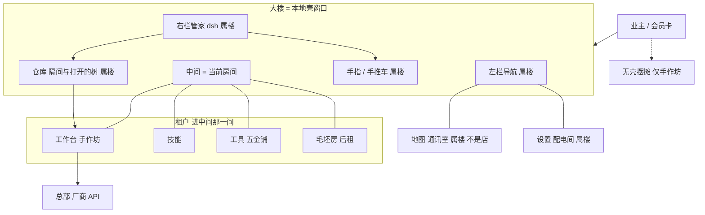
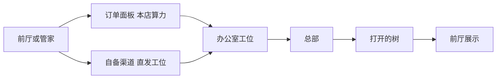
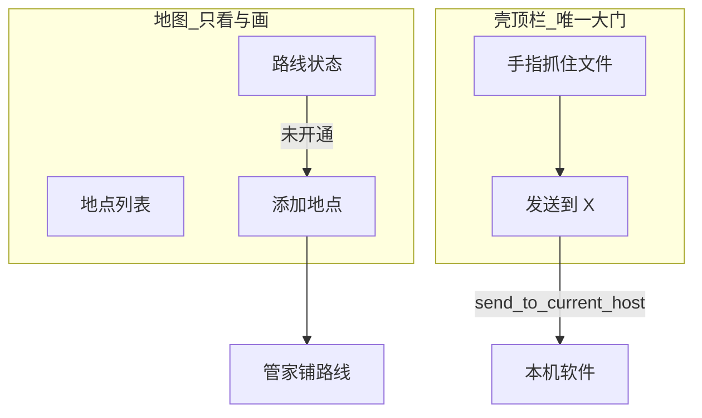

# 架构宪章：本地壳 · 大楼与租户

**定位**：描述本地壳的产品形态（谁是楼、谁是店、谁是物业），供评审需求与改壳时对照。比喻是约束，不是装饰。  
**不是**任务清单。实现以代码为准。全站 AI 分层（菜单 → 拣货 → 手册闸门 → 供货商）看 `docs/多模型可运营改造计划.md` **§1.4**。大楼管壳里谁开门。**仓库**只指楼的货仓。

工作台与后续一方网页共用 Electron partition `persist:assetcutter-team`，**壳内登录一次**。外部 MCP 验收先过**共享登录态门槛**；**壳内工作台登录后**才跑产物链路。dsh 管家用 `persist:assetcutter-dsh`，两套不合并。

---

## 1. 一句话

本地壳是一栋大楼。工作台、技能、工具是楼里三家常驻租户。技能这家店代码房间仍叫 `workflow`（对照地图页代码仍叫 `connections`）。业主还可以点导航加号再租**毛坯房**：进门后跟管家对话，像改一个项目一样生成这间房自己的网站（画在中间，不画在右栏）。Agent 是驻场管家（属楼，不属任何一家店）。**通讯室**是楼侧对外管线（硬装代码仍叫 `connections`）；左栏门牌对用户叫**地图**，负责看「能送到哪些本机软件」、路线通不通、添加/规划地点——不是第四家店，也不是用户在里头做货的工作间。触达楼外软件走壳顶栏**唯一大门**（`send_to_current_host`），不在地图页办配送。

工作台是被租出去的底商，业态是手作坊：货权在作坊，仓储和转运在楼。前厅是左树 + 中间原资产列表 + 右预设。客户必须先进店；进店后可以自己在前厅做，也可以让侧边的管家代做（自己不动小工作台）。本店算力走店内订单面板；自备 Key 是客户和办公室该工位直接结算，不经订单面板，前厅调配完直发该工位，完工写成这棵树上的文件、在前厅展示。

### 1.1 全局架构图

用来对整栋楼：谁属楼、谁是店、货怎么走、哪块已经有代码、哪块只有口径。细规则仍看后面各节。进度以 §7 与 `docs/架构未收口清单.md` 为准，随实现改。

**图例**：`已有` 壳里能进、有对应代码。`半成品` 有骨架但和宪章还对不齐。`未做` 还没有。`口径粗` 方向定了，细到没法直接开工。

#### 楼里有谁



店与店不私接。货要挪到别的店或装卸台，走手指 / 手推车。毛坯房的网站只住中间，不进右栏、不改楼壳。门外 MCP 只给外部大脑，不是店内对讲。

#### 手作坊出货怎么走



不充值仍可进前厅逛文件夹。出图用本店电要充值；自备 Key 不经订单面板，完工写成这棵树上的文件（其它隔间仍在同一座仓）。

#### 进度总表

| 块 | 进度 | 已有什么 | 缺什么 / 不够细 |
| --- | --- | --- | --- |
| 大楼窗口、左栏切房间 | 已有 | 工作台 / 技能 / 工具 / **地图**（通讯室）/ 设置；加号开空房 | 空房只有门牌和空地板；生成站未做 |
| 右栏管家 dsh | 半成品 | 开发态：有 `dsh-bundled` 则跑钉死 `lib/bin.js`，否则 `npx`；`--patch` 钥匙；asar 已列入主进程 cjs | 不改装 loop。施工钥匙按店未齐。口径 §3.11 |
| 会员卡 / 壳内登录一次 | 已有 | `persist:assetcutter-team`；dsh 另一套 partition | 保持文首契约；dsh 另一套不合并 |
| 仓库 | 半成品 | 协议已标四隔间；store 顶层仍是卡 `assetIds` | 作坊真源改为打开的文件夹（§3.12）；流程/货架/毛坯房隔间仍空 |
| 前厅看板 | 半成品 | 工作台画布能用 | 左栏文件树未做；卡网格仍是旧真源；§3.12 要换成文件夹墙 |
| 手作坊硬装 | 半成品 | 画布、生成入口、Job | 「订单面板」「办公室工位」作为店内区域的产品面偏粗 |
| 本店算力 → 总部 | 半成品 | `/api/ai/jobs`、积分闸门、Gateway | 工位领单的产品叙事 vs 代码路由，对照 §3.5 仍要对齐 |
| 自备渠道 | 半成品 | 设置里启用 Key 后可直连 | 和订单面板分道的产品面要盯着，别混成店内单 |
| 技能 / 工具 | 已有 | 壳里能进、有页面。技能门脸是描述 + 执行，点执行交给管家；整理成的 skill 写入 `{沙盒}/skills` | 租约薄。有执行器的才 `replay_run` |
| 地图 / 手指 | 半成品 | 地图页（地点 + 路线，只看+画）、壳顶栏「发送到」大门、finger 四格；切房间会改 surface；对话加地点走管家 handoff | 流程店/五金铺从手指读货、回写仍未接。办事步骤 §3.10 |
| 设置 | 已有 | 配电间能进 | 很少进，不参与做货 |
| 无壳摆摊 | 已有 | 浏览器能进工作台 | 无管家、无装卸台；流程店/五金铺不要求对等 |
| **毛坯房** | **半成品** | 加号、门牌、中间空地板 | 无仓库隔间项目、无 BrowserView 载入生成站、管家还不能改文件 |
| 管家布置软装 | 未做 | 右栏在 | 施工面已写清（§3.9），工具未接 |
| 店与店转运 | 半成品 | finger / 切房间 / `send_to_current_host`；`open_surface` 已含 workflow | 步骤见 §3.8。流程店从手指读货、五金铺回写仍未接 |

盖站只是表里「毛坯房」那一行，不是整张图。三家常驻店不走「对话生成整站」。

---

## 2. 比喻对照


| 比喻 | 产品 | 一句话 |
| --- | --- | --- |
| **大楼** | 本地壳（Electron 窗口） | 房东。提供场地、管线、管家、仓库。 |
| **业主 / 会员** | 用户 | 进大楼先能被认出（登录）。进店用同一张会员卡。 |
| **驻场管家 / 管理员** | Agent（dsh） | 跟窗口走。人进店后，他站在侧边，能转运、能改仓库、能代客操作前厅。不是店长。 |
| **楼的仓库** | 四隔间（§3.7） | 作坊隔间 = 打开的文件夹；其它隔间仍是仓内分区。哪间变了，只刷新订阅它的门脸。 |
| **前厅 / 看板画板** | 工作台画布 | 货的陈列与操作面。客户和管家都能动手。 |
| **底商租户** | 工作台 | 沿街手作坊。货籍在这家店。 |
| **作坊办公室** | 供应商工位 | 每个供应商一个工位：接单、联系总部、完工写进打开的树。 |
| **订单面板** | 本店算力的统一任务队列 | 本店请求先到这里，工位按能力领单。 |
| **总部** | 外部模型厂商 API | 工位把活发出去，做好再收回来。 |
| **充值 / 本店算力** | 站点积分 | 用店里的电要先充。不充仍可进店摆前厅。 |
| **自备渠道** | 自备 API Key | 客户和办公室该工位直接结算。不经订单面板；前厅调配完直发工位，用工位同一通道写成树上文件。 |
| **楼上租户** | 技能（代码 `workflow`） | 技能店。墙上是 skill；有执行器的点执行走 `replay_run`，没有的按技能正文让管家代办。 |
| **楼上租户** | 工具 | 五金铺。货架上的器械与调用面。 |
| **通讯室 / 地图** | 连接（`connections`） | 楼的对外出口。**页面 = 地图**（看地点 + 画路线）；**持久 = 路线**；**配送 UI = 壳顶栏大门**，不是地图页。 |
| **路线** | `software_connection`、probe/install 状态 | 楼侧保存的通路：通往 Maya、Blender… 是否已开通、默认走哪条。写在 `connectedHosts` / 连接名单，不进店私仓。 |
| **配送** | 把手指抓住的文件送出楼外 | 壳顶栏「发送到」+ `send_to_current_host`（**单一出口**；后续租户同路，禁止私接） |
| **配电间** | 设置 | 物业办公室。很少进，不参与做货。 |
| **走廊 / 手推车** | 切房间、转运权、一只手指 | 店与店不私接。楼把货推到别的店或地图出口；手指是走廊上的带货机制（可称配送员在跑货，但 UI 不叫配送员工作台）。 |
| **毛坯房** | 业主另租的一间空铺 | 导航最下加号开门。隔间在仓库里。中间是这间房自己的网站，对话生成、迭代。 |
| **上街摆摊** | 无壳纯浏览器 | 手作坊还能开门；楼的管家和地图（配送）没有。 |

店手册宪章里的词不要和「仓库」混用：

| 店手册说法 | 在本大楼里是 |
| --- | --- |
| 供货商 | 办公室工位背后的总部 |
| 供应商工作手册 | 工位办事：鉴权、契约、把总部货写入**仓库** |
| 菜单 | 前厅墙上的软装（能力、预设） |

---

## 3. 房东与租户

### 3.1 货权、仓库、前厅

- **货权在作坊**：人打开的那棵本机文件夹就是作坊的货。文件和文件夹是真源，不是「项目包」里的卡列表，也不是组/资产集那种货筐。
- **仓储在楼**：楼记住当前打开哪棵树，并通过伴侣只扫 allowlist。字节仍在磁盘上。流程记录、五金铺货架、毛坯房网站仍是仓库其它隔间（§3.7），不要和工作台文件夹捏成一份 JSON。
- **前厅是看板画板**：左树选当前本机目录，中间仍是原来的资产卡片网格与交互，不是另做一堵文件墙。不是第二份真源。人和管家改的是同一棵树上的文件；盘一变，前厅必须变。
- **转运权在楼（管家 / 手推车）**：抓住的是路径上的文件，再推到流程店、五金铺或地图出口配送。步骤见 §3.8。

### 3.2 归楼（物业，不出租成店）

- 窗口本身、侧栏导航、右栏管家。
- 楼的仓库，以及手推车 / 手指。手指四格：选中的文件、打开的预览、当前店（表面）、连着的软件（只到「连着谁、这个文件能不能丢过去」）。
- **通讯室（左栏「地图」）**：展示可触达地点与路线状态；探路、登记路线、发起配送。未知目的地按「先当未知、再沉淀策略」铺新线。状态写在楼侧（连接名单 / `connectedHosts` / 手指），不进任何一家店的私仓。
- 会员识别与配电：密钥、partition、本机登录。进店、跟管家聊，都要先能被认出（**壳内登录一次**）。
- 本店算力的电表（积分闸门）。积分不进仓库正文，也不进任何一家店的硬装。

### 3.3 归店（独立运营）

每家店有自己的门脸和账本，可以调用楼的水电、管家、仓库、装卸台，但不能把大楼收编成自己的后厨，也不能把隔壁店的台面拆过来。

无壳时：街上先摆的是手作坊（自己抱着货）。流程店和五金铺更吃楼里的物业；没大楼时可以没有，或各自缩成路边摊，**不并进作坊后门**。

### 3.4 三家店


| 店 | 业态 | 硬装（租约，不能拆） | 软装（管家可布置） |
| --- | --- | --- | --- |
| 工作台 | 手作坊 | 前厅看板、办公室工位槽、订单面板 | 墙上能力/预设、工位上的供应商、领单策略 |
| 技能 | 技能店 | 步骤骨架、一次运行、记录。门脸：描述 + 执行 | 节点、策略、模板；用户开口后从痕迹编译 skill 存到本店货架 |
| 工具 | 五金铺 | 货架槽位、调用面 | 往货架上加更多工具 |

「给工具间添加更多工具」= 布置五金铺的软装，不是给手作坊加插件。管家进那家店，往货架上添货。

### 3.5 手作坊怎么接单

1. **自己做**：进店入座前厅，在当前文件夹里创建、改文件。
2. **管家代做**：人已经进店，只是自己不点小工作台，让侧边的管家动手。管家写这棵树上的文件，前厅自动跟上。不能人还在店外、只在大堂喊管家去做货。

本店算力（充过积分）：

```text
前厅或管家发出请求
  → 店内订单面板（统一入口）
  → 办公室里有能力的工位依次领单
  → 工位联系该供应商总部
  → 完工写成这棵树上的文件
  → 前厅资产列表更新
```

自备渠道（客户自备 Key，和该工位直接结算，不耗本店算力）：

```text
客户在前厅调配完成
  → 不经店内订单面板
  → 直发办公室里对应的供应商工位
  → 工位走客户自己的渠道联系总部制作
  → 完工仍写成这棵树上的文件
  → 前厅资产列表展示
```

不充值：可以进店用前厅（逛文件夹、看文件、改布局）；要用店里的算力得出图，先充值。不充也可以走自备渠道，直结办公室工位。出图结果写成这棵树上的新文件，不要另建一套项目卡当真源。

### 3.6 开新房间并装修

业主可以开一间新房，再跟管家对话，生成这间房自己的网站。类比：就像在 Cursor 里对着一个项目对话改代码，预览开在旁边。这里预览就是大楼中间那一间屋。整楼进度见 **§1.1**。

**怎么开门（楼的设施，不是某家店的按钮）**

- 左侧图标导航**最下面一颗加号**。
- 点加号：立刻租出一间毛坯房——导航多一个门牌，中间切到这间房，右栏管家还在。
- 此时中间是空网站（空地板）。人已经进门，才能开始对话创建。

**仓库隔间**

- 不要用户指定磁盘路径。租房 = 在楼的仓库里给这间房开一个项目隔间（页面、脚本、资源放这里）。
- 隔间必须有门脸。只在仓库里多个文件夹、中间看不见，不算开了房间。

**对话创建 = 管家改这个隔间，中间刷新**

- 管家像施工队：按用户的想法写/改隔间里的文件，中间这块地载入这间房的网站。
- 网站可以完全自定义（布局、交互、这间房自己的工具面）。那是这间房的装修，不是砸大楼。
- 大楼承重墙仍不能拆：导航、右栏管家、仓库、通讯室、三家常驻店的硬装。生成的网站只能占中间这间房的框，不能把管家吃进去，也不能改成楼的外壳。

毛坯房是独立租户，和三家常驻店同级，只经走廊 / 手推车往来。现有三家店不走这条「生成整站」的路；它们只许管家布置各自租约里的软装。

**中间怎么打开生成站**

1. 点加号时，仓库开一个隔间（例如这间房的项目根），写入空入口页。不要让用户选磁盘路径。
2. 导航多一个门牌。中间这块地是楼提供的载入框（壳里一块 BrowserView），只负责打开该隔间的入口。
3. 管家改隔间里的文件；壳刷新中间。人和管家都看着中间这块地，不在右栏聊天里看成品。
4. 隔离：生成站不能改左栏导航、不能吃掉右栏管家、不能冒充仓库真源。出图、积分、连接仍走楼的工位 / 通讯室，不要在站里另拉一条总部电缆。
5. 删房：右键门牌删除。撤门牌、卸掉中间载入；隔间可归档，不把网站文件散进用户打开的素材树。

现状：加号、门牌、空地板已有。隔间项目文件和中间载入生成站仍未做。下一步：仓库隔间 + BrowserView 载入框，再给管家「读写这间房隔间」的工具。

### 3.7 仓库隔间

同一座仓库，分区存放。不是四套平行数据库。作坊隔间 = 当前打开的文件夹（文件真源，§3.12）。其它隔间要补，不要再抄一份网页私仓，也不要把工作台做成「项目卡库」。

| 隔间 | 放什么 | 谁订阅（门脸） |
| --- | --- | --- |
| 作坊文件夹 | 当前打开的本机树（文件/文件夹是真源） | 工作台前厅 |
| 流程记录 | 一次运行、步骤结果、记录 | 技能页 |
| 五金铺货架 | 货架上有哪些工具、调用面登记 | 工具页 |
| 毛坯房项目 | 该房网站的页面、脚本、资源 | 该房中间载入框 |

哪一隔间变了，只刷新订阅它的门脸。作坊这棵树上的文件变了前厅必须变；流程记录变了不要靠前厅私藏一份运行态。现状代码仍有「项目 + WorkflowAsset 卡」；推进方向是丢掉卡/项目包当真源，见 §3.12。

### 3.8 手推车：货怎么送到别的店

手指始终只有一只：选中的文件、打开的预览、当前店（表面）、连着的软件（只到「连着谁、这个文件能不能丢过去」）。送货 = 物业推车，不是店与店私接管线。人可以自己推，也可以让已进店的管家推。

共同前置：手指抓住要送的那份文件（本机路径，相对已打开的树根），不是网页按钮，也不是项目卡 id。

**送到流程店**

```text
抓住这份文件
  → 走廊：切到技能（人进店，代码 `workflow`）
  → 流程店从手指读当前货，当作这一次运行的输入
  → 跑步骤；记录写入「流程记录」隔间
  → 需要回作坊的结果再写成这棵树上的文件，前厅订阅更新
```

禁止把流程引擎嵌进前厅并当成归属。入口可以指路，跑批次仍是流程店的事。

**送到五金铺**

```text
抓住这份文件
  → 走廊：切到工具（人进店）
  → 五金铺对这张货调用货架上的器械
  → 产物若归作坊：写成这棵树上的文件；若归五金铺隔间：写货架登记
  → 作坊树上的文件变了，前厅跟上
```

禁止把工具仓库嵌进前厅插件栏冒充软装。

**送到地图出口（配送出楼）**

```text
抓住这份文件
  → 看手指：连着谁、这条路线能不能配送
  → 能送：在任意房间点壳顶栏「发送到 X」（`send_to_current_host`，对象是路径上的文件）
  → 不能送 / 路线未开通：进地图（通讯室）看地点与路线、添加地点，找管家铺线（§3.10）；不要在各店私接导出管线
```

不到 Maya 里选中某个物体。配送只交接到「连着谁、文件能不能送出去」。

回程同一只手：别的店产出若要回作坊，写成这棵树上的文件、改手指，前厅订阅，不要打电话让前厅按按钮。

### 3.9 管家施工面

管家跟窗口走。变的是他站的店和手指放在哪。人必须已经进那间房，他才能动手。不改装 dsh 上游 loop/session，只规定他能进哪些门、能写哪一隔间。

| 人站在哪 | 管家可以 | 管家不可以 |
| --- | --- | --- |
| 手作坊 | 改这棵树上的文件（代做）；按 §3.5 出图并落盘 | 砸前厅 / 订单面板 / 工位槽硬装；人未进店就做货 |
| 流程店 | 布置软装：节点、策略、模板；代跑一次运行（写流程记录隔间）。墙上点执行 = 按这张单对话确认格后跑 | 拆步骤骨架；把流程引擎搬进前厅 |
| 五金铺 | 往货架加工具、改调用面登记 | 拆货架槽；把工具收成作坊插件 |
| 通讯室（地图） | 探路、登记路线 | 把通讯室做成第四家店；把「地图」做成做货工作间；在地图页办配送 UI；伸进宿主内部选物体 |
| 毛坯房 | 读写该房项目隔间，壳刷新中间 | 把站画在聊天里；改楼壳或管家右栏 |
| 设置 | 少进；配电（密钥、登录） | 当做出货车间 |

对话加地点 / 开通路线走管家 + 地图（通讯室），不走隐藏的旧 Copilot 入口。

### 3.10 通讯室：地图 · 路线 · 配送

通讯室是**给其它房间和管家服务的楼侧设施**，不是用户在里头做货的第四家店。左栏门牌对用户叫**地图**；实现上仍是 `view-connections` / `connections`，不必为改门牌重命名 IPC。

#### 三层（用户向认知）

| 层 | 用户看到什么 | 宪章 / 代码 |
| --- | --- | --- |
| **地图** | 能送到哪些本机软件（Maya、Blender…） | 通讯室页、地点列表、`connectedHosts` |
| **路线** | 每条通路是否已开通、需否修复、默认走哪条 | `software_connection`、probe/install、连接名单 |

同一软件地点可含多个本机版本子行（如 UE 5.3 / 5.4 / 5.5）；版本不是多个顶层地点，子行各自展示路线 pill，顶栏「发送到」尊重当前/所选版本。

| **配送** | 把手指抓住的文件送出楼外本机软件 | `send_to_current_host`、壳 `#shellSendGate` |

**配送员**可用来解释手指 + 手推车如何跑货（「还不知道路，先开通路线」），但**页面名不叫配送员**——页面是地图，配送是动词。



#### 办事步骤（与实现对齐）

1. 人进**地图**页（通讯室）。右栏管家还在。
2. 业主要送到哪 / 要开通哪条路线。管家先看地点与已开通路线（`connection_list` 等）。
3. **路线已通**：手指有货时，在**任意租户**点壳顶栏「发送到 X」出楼；不必先进地图。
4. **路线未通**：先当未知，探路，再沉淀策略，铺新线。不要在手作坊里为某一个软件拉专线。
5. 办完，路线与配送状态写在楼侧（连接名单 / `connectedHosts` / 手指），不写进某一家店的私仓。

### 3.11 管家怎么住进楼（dsh）

dsh 是物业雇来的原版管家，不是第四家店，也不是自造聊天框。

**怎么挂上**

- 壳主进程在 loopback 拉起钉死版本 `0.1.1-rc.2`：有 `dsh-bundled` 则 `node/electron + lib/bin.js web --no-open --host 127.0.0.1 --port 3080`，没有才回退 `npx`（`dsh-host.cjs`）。`3080` 已在跑则复用。
- 右栏是独立 BrowserView，打开该地址，分区 `persist:assetcutter-dsh`，和团队网页 `persist:assetcutter-team` 不合并。
- 用户入口是壳窗口。不要让业主自己去浏览器开 `:3080`。

**改什么、不改什么**

- **不改装管家本人**：不 fork `agent-loop` / `session`，不扣右栏换自造 UI。官方更新时抬钉死的版本号；楼壳和工牌留下。
- **只发钥匙**：`--patch` 本地 Cordis 插件。源码在 `companion-desktop/dsh-plugins/`（安装包走 extraResources，不进 asar）。启动时写一份 `{userData}/dsh-inject/cordis.yml` 指向这两把钥匙，并给 dsh 子进程 `ASSETCUTTER_DSH_INJECT` / `ASSETCUTTER_DSH_TOOLS`。稿一变只重写 `workspace-finger.txt`，不再生 `.mjs`。现有两把：稿/手指进 `systemPrompt.context`；工具打本机 `3081`。
- **判定**：只有管家隔着 Cordis 才能做的事，才做成 dsh 插件。窗口、门牌、加号、仓库真源、积分、三家店页面，继续放壳和各店。
- **不要做成插件的**：前厅画布、订单面板、流程引擎、货架硬装、**地图整页**（通讯室硬装）、把网站画在聊天里。网上炫工作台多为社区插件或发行版 Fork；Fork 难跟官方。本楼走「壳包原版 dsh + 自己的钥匙」，不走换皮发行版。

**安装包现状（未收口）**

开发态：有 `dsh-bundled` 则直接跑钉死版本的 `lib/bin.js`，没有才回退 `npx`。发给用户的安装包把同一份树打进 extraResources（`copy-dsh-bundled.cjs`，与 sam-local 一样）。壳用 Electron `ELECTRON_RUN_AS_NODE` 启动，不指望用户机 Node/`npx`。`companion-desktop/package.json` → `build.files` 已列入 dsh/仓库主进程模块。

**先做硬的是楼壳和仓库，不是插件皮肤。** 钥匙按人已经进了哪间房再补（§3.9）。顺序见 §8 第 10 条。

### 3.12 作坊文件真源（对标独立软件 Connecter，不是通讯室）

Connecter 是店外的独立 DAM。本楼要借的不只是「左侧多一棵树」，而是它的真源模型：**本地文件和文件夹才是货**。

工作台不再以「项目」或卡列表为真源。打开一棵本机树 = 进了这家作坊。组就是当前层里的子文件夹（拖成组会新建文件夹并搬文件）；不要再做项目卡上的虚拟组 / 资产集 / 货筐。

**真源：货 vs 库**

- **货**是磁盘上的文件和文件夹（本机或 NAS）。「+」只是往库里**挂上**一个素材根，**不复制、不搬家**。一张卡对应用户树上的**稳定路径文件**（检出文件）。Maya 等 DCC 连的是这条路径。
- **库**是用户指定的工作区目录（`workshopWorkspaceDir`）。软件自己产生的东西都进这座库：已挂根名单、上次打开位置、多版图、`ac-asset.json`、缩略图、链接槽。未指定库则不能生成、不能写版本、不能「+」挂根。禁止默默写到 C 盘 `%LOCALAPPDATA%` / Electron `userData`。
- 库目录规范：

```
{库}/
  README-库目录.txt
  library.json          ← 根名单 + 上次打开；可带走
  index.json            ← 检出路径 → assetId
  packages/{assetId}/   ← 版本字节 + ac-asset.json
  thumbs/               ← 预览缓存，可删可再生
  links/{linkId}.json   ← 链接/书签槽（先定格式）
  recycle/              ← 回收站；左树与「浏览器资产」同级显示
```

- `library.json`：`v`、`name`、`roots[]`（`path`/`label`/`addedAt`）、`open`（`root`/`rel`）。壳的 `companion-shell-settings.json` **只留指针** `workshopWorkspaceDir`。旧字段 `workshopTreeRoots` 只作一次性迁入后清空。
- `links/{id}.json`：`v`、`id`、`kind`（`bookmark`|`url`|`path`）、`title`、`href`、`addedAt`。现在不做链接 UI。
- **禁止为生成而搬家、在用户树建包目录。** 软件不得擅自删源。用户主动删除：把文件挪到库目录 `{库}/recycle/`，7 天后真删。左树钉死「回收站」与「浏览器资产」同级（`ac-recycle:`），不是素材根下的隐藏夹。旧树里已有的 `assetId/` + `ac-asset.json` 只读兼容，不再新建。素材根上残留的 `.ac-recycle/` 不再使用。
- 网格卡片正面和灯箱是同一套显示（`displayKey` / `faceFileId`），只改预览，不写用户树。检出是 `checkoutFileId`（已写入稳定路径的那一版）。点「应用」才把当前显示覆盖到检出槽：**允许改扩展名**（例如 `.md` 出图后应用成 `.png`），层内仍一文件一卡；旧检出进回收站。送出、切卡、关灯箱都不自动覆盖。
- **稳定指向用路径 + 库内 `assetId`/`fileId`。** 打开散图目录只读平铺。对着已有文件出图：先把原字节备份进库，新结果只进库；默认不改正面、不覆盖检出。空白生成和「新建文本」都落在**当前选中的素材文件夹**（图 / `.md` / 模型），版本在库里。
- 包清单 `ac-asset.json`（只在库里）：`v`、`id`、`title`、`displayFileId`、`files[fileId]`（`name`/`role`/`step?`）、`resultOrder`、`tags`、`checkoutRel`、`checkoutName`、`faceFileId`、`checkoutFileId`。
- 左树 **不列出** 用户树里旧的资产包目录（带清单的子目录 `isPackage`，不当成可进入的一层）。库目录不得建在某个素材根里面。
- 现有「云项目 + `WorkflowAsset` + companionKey 卡」是过渡投影，要收掉，不能再当主轴。禁止再复制一份进 `projects/<id>/assets/` 当第二真源。左树默认有一个不可删除的「浏览器资产」文件夹，专门列这些还在浏览器/项目里的卡；指定库后同级再钉一个「回收站」（`ac-recycle:` → `{库}/recycle/`）。本机文件夹仍用「+」挂上。
- `volumeRoot` 仍是伴侣沙盒卷根，不要当成用户素材库，也不要当成版本仓。用户的货就是他挂上的那些树。

**缩略图（派生，不是货）**

对标 Connecter：库里只有货，预览是软件自己的磁盘缓存。不进用户树、不写用户树旁的 `_thumb`。

- **放哪**：用户指定工作区下的 `thumbs/`。未指定工作区则不做缩略图落盘。禁止默认堆到 `{userData}/workshop-thumbs`。
- **不要堆内存**：256 JPEG 落盘。前厅只给**可见格**挂预览（blob / 短命 URL），滚出视野就放掉。禁止把整层缩略图的 dataUrl 长期堆在 React state 里（那才会把内存打满）。IPC 也不该把整层 base64 一次性拉上来。
- **键与失效**：打开的根 + **检出文件**的相对路径 + 体积 + mtime + 边长（约 256）。源文件变了就换键重做；缓存文件丢了可以再生。
- **怎么管理**：磁盘设上限（量级 1GB 级，超了按最久未用删 `.jpg`）。设置里以后只需要「清理缩略图缓存」，不要做成第二个素材库。解码/借系统缩略图在壳主进程；一屏只解可见格，不要一进店扫整棵树。
- **3D**：卡上只贴静态海报；没有就占位。禁止每张卡起 WebGPU。
- **体验**：第二次进同一层应对齐 Connecter（磁盘命中、可见再解）。第一次进大文件夹、MAX/FBX/CAD 覆盖面不要求和它第一天打平。

**标签与颜色（元数据，不是货；现在定槽位，避免以后打补丁）**

Connecter 的标签是打在「库里的文件」上，不必先把文件收成项目卡。本楼要对齐的是这套**身份**，不是马上做标签 UI。

- **货仍是文件。** 标签、色标、评分丢了，文件夹里的图还在。禁止为了标签再建第五隔间、禁止用 `WorkflowAsset.id` / 云项目 `imageTags` 当标签真源。
- **已建工作区记录的卡**：标签写在工作区 `ac-asset.json` 里。复制工作区到另一台机器，标签还在。
- **尚未建工作区记录的散文件**：标签走楼侧索引，键 = 打开的根 + 相对路径（可选再加体积/hash 防改名误贴）。不要在每张 jpg 旁写 `.tag` 污染用户树。第一次出图写入工作区时，把索引里的标签**搬进** `ac-asset.json`，然后删掉该条索引。
- **按版本还是按卡**：默认标签打在**整张卡**上，与 Connecter「一个文件条目一套标签」一致。某一步结果若要单独标，用 json 里该文件的可选字段，不要另起一套卡 id。
- **旧工作流 AI 粗标/精标**：以后写入同一份 json/索引，不要平行再做 Catalog。
- **现在不做**：标签筛选 UI、色标、团队共享库。但 list / 写版本 / 绑定散文件的代码必须给 json 留 `tags` 字段，索引键必须是路径而不是项目卡 id。

**前厅**

- 左栏是 Folders 面板：可挂多个本机根（+ 添加，右键从库里拿掉，不删盘）。点文件夹才刷新中间。
- 中间资产列表仍用原来的卡片网格与交互（点选、灯箱、框选、拖到预设）。左树选当前本机目录，不另做一堵文件墙。
- 能力预设是右侧功能区整列（壳内左树、中列表、右预设）；不要占掉文件夹树。
- 不要树顶再挂一个「本店稿 / 本店项目」虚拟库和磁盘抢真源。

**手指与管家**

- 选中 = `selectedRoot` + `selectedAssetId` + `selectedFileId`（包）或 `selectedRelPath`（散文件）。`selectedRelPath` 可派生。
- 预览 = 打开工作区哪一版或检出文件；灯箱/出图必须 IPC 读源文件，禁止用缩略图当真图。
- 管家改文件就是改盘；不要先 upsert 一张卡再让网页画。
- 未打开树、人还在店外，不能代做。

**装卸**

- 送出的是文件。先抓住路径，再看路线能不能配送（§3.8）。不要「先入仓成卡再送」。

**无壳浏览器**

- 没有本机树就没有作坊真源。摆摊只能缩水或只读云上的投影，不能假装卡列表是真源。文件真源需要壳 + 伴侣。

**不要做**

- 第五隔间「磁盘库」和文件夹真源并列。
- 把项目 JSON / 卡 id 继续写进新功能当主索引。
- 复活旧侧栏「资产库」五分类。
- 先做标签筛选 UI、色标面板、团队 Catalog、锁定、Web 共享库（标签**槽位**要留在 json/路径索引里，见上）。
- 在用户素材树旁批量写缩略图文件。
- 文件墙每张卡起 3D 渲染器。

---

## 4. 必须遵守的原则

1. **独立运营**  
   各店同级，互不隶属（三家常驻店 + 后租的毛坯房）。工作流和工具不是手作坊的后房。一家店打烊，不应导致另一家必须嵌进对方才能活。

2. **货权在作坊，仓储和转运在楼**  
   作坊货的真源是本机文件和文件夹。禁止再抄一份卡列表 / 项目包当网页自己的真源。禁止管家只打电话让前厅按按钮。哪一隔间变了，订阅它的门脸必须跟上。送货走 §3.8，不走店与店私线。

3. **租户用楼，不吞楼**  
   店可以调用通讯室、管家、仓库和手指。禁止把连接驱动、管家循环、壳窗口收进某一家店的实现里。禁止把前厅画布 Cordis 化成管家内脏。

4. **店与店不私接**  
   手作坊要把活送给流程店，或去五金铺借东西，走走廊和手推车。禁止为图省事把流程引擎或工具仓库嵌进前厅并当成归属。入口可以指路，归属仍是那家店。

5. **硬装 / 软装分清**  
   硬装是承重墙：前厅、订单面板、工位槽、步骤骨架、货架；毛坯房则是门牌、中间这块能载入本房网站的框、仓库隔间。框里的网站可以完全自定义，那是这间房的装修。管家可以改隔间、刷新中间，不能砸楼的导航、右栏和三家常驻店的承重墙。

6. **管家属楼**  
   右栏跟大楼走。代做的前提是人已经进店；代做只表示客户自己不操作前厅，改由管家操作。变的是他站的店和手指放在哪，不是换一个人格。禁止再把管家做进工作台网页、切店就卸掉右栏。禁止把「只跟管家聊、人还没进店」当成一条产品路径。开新房间也一样：先点加号进空房，再对话创建。

7. **本店单走面板，自备渠道直结工位**  
   站点算力请求必须先到订单面板，再由工位按能力领单。自备 Key 是客户和办公室该工位直接结算：前厅调配完直发工位，用工位联系总部、同一通道写成树上文件，不进订单面板。禁止把自备渠道伪装成本店订单，也禁止本店单绕过面板直连总部。工位还是那些工位，变的只是谁出钱、单子过不过收银台。

8. **新房间是租约，对话创建的是这间房的网站**  
   点加号开门。装修 = 管家改这间房仓库隔间里的项目，中间载入生成的网站（可以完全自定义）。禁止把房间只画在聊天里。禁止未进这间房就在空气里盖站。生成的网站不能吞掉大楼外壳或管家右栏。

9. **两句判定（功能往哪放）**
   - 这是哪家店的生意？做货归作坊，跑批次归流程店，加器械归五金铺；点加号开出来的空铺，生意就是这间房自己的网站。说不清就先问是不是其实该归通讯室或楼的仓库。
   - 能不能在对方店不在时照常开门？能，才算独立租户；必须嵌进工作台才能活，就还是后房，需要拆出来。
   - 这是写树上的文件（或其它隔间），还是只改前厅皮？只改皮、盘上不变，不算做完。

10. **钥匙不是楼**
    只有管家隔着 Cordis 才能做的事，才做成 dsh 插件。楼壳、仓库真源、三家店硬装不是插件。不 fork Harness，也不把整栋楼 Cordis 化。挂法见 §3.11。

---

## 5. 刻意不作为目标

- **不要求**现在就把工作流、工具做成可热插拔的第三方安装包。毛坯房是楼提供的屋型，不是第三方商店。
- **不要求**每家店或毛坯房在无壳浏览器里都有完整对等体验。无壳保底的是手作坊。
- **不要求**通讯室 / 地图变成第四家租户。它是管线与出口看板。人可以走进去办事，它仍是物业。
- **不要求**把「配送」做成独立房间。配送是动作，地图是页面，路线是持久状态。
- **不要求**订单面板或办公室变成第四、第五家店。它们是手作坊店内区域。毛坯房才是另租的一间屋。
- **不要求**管家变成店长。用户是业主兼会员，管家是物业派驻；人进店后可以代客操作前厅，但不能在人未进店时开做。
- **不到**管家伸进 Maya 里选中某个物体。配送只交接到「连着谁、这张卡能不能送出去」。
- **不到**供应商总部内部（厂商后台、账单中心）。工位只认合同：发出去、收回来、写成打开的树上的文件。
- **不要求**把整栋楼做成 dsh 社区发行版，也不 fork Harness 换皮。管家跟官方版本走；楼和店跟本仓库走。

---

## 6. 与已拍板技术口径对齐（禁止用比喻重开）

这些决定已经在交接里拍过，本宪章只翻译成大楼语言，不另起一套：

| 已拍板 | 大楼说法 |
| --- | --- |
| dsh 属于本地壳，不属于工作台 | 管家属楼，不属底商 |
| 左/中是当前店，右边是原版 dsh | 进店后管家站在侧边；代做 = 人不用自己点前厅 |
| 人和助手共用一份稿、一只手指 | 同一座仓库、同一只手 |
| 网页是渲染器；有壳时写路径走文档 | 前厅是看板；仓库是真源 |
| 内部不打电话按网页按钮 | 管家直接改仓库，前厅跟着变 |
| MCP 只给外部大脑 | 楼门外的另一条专线，不是店内对讲 |
| 纯浏览器无壳仍能进工作台 | 手作坊可以上街摆摊 |
| 不魔改 dsh 上游 loop/session | 不改装管家本人，只发钥匙（进门、写隔间）。整栋楼不是 dsh 插件树 |
| 站点算力走统一派发 / Job | 本店单进订单面板，工位领单 |
| 自备 Key 不扣站点积分 | 客户和该工位直接结算；不经订单面板，完工写成树上文件 |
| 用户可开新房间并对话生成该房网站 | 导航最下加号开门；仓库隔间是项目；中间载入生成站；人不进门不盖站；站不能吞楼 |
| 安装包要能加载管家 | 钉死版本打进 extraResources（`dsh-bundled`）；asar `build.files` 已列入 dsh/仓库 cjs。打包前跑 `copy:dsh-bundled` |

---

## 7. 与当前代码的粗略映射（演进中，非权威清单）


| 层次 | 现状参考（会随重构变化） |
| --- | --- |
| 大楼 | `companion-desktop/`（`main.cjs`、`shell/index.html`、embedded BrowserView） |
| 管家 | dsh 右栏（`dsh-host.cjs`、`persist:assetcutter-dsh`）；钥匙 `dsh-plugins/*.mjs`；投影 `{userData}/dsh-inject/`。入口是壳窗口，不是浏览器 `:3080` |
| 楼的仓库 | `workspaceDocumentProtocol`、文档 store。四隔间已标。作坊隔间推进为打开的文件夹（§3.12）；现状顶层 `assetIds` 仍是过渡卡列表 |
| 前厅 | 工作台应变为树 + 文件夹墙（§3.12）。现状仍是 `WorkflowSection` 卡网格 |
| 会员卡 | `persist:assetcutter-team`，壳内登录一次 |
| 本店算力 / 订单 | 统一派发、`/api/ai/jobs`、积分闸门 |
| 办公室工位 / 总部 | Gateway route / adapter / 上游供应商 |
| 自备渠道 | 设置里启用自备 Key 后，前厅直发对应工位（仍入楼的仓库） |
| 流程店 | 壳「技能」视图（`workflow`）；应订阅流程记录隔间。执行走管家 handoff。管家施工见 §3.9 |
| 五金铺 | 壳「工具」视图；应订阅货架隔间。管家施工见 §3.9 |
| 通讯室 / 地图 | 壳「地图」页（`view-connections`）、`software_connection`、已连接宿主投影。配送 UI 在壳 `#shellSendGate`。办事 §3.10 |
| 手指 / 手推车 | `finger` 四格；配送步骤 §3.8。`send_to_current_host` 已有。`workspace_open_surface` 已映射 canvas/workflow/tools/connections/settings（`shell-rooms.cjs`） |
| 管家施工面 | 口径 §3.9。右栏在；进各店改隔间的工具未接。加地点 / 铺路线走 `shell-dsh-handoff` |
| 毛坯房 | 楼体已有：加号、动态门牌、中间空地板（`shell-leased-rooms.cjs`）。无隔间项目文件；中间还不是载入生成站的 BrowserView；管家不能改文件 |
| 摆摊 | 无壳时网页自持文档与画布；没有管家、没有装卸台 |

现状若与第 4 节原则冲突：**优先改实现或显式记录例外**，不要改比喻来迁就旧嵌套。

---

## 8. 以后加东西时怎么用

先问归属，再动代码：

1. 这是**楼的管线 / 仓库**、**某家店的硬装**，还是**某家店的软装 / 毛坯房网站**？
2. 若是新店或新毛坯房：必须能独立开门，且只经走廊 / 手推车与其它店往来。开门入口是导航加号，属楼。
3. 若是新目的地（本机软件）：进地图添加/开通路线；触达外部只走壳顶栏大门，禁止各店私接导出管线。
4. 若是新工具：进五金铺货架，不要塞进前厅插件栏冒充软装。新房间里的工具是这间房网站的一部分，不是改五金铺硬装。
5. 若是新供应商：在作坊办公室加一个工位。本店单经订单面板领；自备渠道是前厅调配完直发同一工位，不进订单面板，完工仍入楼的仓库。不要让前厅绕过工位去直连总部。
6. 写完必须落楼的仓库。只改中间像素、隔间没有，不算做完。
7. 若用户要新房间：点加号进空房，对话让管家改这间房的隔间项目，中间刷新网站。不要把站画在右栏聊天里。不要让生成站改楼的导航壳或管家。
8. 店与店送货走 §3.8：先抓住仓库里的货，再切店。不要为图省事把流程引擎或工具仓库嵌进前厅。
9. 管家能改什么看 §3.9。三家常驻店只许布置软装，不走「生成整站」。加地点 / 开通路线走管家 + 地图（通讯室）。
10. **先做硬楼壳和仓库，再扩钥匙，最后盖站。**
    - **楼壳**：asar `build.files` 已列主进程模块；钉死 dsh 打进 extraResources（`dsh-bundled`）。房间目录、加号空房、右栏常驻、拖宽/收起已有，别拆。
    - **仓库**：作坊隔间 = 打开的本机树（文件真源，§3.12）；流程记录 / 货架 / 毛坯房仍是其它隔间。门脸只订阅自己那一间。空房隔间与毛坯房载入框一起做，网站文件不要散进用户素材树。
    - **不要先做**：炫酷 dsh 插件皮肤、Fork 发行版、加号盖站、把前厅 Cordis 化、Connecter 式团队 Catalog、继续加项目卡当主索引。作坊文件树是店硬装，与收掉卡真源一起做。

---

## 9. 文档地图

`docs/` 根上只留这些，其余默认不读（在 `docs/archived/`）：

| 留着 | 用途 |
| --- | --- |
| `错题本.md` / `错题本-归档.md` | 问题与修复 |
| `交接文档.md` | 交接增量 |
| 本宪章 | 产品形态（楼 / 店 / 管家）；「仓库」只在本宪章 |
| `架构未收口清单.md` | 已定但未闭环 |
| `adr/` | 已拍板决策 |
| `多模型可运营改造计划.md` | 供应商工作手册原则、闸门、拣货路径、PR 自检 |
| `工作流步骤时间线审计与Overlay快照.md` | 时间线 / 审计 / Overlay 环 |
| `AI执行路由闭环架构审计.md` | 拣货路径与绕路审计 |

登录 partition 契约写在本宪章文首（`persist:assetcutter-team`，壳内登录一次）。

---

**修订记录**

- **2026-08-25**：初稿。大楼 / 三家租户 / 管家 / 通讯室；工作台定为底商手作坊；工作流与工具定为楼上另两家店，不是后房。
- **2026-08-25**：补文档地图；过时 Copilot / 执行账本迁入 `docs/archived/`。
- **2026-08-25**：第二轮清理 — 全局 Agent、项目 Agent、Workflow/连接循环任务书、Script Hub 规格、Visual Agent 北极星等整份归档；原路径不再留 stub。登录契约收到桌面壳规格。
- **2026-08-25**：`docs/` 根只留错题本、交接与架构类；其余进 `docs/archived/`。登录契约收到本宪章文首。
- **2026-08-25**：货权在作坊、仓储与转运在楼；前厅是仓库看板；供应商是作坊办公室工位；本店单走订单面板，自备 Key 直结该工位结算（不经面板，同一通道入仓）；进店后可自做或让管家代做（代做不是店外路径）；进店先会员卡，本店算力要充值。
- **2026-08-25**：代做收口 — 人必须先进店。代做只是自己不操作小工作台，改由管家操作同一座仓库 / 前厅。
- **2026-08-25**：自备 Key 收口 — 不是店外另一家供应商。客户和办公室该工位直接结算；前厅调配完直发工位，走客户渠道联系总部，完工同一通道入仓、前厅展示。
- **2026-08-25**：命名收口 — 「仓库」只指楼的货仓。店手册原「仓库」改称供应商工作手册。
- **2026-08-25**：店仓菜单宪章取消独立成篇。原则并入 `多模型可运营改造计划.md` §1.4；该文件归档。
- **2026-08-25**：业主可开新房间并装修。第一版屋型是毛坯房：楼批租约、导航多一项、人进门后管家布置软装。禁止对话生成页面冒充房间。
- **2026-08-25**：毛坯房补口径 — 像给管家一块专属项目目录，但是仓库隔间，不是用户指定的磁盘路径。展示：导航多一个门牌，中间换成这间房的空地面，右栏仍是管家。
- **2026-08-25**：毛坯房改口 — 对话生成这间房自己的完全自定义网站。入口是导航最下加号，点开即进空房；管家改隔间项目，中间刷新。网站不能画在右栏，也不能吞楼。前条「禁止生成自定义网站」作废。
- **2026-08-25**：§1.1 补架构图：窗口三列 + 点加号进空房再对话盖站的时序。
- **2026-08-25**：§1.1 重画 — 窗口用三列表，流向用一条竖线；去掉会挤成一团的嵌套 Mermaid。
- **2026-08-25**：§1.1 改为整栋楼全局图：归属、出货路径、进度总表（已有 / 半成品 / 未做 / 口径粗）。盖站只占毛坯房一行。
- **2026-08-25**：补口径缺口 — 仓库四隔间（§3.7）、手推车步骤（§3.8）、管家施工面（§3.9）、通讯室办事（§3.10）、毛坯房中间载入框（§3.6）。进度表 / §7 / §8 同步。尚未做实现。
- **2026-08-25**：楼体框架首版 — 常驻房间目录 `shell-rooms.cjs`；管家 `open_surface` 可切工作流/设置；导航加号租空房（门牌 + 空地板）。盖站与隔间项目未做。
- **2026-08-25**：§3.11 管家怎么住进楼 — 开发态 npx 3080 + BrowserView；不 fork Harness；只有 Cordis 钥匙才是插件；楼壳/店硬装不是插件。安装包未打进 dsh、asar 缺文件。§8 第 10 条：先做硬楼壳和仓库。
- **2026-08-25**：楼壳 asar `build.files` 列入 dsh/仓库主进程模块；仓库协议标四隔间（顶层 `assetIds` = 作坊稿）。dsh 运行时仍未打进 extraResources。
- **2026-08-25**：dsh 钥匙做硬 — 源码 `companion-desktop/dsh-plugins/*.mjs`；userData 只写投影 txt + 启动 yaml；子进程用环境变量读投影。
- **2026-08-25**：钉死 dsh 运行时打进 extraResources — `copy-dsh-bundled.cjs` 安装 `@deepseek-ai/dsh@0.1.1-rc.2` 到 `dsh-bundled/`；壳优先 `lib/bin.js`，安装包用 Electron 当 Node，不再指望用户机 `npx`。
- **2026-08-26**：地图/配送 UI 收口 — 地图页只看+画（无 Dock/配送到此）；出楼配送走壳顶栏 `#shellSendGate` 单一出口；§1 / §3.8 / §3.9 / §3.10 / §7 / §8 同步。
- **2026-08-26**：§3.12 缩略图 — 楼侧派生缓存，不污染用户树；可见格 + 系统缩略图；3D 只贴海报。第二次进同一层要对齐 Connecter 手感，格式覆盖面不第一天打平。
- **2026-08-31**：复现房间 — 用户面门牌「复现」，代码仍 `workflow`。卡面描述 + 执行，点执行管家 handoff（`replay_run`）。创建走注入 skill + `replay_compile`（痕迹环、fixture 通过才上墙）。
- **2026-09-01**：用户面门牌改为「技能」；代码仍 `workflow`。整理成的手续写入 `{COMPANION_SANDBOX_ROOT}/skills/{id}/SKILL.md`，墙上列出货架 skill + 已登记执行器。
